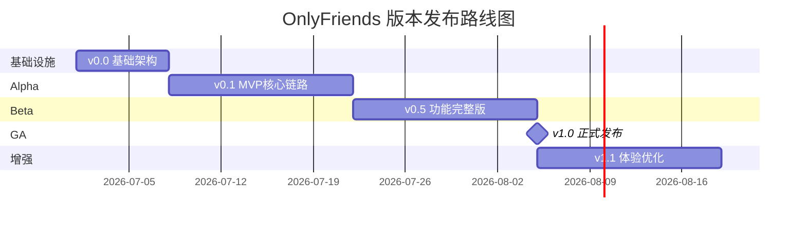

# OnlyFriends（趣聚平台）版本发布计划

> **文档版本**：RP-1.0  
> **状态**：已定稿

---

## 1. 文档说明

| 项 | 说明 |
|---|---|
| 发布策略 | 增量交付（Incremental Delivery）+ 时间盒（Time-boxed）迭代 |
| 总周期 | 8 周（4 周核心开发 + 2 周联调测试 + 2 周缓冲与发布） |
| 环境链路 | Dev → Test → Staging → Production |

### 版本命名规范

| 版本 | 含义 |
|------|------|
| v0.0.x | 基础架构，环境就绪 |
| v0.1.x | 内部 Alpha，核心链路可演示 |
| v0.5.x | 公开 Beta，功能完整待打磨 |
| v1.0.0 | 正式发布（GA） |
| v1.x.0 | 功能增强版本 |

---

## 2. 版本路线图总览



### 版本演进一览

| 版本 | 周期 | 核心目标 | 用户故事范围 |
|------|------|----------|--------------|
| v0.0 | 第 1 周 | 开发环境就绪，服务可启动 | US-INF-001~002 |
| v0.1 | 第 2–3 周 | MVP 主价值链打通 | 全部 P0 |
| v0.5 | 第 4–5 周 | 功能完整，可内测 | P0 + P1 |
| v1.0 | 第 6–7 周 | 生产上线，面向真实用户 | P0 + P1 + NFR |
| v1.1 | 第 8 周+ | 体验优化，P2 增强 | P2 |

---

## 3. v0.0 — 基础架构版（第 1 周）

### 3.1 版本目标

开发环境就绪，各微服务可启动并联调，团队接口契约冻结。

### 3.2 交付范围

| 模块 | 交付物 |
|------|--------|
| 基础设施 | Docker Compose（MySQL 8.0 / Redis 7 / Nacos 2.x / MinIO）一键启动 |
| 数据库 | 约 30 张核心表初始化脚本（附录 B） |
| 微服务骨架 | Gateway (:8080)、User (:8081)、Activity (:8082)、Social (:8083)、IM (:8084)、Admin (:8085)、AI (:8001) |
| 网关 | 路由规则配置、JWT 鉴权过滤器骨架、CORS 配置 |
| 契约 | OpenFeign 内部接口定义冻结（附录 E） |
| 前端工程 | 微信小程序工程初始化（Vant Weapp）；Vue 3 管理后台工程初始化（Element Plus） |
| 规范 | 统一响应格式、错误码、Git 分支策略、接口联调规范 |

### 3.3 里程碑与退出标准

- [ ] 全部 Docker 容器 `Status=Up` 或 `healthy`
- [ ] `GET /api/v1` 健康检查通过
- [ ] 各服务成功注册至 Nacos
- [ ] OpenFeign 契约各组签字确认
- [ ] 新人可按附录 A 在 4 小时内完成环境搭建

### 3.4 团队分工

| 小组 | 任务 |
|------|------|
| 基础设施组 | Docker Compose、数据库建表、Nacos 配置、Gateway 骨架 |
| 各业务组 | 各自服务代码骨架、实体类、Repository 层 |
| 前端组 | 小程序/管理后台工程初始化、请求封装 |

---

## 4. v0.1 — MVP Alpha（第 2–3 周）

### 4.1 版本目标

打通「注册 → 建活动 → AI 审核 → 发布 → 浏览 → 报名」主价值链，完成内部 Demo。

### 4.2 交付范围

#### 后端

| 服务 | 功能 |
|------|------|
| User Service | 注册、邮件激活、登录、Token 刷新 |
| Activity Service | 草稿创建、提交审核、活动列表（推荐/最新）、详情、基础报名 |
| AI Service | 内容安全审核（规则引擎 + LLM 两层） |
| Admin Service | 管理员登录、活动人工审核（通过/驳回/要求修改） |
| Gateway | JWT 鉴权、路由转发 |

#### 前端

| 端 | 页面 |
|----|------|
| 微信小程序 | 注册页、登录页、首页（推荐/最新 Tab）、活动详情页、活动创建页 |
| 管理后台 | 登录页、活动审核页 |

### 4.3 用户故事清单（P0）

US-U-001~004 · US-A-001~003 · US-A-006 · US-A-009~010 · US-AI-001 · US-ADM-001~002 · US-INF-001~002

### 4.4 服务开发优先级

```
User Service → Activity Service → AI Service → Gateway → Admin Service
```

### 4.5 明确排除（Out of Scope）

- 等待队列、地图模式、附近活动
- IM 即时通讯
- 兴趣小队与好友关系
- 商家申请
- 活动签到、总结与评价
- AI 活动策划生成

### 4.6 退出标准（Alpha 门禁）

- [ ] 全部 P0 用户故事验收标准通过
- [ ] 内部 Demo 可完整演示：注册 → 激活 → 登录 → 创建活动 → 提交审核 → AI/人工审核 → 首页浏览 → 报名
- [ ] 无 P0 级未关闭缺陷

---

## 5. v0.5 — Beta 完整版（第 4–5 周）

### 5.1 版本目标

补齐架构文档定义的全部 P1 功能，达到可内测状态。

### 5.2 交付范围

#### 活动模块（补全）

- AI 活动策划生成（流式输出）
- 活动模板与克隆
- 附近活动 / 地图模式 / 高级筛选
- 等待队列与自动递补（30 分钟确认机制）
- 取消报名与名额释放
- 签到二维码（HMAC 签名 + 可选位置校验）
- 活动图文总结（AI 图片分类）
- 活动评价
- 活动状态自动流转（定时任务）

#### 用户模块（补全）

- 个人资料编辑（昵称/头像/标签等）
- 商家申请与状态查询

#### 社群模块（新增）

- 关注 / 粉丝 / 好友申请与好友管理
- 兴趣小队创建、发现、加入、管理
- 小队相册 / 文件 / 投票 / 积分榜

#### IM 模块（新增）

- WebSocket 私聊 / 群聊
- 会话列表与未读数
- 离线消息拉取
- 消息撤回（2 分钟内）

#### 管理后台（补全）

- 用户查询 / 封禁 / 解封
- 商家申请审核
- 活动下架 / 恢复
- 小队查询 / 停用 / 恢复

#### 通知模块（新增）

- 审核结果、等待队列递补等系统通知

### 5.3 用户故事清单（P1）

全部 P1 用户故事（参见 [user-stories.md](./user-stories.md)）

### 5.4 服务开发优先级

```
Social Service → IM Service → Activity（报名/签到/等待队列）→ Admin 补齐 → 通知模块
```

### 5.5 联调重点

| 调用链 | 说明 |
|--------|------|
| Activity → AI | OpenFeign 内容审核、活动策划、图片分类 |
| Activity → User | 信誉分校验、用户信息批量查询 |
| IM → Social | 好友关系校验 |
| IM → User | 用户基础信息查询 |
| Activity → IM | Redis Pub/Sub 名额释放通知 |
| Admin → User/Activity/Social | 管理操作 Feign 调用 |

### 5.6 退出标准（Beta 门禁）

- [ ] P0 + P1 用户故事 AC 通过率 ≥ 95%
- [ ] NFR-P-001（页面加载 ≤5s）、NFR-P-002（接口 P95 ≤2000ms）达标
- [ ] 8 人团队内部全功能走查无 P0/P1 缺陷
- [ ] 微信小程序主要页面可正常使用

---

## 6. v1.0.0 — 正式发布 GA（第 6–7 周）

### 6.1 版本目标

生产环境上线，面向真实用户开放。

### 6.2 交付范围

| 类别 | 内容 |
|------|------|
| 部署 | Nginx 反向代理 + HTTPS/WSS + Docker Compose 生产配置 |
| 性能 | Redis 缓存（活动列表 5min / 用户信息 30min）、列表精简字段、图片 WebP + CDN |
| 安全 | 网关限流（429）、签到 HMAC 校验、文件上传类型/大小限制、BCrypt 密码存储 |
| 监控 | 基础日志聚合、服务健康检查端点、关键指标告警 |
| 文档 | 部署运维手册、API 文档、用户使用指南 |
| 合规 | 微信小程序提审、域名备案、隐私政策 |

### 6.3 发布流程

```
1. Staging 环境全量回归测试
2. 生产环境灰度发布（10% 流量，观察 24h）
3. 全量切换
4. 微信小程序提交审核
5. 审核通过后正式发布
```

### 6.4 发布清单（Checklist）

- [ ] 数据库备份策略就绪（每日自动备份 + 恢复演练）
- [ ] 密钥与 API Key 使用环境变量注入，不硬编码
- [ ] 微信小程序服务器域名与业务域名备案完成
- [ ] 管理后台独立域名 + HTTPS 证书
- [ ] 管理员初始账号创建并修改默认密码
- [ ] 回滚方案验证（可回退至上一稳定版本）
- [ ] 生产冒烟测试 100% 通过

### 6.5 退出标准（GA 门禁）

- [ ] 全部 P1 用户故事 AC 通过
- [ ] NFR 全项达标（参见 [acceptance-criteria.md](./acceptance-criteria.md) §4）
- [ ] 生产环境部署验证通过
- [ ] 运维手册与应急预案齐备
- [ ] 微信小程序审核通过

---

## 7. v1.1.0 — 体验增强版（第 8 周及以后）

### 7.1 版本目标

基于内测/公测反馈优化体验，交付 P2 能力。

### 7.2 候选范围

| 功能 | 关联故事 |
|------|----------|
| IM 消息转发 | US-I-006 |
| 管理员操作日志可视化 | US-ADM-007 |
| 小队积分体系细化与排行榜优化 | US-S-010 |
| 全文搜索性能优化（Elasticsearch 可选） | — |
| 小程序分包优化（主包 <2MB） | NFR-P-004 |
| 活动推荐算法优化 | — |

### 7.3 退出标准

- [ ] P2 用户故事 AC 通过
- [ ] 用户反馈 Top 10 问题关闭率 ≥ 80%

---

## 8. 跨版本依赖矩阵

| 依赖项 | 阻塞版本 | 说明 |
|--------|----------|------|
| OpenFeign 契约冻结 | v0.0 | 后续版本不可破坏性变更 |
| AI 服务内网部署 | v0.1 | Activity Service 依赖 AI 内容审核 |
| 好友关系服务 | v0.5 | IM 私聊前置依赖 |
| 小队创建 | v0.5 | 群聊 Channel 前置依赖 |
| HTTPS + WSS | v1.0 | 微信小程序生产环境硬性要求 |
| 腾讯地图 SDK | v0.5 | 附近活动 / 地图模式 |
| SMTP 邮件服务 | v0.1 | 注册激活邮件 |
| 大模型 API Key | v0.1 | AI 内容审核 |

---

## 9. 团队迭代与版本映射

与架构文档 §13.2 开发里程碑对齐：

| 迭代周 | 版本增量 | 团队焦点 |
|--------|----------|----------|
| 第 1 周 | v0.0 | 基础设施组主导：环境、建表、骨架、契约冻结 |
| 第 2 周 | v0.1 前半 | 用户组 + 活动组：注册登录、活动创建提交、AI 审核 |
| 第 3 周 | v0.1 后半 | 活动组 + 前端组：列表/详情/报名、管理后台审核 |
| 第 4 周 | v0.5 前半 | 社群组 + AI/IM 组：好友/小队、WebSocket 通讯 |
| 第 5 周 | v0.5 后半 | 全组：等待队列、签到、商家、通知、管理补齐 |
| 第 6 周 | v1.0 前半 | 全组：前后端联调、性能优化、安全加固 |
| 第 7 周 | v1.0 后半 | 部署上线、灰度发布、微信提审、文档完善 |
| 第 8 周+ | v1.1 | 体验优化、P2 功能、用户反馈迭代 |

### 推荐分组（6–8 人团队）

| 小组 | 人数 | 负责模块 |
|------|------|----------|
| 前端组 | 2 | 微信小程序 + 管理后台 Web |
| 用户与社群组 | 1–2 | User Service + Social Service |
| 活动组 | 2 | Activity Service |
| AI 与 IM 组 | 1–2 | AI Service + IM Service |
| 基础设施组 | 1 | Gateway + Admin + DevOps |

---

## 10. 风险登记册

| 编号 | 风险描述 | 概率 | 影响 | 缓解措施 | 关联版本 |
|------|----------|------|------|----------|----------|
| R-001 | AI 大模型 API 不稳定或超时 | 中 | 高 | 超时自动转人工审核；规则引擎兜底 | v0.1+ |
| R-002 | WebSocket 在小程序环境兼容性问题 | 中 | 中 | 提前 POC 验证；准备 HTTP 轮询降级方案 | v0.5 |
| R-003 | 多服务联调进度不一致 | 高 | 高 | 契约先行；Mock 服务；每周集成日 | 全周期 |
| R-004 | 微信小程序审核周期不确定 | 中 | 高 | 提前 2 周提审；预留 1 周缓冲 | v1.0 |
| R-005 | 暑期实践人力波动 | 中 | 中 | P0/P1 严格分级；P2 可延期至 v1.1 | 全周期 |
| R-006 | MySQL 单实例性能瓶颈 | 低 | 中 | Redis 缓存热点数据；索引优化；v1.1 考虑读写分离 | v1.0+ |
| R-007 | MinIO/OSS 存储成本超预期 | 低 | 低 | 图片压缩 WebP；设置存储配额告警 | v1.0+ |

---

## 11. 沟通与评审机制

| 活动 | 频率 | 参与方 | 产出 |
|------|------|--------|------|
| 每日站会 | 每日 15min | 全组 | 阻塞项同步 |
| 接口评审 | v0.0 期间 1 次 | 各服务负责人 | 冻结 OpenFeign 契约 |
| 集成日 | 每周五 | 全组 | 跨服务联调、缺陷记录 |
| Sprint 评审 | 每版本结束前 | 全组 + 指导教师 | Demo 演示、门禁检查 |
| 回顾会 | 每版本结束后 | 全组 | 改进项记录 |
