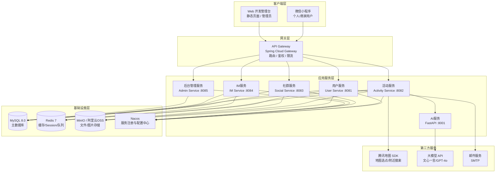
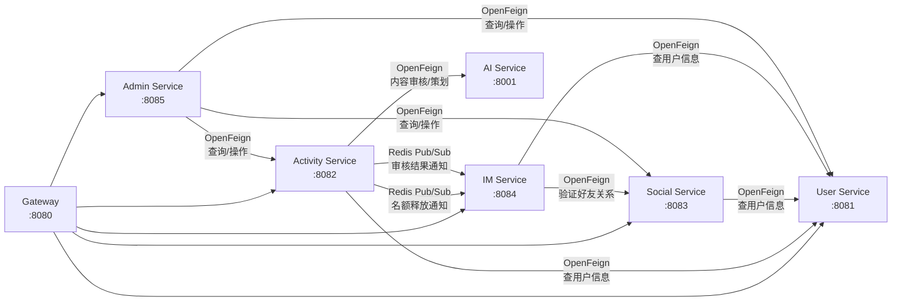
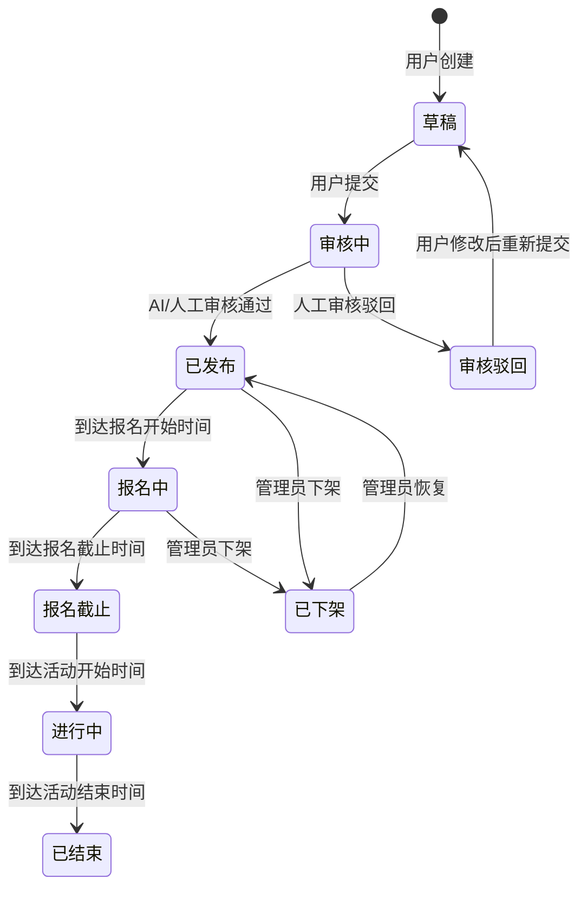
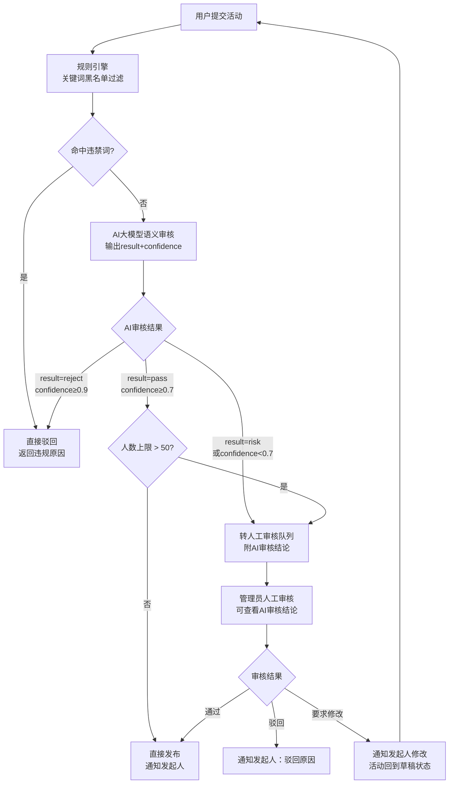
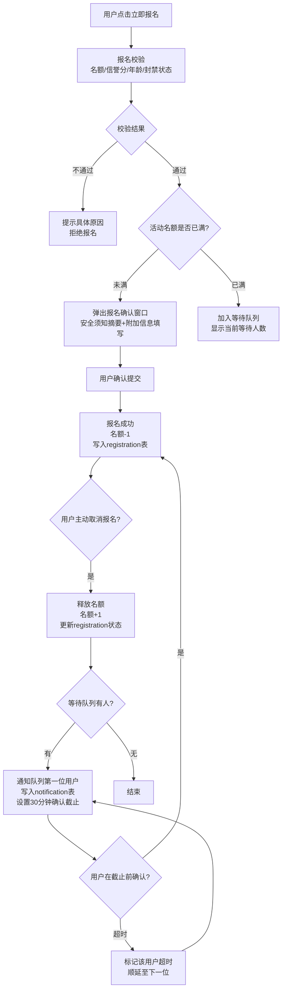
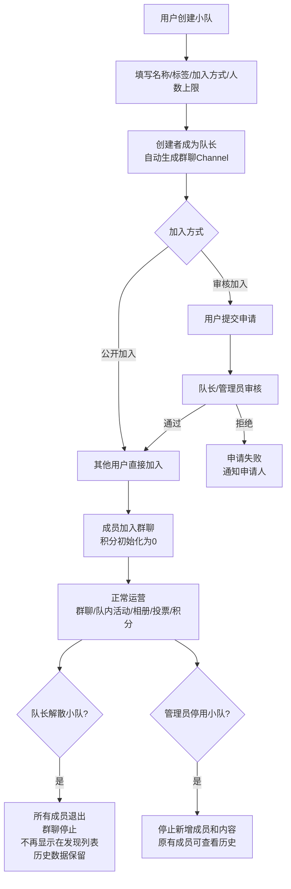
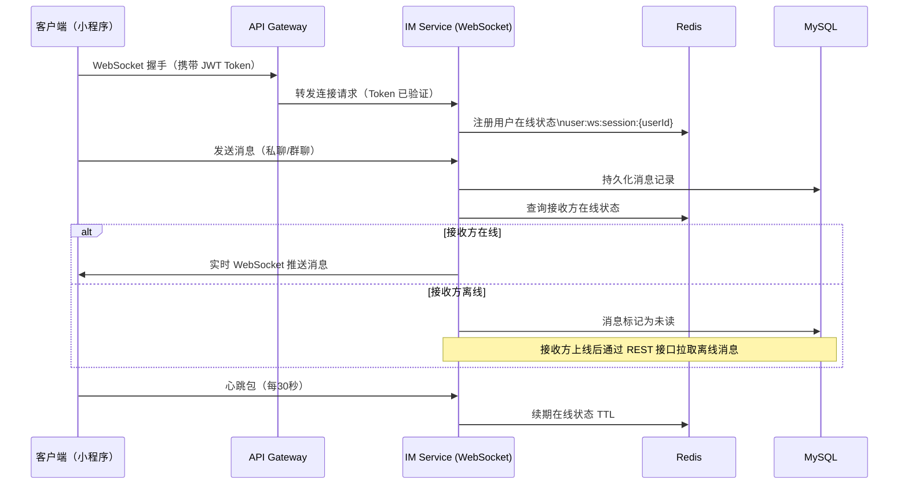
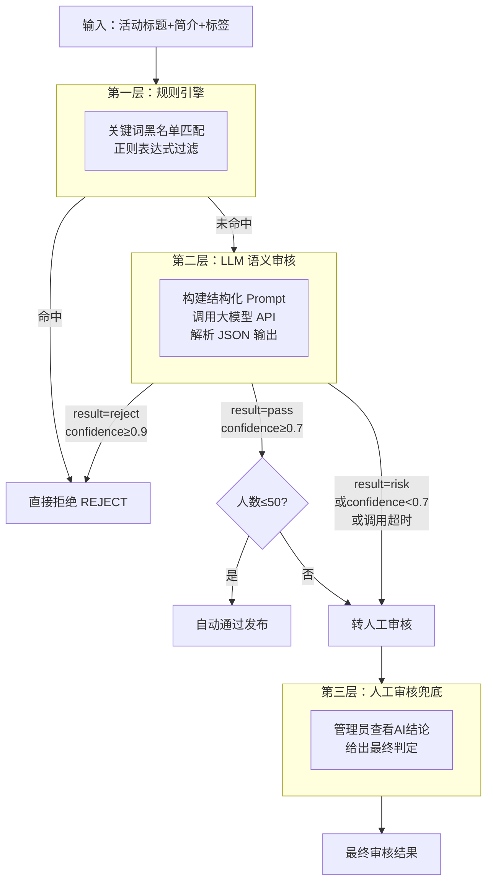
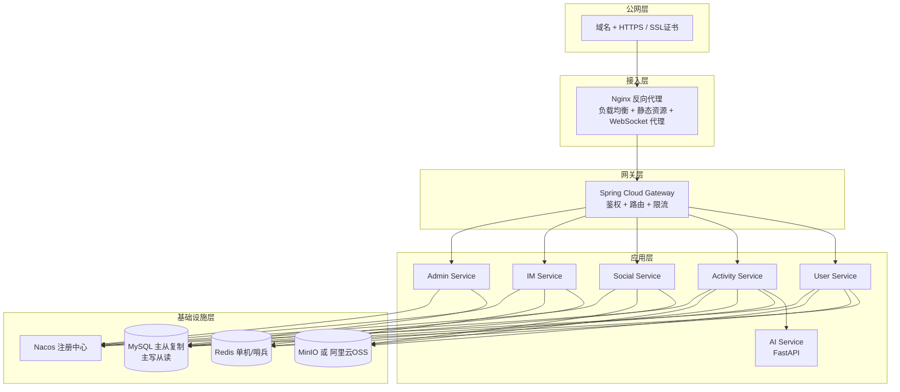

# OnlyFriends 系统架构与实现方案

> **文档版本**：v3.0 | **状态**：工程级可编程版（开发人员直接参考编码）
>
> **技术栈**：微信小程序 · Spring Boot 微服务 · FastAPI · MySQL · Redis · WebSocket
>
> **本文档包含**：架构设计 · 微服务拆分 · 完整SQL脚本 · 代码骨架 · 接口字段定义 · OpenFeign契约 · 前端页面接口映射 · 环境搭建指南

---

## 目录

1. [总体架构设计](#1-总体架构设计)
2. [微服务拆分决策](#2-微服务拆分决策)
3. [技术选型说明](#3-技术选型说明)
4. [各服务模块详细设计](#4-各服务模块详细设计)
   - 4.1 [网关服务（Gateway）](#41-网关服务gateway)
   - 4.2 [用户服务（User Service）](#42-用户服务user-service)
   - 4.3 [活动服务（Activity Service）](#43-活动服务activity-service)
   - 4.4 [社群服务（Social Service）](#44-社群服务social-service)
   - 4.5 [即时通讯服务（IM Service）](#45-即时通讯服务im-service)
   - 4.6 [AI 服务（AI Service）](#46-ai-服务ai-service)
   - 4.7 [后台管理服务（Admin Service）](#47-后台管理服务admin-service)
5. [数据库设计](#5-数据库设计)
6. [API 接口设计规范与清单](#6-api-接口设计规范与清单)
7. [核心业务流程设计](#7-核心业务流程设计)
8. [AI 自主评判模块详细设计](#8-ai-自主评判模块详细设计)
9. [即时通讯方案](#9-即时通讯方案)
10. [安全与权限设计](#10-安全与权限设计)
11. [部署架构方案](#11-部署架构方案)
12. [非功能性需求实现](#12-非功能性需求实现)
13. [团队分工建议](#13-团队分工建议)
14. [附录：项目目录结构参考](#附录项目目录结构参考)

**工程实施附录（可直接编程）**

- [附录 A：本地开发环境搭建指南](#附录-a本地开发环境搭建指南)
- [附录 B：数据库初始化 SQL 脚本](#附录-b数据库初始化-sql-脚本)
- [附录 C：各服务代码骨架](#附录-c各服务代码骨架)
- [附录 D：接口字段定义与示例 JSON](#附录-d接口字段定义与示例-json)
- [附录 E：微服务间 OpenFeign 契约](#附录-e微服务间-openfeign-契约)
- [附录 F：前端页面与接口对应关系](#附录-f前端页面与接口对应关系)

---

## 1. 总体架构设计

### 1.1 架构概览

OnlyFriends 采用**前后端分离 + 适度微服务**的整体架构。前端以微信小程序为主要用户入口；开发与测试使用仓库内 **Web 开发管理台**（`frontend/server.js`，静态 HTML + Node.js，端口 5173）。后端按业务边界拆分为 **6 个独立微服务**：网关服务、用户服务、活动服务、社群服务、即时通讯服务和 AI 服务；后台管理功能作为独立的 Admin 服务，复用各业务服务的数据层能力。数据层以 MySQL 为主存储，Redis 承担缓存与会话管理，MinIO/OSS 承担文件与图片存储。



### 1.2 分层职责说明

| 层次 | 组件 | 职责描述 |
|------|------|----------|
| 客户端层 | 微信小程序 | 个人用户、商家用户的全部功能入口 |
| 客户端层 | Web 管理后台 | 管理员用户管理、活动审核、小队管理 |
| 网关层 | Spring Cloud Gateway | 请求路由、JWT 鉴权前置、接口限流、跨域处理 |
| 应用层 | 用户服务 | 注册/登录/激活、个人资料、商家申请 |
| 应用层 | 活动服务 | 活动全生命周期：创建、审核、发现、报名、签到、总结 |
| 应用层 | 社群服务 | 好友关系、关注关系、兴趣小队管理 |
| 应用层 | IM 服务 | 私聊/群聊消息、WebSocket 长连接管理 |
| 应用层 | AI 服务 | 活动策划生成、内容安全审核、图片 AI 分类 |
| 应用层 | 后台管理服务 | 管理员操作：用户封禁、活动下架、小队停用 |
| 基础设施层 | MySQL 8.0 | 所有结构化业务数据的持久化存储 |
| 基础设施层 | Redis 7 | Token 缓存、热点数据缓存、等待队列、在线状态、分布式锁 |
| 基础设施层 | MinIO / OSS | 用户头像、活动图片、营业执照、群文件等二进制文件 |
| 基础设施层 | Nacos | 服务注册发现、统一配置管理 |

---

## 2. 微服务拆分决策

### 2.1 为什么做微服务拆分

v1 方案将所有业务逻辑集中在一个 Spring Boot 单体服务中。对于暑期实践项目，这会带来以下问题：多名团队成员同时修改同一代码库，Git 合并冲突频繁；某一模块的 Bug 可能导致整个服务不可用；AI 服务需要 Python 生态（LangChain、OpenAI SDK），无法与 Java 服务共存；IM 服务需要维护大量 WebSocket 长连接，与普通 HTTP 服务的资源模型不同。因此，按业务边界进行适度微服务拆分，既能支持团队并行开发，又不引入过重的运维负担。

### 2.2 拆分原则与边界划定

本平台的微服务拆分遵循以下三条原则：**业务内聚**（同一领域的功能放在同一服务，减少跨服务调用）、**团队独立**（每个服务可由独立小组负责，互不干扰）、**技术异构**（AI 服务使用 Python/FastAPI，其余服务使用 Java/Spring Boot）。

| 服务名称 | 端口 | 核心职责 | 技术框架 | 建议负责人数 |
|----------|------|----------|----------|--------------|
| Gateway | 8080 | 路由、鉴权、限流 | Spring Cloud Gateway | 0.5人（兼任） |
| User Service | 8081 | 用户注册/登录/资料/商家 | Spring Boot | 1人 |
| Activity Service | 8082 | 活动全生命周期 | Spring Boot | 2人 |
| Social Service | 8083 | 好友/关注/小队 | Spring Boot | 1-2人 |
| IM Service | 8084 | 即时通讯 WebSocket | Spring Boot + STOMP | 1人 |
| AI Service | 8001 | 活动策划/内容审核/图片分类 | FastAPI (Python) | 1人 |
| Admin Service | 8085 | 后台管理操作 | Spring Boot | 1人（兼任） |

### 2.3 服务间通信设计

微服务之间的通信分为两种模式：**同步调用**和**异步通知**。

同步调用使用 **Spring Cloud OpenFeign**，适用于需要立即获取返回值的场景，例如活动服务调用用户服务查询用户信息、活动服务调用 AI 服务进行内容审核。异步通知使用 **Redis Pub/Sub**，适用于不需要等待结果的场景，例如等待队列名额释放通知、活动状态变更通知。项目规模不引入 Kafka，以降低运维复杂度。



### 2.4 共享数据库 vs 独立数据库

考虑到暑期实践项目的规模和运维成本，本平台采用**共享 MySQL 实例、逻辑分库**的策略：所有服务共用同一个 MySQL 实例，但每个服务只操作自己的数据表，不允许跨服务直接查询其他服务的表（必须通过 OpenFeign 接口调用）。这样既保留了微服务的边界清晰性，又避免了多数据库带来的分布式事务复杂度。

---

## 3. 技术选型说明

### 3.1 前端技术栈

微信小程序是本平台的核心用户端，天然具备微信生态集成优势。UI 组件库可选用 **Vant Weapp**，地图能力使用**腾讯地图 SDK for 小程序**，满足活动地点选点和地图模式展示的需求。开发与联调阶段使用 **`frontend/` 下的 Web 开发管理台**（`server.js` + 静态页面，端口 5173），与后端共用同一套 REST API；生产环境可另行规划独立 Vue/React 管理后台。

### 3.2 后端技术栈

| 技术 | 版本 | 用途说明 |
|------|------|----------|
| Spring Boot | 3.x | 各业务微服务框架 |
| Spring Cloud Gateway | 4.x | API 网关，统一路由与鉴权 |
| Spring Cloud OpenFeign | 4.x | 微服务间同步 HTTP 调用 |
| Nacos | 2.x | 服务注册发现 + 配置中心 |
| Spring Security + JWT | - | 身份认证与接口鉴权 |
| MyBatis-Plus | 3.x | ORM 框架，简化 CRUD 操作 |
| FastAPI | 0.110+ | AI 服务封装，异步高性能 Python 框架 |
| Spring WebSocket + STOMP | - | 即时通讯长连接 |
| Spring Task | - | 定时任务（活动状态流转、等待队列超时） |
| Redis | 7.x | 缓存、分布式 Session、等待队列、在线状态 |
| MySQL | 8.0 | 主数据库 |
| MinIO | - | 私有化对象存储（或替换为阿里云 OSS） |
| Docker + Docker Compose | - | 容器化部署 |

### 3.3 AI 技术选型

| AI 能力 | 推荐模型/服务 | 备注 |
|---------|--------------|------|
| 活动策划文本生成 | 文心一言 4.0 / GPT-4o | 中文理解能力强，支持结构化 JSON 输出 |
| 内容安全语义审核 | 文心一言 + 腾讯云内容安全 API | 双重保障，降低误判率 |
| 图片 AI 分类 | 通义千问 VL / GPT-4V | 多模态视觉理解能力 |

---

## 4. 各服务模块详细设计

### 4.1 网关服务（Gateway）

网关服务是所有外部请求的统一入口，承担以下职责：**JWT Token 解析与验证**（在网关层统一鉴权，各业务服务无需重复验证）、**请求路由**（根据路径前缀转发至对应微服务）、**接口限流**（基于 Redis 令牌桶，防止接口滥用）、**跨域处理**（统一配置 CORS）。

路由规则如下：

| 路径前缀 | 转发目标 | 是否需要鉴权 |
|----------|----------|--------------|
| `/api/v1/auth/**` | User Service | 否（登录/注册接口） |
| `/api/v1/users/**` | User Service | 是 |
| `/api/v1/merchant/**` | User Service | 是 |
| `/api/v1/activities/**` | Activity Service | 是（部分接口公开） |
| `/api/v1/ai/**` | Activity Service（内部转 AI Service） | 是 |
| `/api/v1/follows/**` | Social Service | 是 |
| `/api/v1/friends/**` | Social Service | 是 |
| `/api/v1/teams/**` | Social Service | 是 |
| `/api/v1/im/**` | IM Service | 是 |
| `/ws/**` | IM Service | 是（WebSocket 握手时验证） |
| `/api/v1/admin/**` | Admin Service | 是（需 ROLE_ADMIN） |

### 4.2 用户服务（User Service）

用户服务负责平台所有用户身份相关的功能，是其他服务的基础依赖。

**核心功能模块：**

注册与登录模块实现邮箱+密码注册、邮件激活链接发送（SMTP）、JWT Token 签发与刷新。商家申请模块处理营业执照/凭证上传（文件存至 MinIO）和商家身份状态管理。个人资料模块管理头像、昵称（全平台唯一，需加唯一索引）、性别、生日、个性签名、兴趣标签等信息。

**对外暴露的 OpenFeign 接口（供其他服务调用）：**

```java
@FeignClient(name = "user-service")
public interface UserFeignClient {
    // 根据用户ID批量查询用户基础信息（昵称、头像）
    @GetMapping("/internal/users/batch")
    List<UserBasicDTO> getUsersByIds(@RequestParam List<Long> ids);

    // 验证用户是否存在且状态正常
    @GetMapping("/internal/users/{id}/valid")
    Boolean isUserValid(@PathVariable Long id);

    // 查询用户信誉分（报名校验使用）
    @GetMapping("/internal/users/{id}/credit")
    Integer getUserCredit(@PathVariable Long id);
}
```

### 4.3 活动服务（Activity Service）

活动服务是平台最核心、业务最复杂的服务，负责活动的完整生命周期管理。建议由 2 名成员分工：一人负责活动创建/审核/发布流程，另一人负责报名/签到/总结/评价流程。

**核心功能模块：**

活动创建模块支持手动填写、AI 策划生成（调用 AI 服务）、模板快速创建和活动克隆四种方式，并支持草稿自动保存。活动审核模块实现 AI 自动审核与人工审核的双轨流程（详见第 8 节）。活动发现模块提供首页信息流（推荐/最新/附近三个 Tab）、关键词搜索、高级筛选和地图模式四种入口。报名与等待队列模块实现名额管理、报名校验、等待队列自动递补（基于 Redis 有序集合）。活动签到模块生成含 HMAC-SHA256 签名的二维码，支持可选的位置校验。活动总结模块支持图文发布，集成 AI 图片分类辅助整理素材。

**活动状态机：**



### 4.4 社群服务（Social Service）

社群服务负责平台的人际关系和兴趣小队功能，是平台"社交"属性的核心承载。

**核心功能模块：**

关注与好友模块实现单向关注、互关自动升级为好友、好友申请/同意/拒绝/删除、好友备注与分组标签管理。兴趣小队模块实现小队创建（名称/标签/加入方式/人数上限）、小队发现与搜索、公开加入/审核加入两种方式、小队解散。小队管理模块实现三级权限体系（队长/管理员/普通成员）、群公告发布、队内活动发布、小队相册管理、积分榜计算与展示、小队投票功能。

**积分计算规则（示例）：**

| 行为 | 积分变化 |
|------|----------|
| 参与队内活动并签到 | +10 |
| 发布动态 | +2 |
| 动态被小队精选 | +5 |
| 上传相册照片 | +1 |
| 参与投票 | +1 |

### 4.5 即时通讯服务（IM Service）

IM 服务采用**自建 WebSocket 服务**方案，基于 Spring Boot 集成 STOMP 协议实现，相比接入腾讯云 IM 等第三方服务成本更低，且对于暑期实践项目规模完全足够。

**连接与订阅设计：**

```
WebSocket 连接端点：ws://host/ws/im?token={JWT}
私聊消息订阅：    /user/{userId}/queue/messages
群聊消息订阅：    /topic/team/{teamId}
发送私聊消息：    /app/chat.private
发送群聊消息：    /app/chat.group
撤回消息：        /app/chat.recall
```

用户连接时携带 JWT Token 进行身份验证。连接成功后，服务端将用户的 WebSocket Session 注册到 Redis（`user:ws:session:{userId}`），并订阅该用户所在的所有小队群聊 Topic。消息发送后**同步写入 MySQL** 保证持久化，在线用户通过 WebSocket 实时推送，离线用户上线后通过 REST 接口拉取离线消息。

### 4.6 AI 服务（AI Service）

AI 服务是本平台的技术亮点，使用 FastAPI（Python）构建，监听内网端口 `8001`，**仅接受来自活动服务的内部调用**，不对外暴露。详细设计见第 8 节。

**服务目录结构：**

```
onlyfriends-ai-service/
├── routers/
│   ├── activity_plan.py      # AI 活动策划（POST /ai/plan-activity）
│   ├── content_review.py     # 内容安全审核（POST /ai/review-content）
│   └── image_classify.py     # 图片 AI 分类（POST /ai/classify-images）
├── services/
│   ├── llm_service.py        # 大模型调用封装（文心一言/GPT-4o）
│   ├── vision_service.py     # 视觉模型调用封装
│   └── rule_engine.py        # 规则引擎（关键词黑名单）
├── models/
│   ├── review_result.py      # 审核结果数据模型
│   └── activity_plan.py      # 活动策划结果数据模型
├── config.py                 # 配置（API Key、超时、重试）
├── requirements.txt
└── main.py
```

### 4.7 后台管理服务（Admin Service）

后台管理服务为管理员提供专用接口，通过 OpenFeign 调用其他业务服务完成查询和操作，自身维护管理员账号表、操作日志表和审核记录表。

**核心功能：** 管理员登录（独立账号体系，不走用户服务）、用户查询/封禁/解封、商家申请人工审核、活动人工审核（通过/驳回/要求修改）、活动下架/恢复、小队查询/停用/恢复。

---

## 5. 数据库设计

### 5.1 数据库总览

本平台共设计约 **30 张核心数据表**，按服务归属分组如下：

| 所属服务 | 数据表 | 说明 |
|----------|--------|------|
| 用户服务 | `user`、`merchant_info`、`merchant_apply` | 用户基础信息、商家信息、商家申请 |
| 活动服务 | `activity`、`activity_tag`、`activity_template`、`activity_review_record`、`activity_registration`、`activity_waitlist`、`activity_checkin`、`activity_summary`、`activity_comment` | 活动全生命周期 |
| 社群服务 | `user_follow`、`friend_relation`、`friend_apply`、`team`、`team_member`、`team_album`、`team_file`、`team_vote`、`team_vote_option`、`team_vote_record`、`team_score_log` | 关注/好友/小队 |
| IM 服务 | `im_message`、`im_group_message`、`im_conversation` | 私聊/群聊消息 |
| 通知模块 | `notification` | 系统通知（等待队列通知、审核结果通知） |
| 后台管理 | `admin_user`、`user_ban_record`、`activity_offline_record`、`team_disable_record`、`admin_operation_log` | 管理员与操作记录 |

### 5.2 核心数据表设计

#### 用户表 `user`

```sql
CREATE TABLE `user` (
  `id`             BIGINT       NOT NULL AUTO_INCREMENT COMMENT '用户ID',
  `email`          VARCHAR(100) NOT NULL UNIQUE COMMENT '邮箱（登录账号）',
  `password_hash`  VARCHAR(255) NOT NULL COMMENT '密码哈希（BCrypt）',
  `nickname`       VARCHAR(50)  NOT NULL UNIQUE COMMENT '昵称（全平台唯一）',
  `avatar_url`     VARCHAR(500) COMMENT '头像URL',
  `gender`         TINYINT      COMMENT '性别：0未知 1男 2女',
  `birthday`       DATE         COMMENT '生日',
  `bio`            VARCHAR(200) COMMENT '个性签名',
  `interest_tags`  JSON         COMMENT '兴趣标签列表',
  `user_type`      TINYINT      NOT NULL DEFAULT 0 COMMENT '用户类型：0个人 1商家',
  `status`         TINYINT      NOT NULL DEFAULT 1 COMMENT '状态：0未激活 1正常 2封禁',
  `credit_score`   INT          NOT NULL DEFAULT 100 COMMENT '信誉分（0-100）',
  `activate_token` VARCHAR(100) COMMENT '激活Token（激活后清空）',
  `ban_expire_at`  DATETIME     COMMENT '封禁到期时间（NULL表示永久封禁）',
  `created_at`     DATETIME     NOT NULL DEFAULT CURRENT_TIMESTAMP,
  `updated_at`     DATETIME     NOT NULL DEFAULT CURRENT_TIMESTAMP ON UPDATE CURRENT_TIMESTAMP,
  PRIMARY KEY (`id`),
  INDEX `idx_email` (`email`),
  INDEX `idx_nickname` (`nickname`),
  INDEX `idx_status` (`status`)
) ENGINE=InnoDB DEFAULT CHARSET=utf8mb4 COMMENT='用户表';
```

#### 活动表 `activity`

```sql
CREATE TABLE `activity` (
  `id`               BIGINT        NOT NULL AUTO_INCREMENT COMMENT '活动ID',
  `creator_id`       BIGINT        NOT NULL COMMENT '发起人用户ID',
  `title`            VARCHAR(100)  NOT NULL COMMENT '活动名称',
  `description`      TEXT          COMMENT '活动简介',
  `tags`             JSON          COMMENT '活动标签列表',
  `cover_url`        VARCHAR(500)  COMMENT '封面图URL',
  `start_time`       DATETIME      NOT NULL COMMENT '活动开始时间',
  `end_time`         DATETIME      NOT NULL COMMENT '活动结束时间',
  `reg_deadline`     DATETIME      NOT NULL COMMENT '报名截止时间',
  `location_name`    VARCHAR(200)  COMMENT '地点名称',
  `location_lat`     DECIMAL(10,7) COMMENT '纬度',
  `location_lng`     DECIMAL(10,7) COMMENT '经度',
  `location_detail`  VARCHAR(500)  COMMENT '详细地址',
  `max_participants` INT           NOT NULL DEFAULT 0 COMMENT '人数上限，0表示不限',
  `current_count`    INT           NOT NULL DEFAULT 0 COMMENT '当前报名人数',
  `fee`              DECIMAL(10,2) NOT NULL DEFAULT 0 COMMENT '活动费用（0为免费）',
  `status`           TINYINT       NOT NULL DEFAULT 0 COMMENT '状态：0草稿 1审核中 2已发布 3报名中 4报名截止 5进行中 6已结束 7已下架 8审核驳回',
  `review_type`      TINYINT       NOT NULL DEFAULT 0 COMMENT '审核类型：0AI自动 1人工审核',
  `is_team_only`     TINYINT       NOT NULL DEFAULT 0 COMMENT '是否仅限小队：0否 1是',
  `team_id`          BIGINT        COMMENT '关联小队ID（队内活动）',
  `template_id`      BIGINT        COMMENT '使用的模板ID',
  `clone_from_id`    BIGINT        COMMENT '克隆来源活动ID',
  `checkin_qr_code`  VARCHAR(500)  COMMENT '签到二维码内容（含签名）',
  `location_verify`  TINYINT       NOT NULL DEFAULT 0 COMMENT '是否开启位置签到校验',
  `created_at`       DATETIME      NOT NULL DEFAULT CURRENT_TIMESTAMP,
  `updated_at`       DATETIME      NOT NULL DEFAULT CURRENT_TIMESTAMP ON UPDATE CURRENT_TIMESTAMP,
  PRIMARY KEY (`id`),
  INDEX `idx_creator` (`creator_id`),
  INDEX `idx_status` (`status`),
  INDEX `idx_start_time` (`start_time`),
  INDEX `idx_location` (`location_lat`, `location_lng`),
  FULLTEXT INDEX `ft_title_desc` (`title`, `description`)
) ENGINE=InnoDB DEFAULT CHARSET=utf8mb4 COMMENT='活动表';
```

#### AI 审核记录表 `activity_review_record`（新增）

```sql
CREATE TABLE `activity_review_record` (
  `id`              BIGINT       NOT NULL AUTO_INCREMENT,
  `activity_id`     BIGINT       NOT NULL COMMENT '活动ID',
  `review_stage`    TINYINT      NOT NULL COMMENT '审核阶段：0AI审核 1人工审核',
  `reviewer_id`     BIGINT       COMMENT '人工审核员ID（AI审核时为NULL）',
  `ai_result`       VARCHAR(20)  COMMENT 'AI判定结果：pass/risk/reject',
  `ai_risk_level`   TINYINT      COMMENT 'AI风险等级：0-10',
  `ai_risk_categories` JSON      COMMENT 'AI识别的风险类别列表',
  `ai_reason`       TEXT         COMMENT 'AI审核说明',
  `ai_confidence`   DECIMAL(4,3) COMMENT 'AI置信度：0.000-1.000',
  `final_result`    TINYINT      NOT NULL COMMENT '最终结果：0通过 1驳回 2要求修改 3转人工',
  `review_comment`  TEXT         COMMENT '审核意见（驳回/要求修改时必填）',
  `created_at`      DATETIME     NOT NULL DEFAULT CURRENT_TIMESTAMP,
  PRIMARY KEY (`id`),
  INDEX `idx_activity` (`activity_id`),
  INDEX `idx_reviewer` (`reviewer_id`)
) ENGINE=InnoDB DEFAULT CHARSET=utf8mb4 COMMENT='活动审核记录表（含AI审核结果）';
```

#### 活动报名表 `activity_registration`

```sql
CREATE TABLE `activity_registration` (
  `id`          BIGINT   NOT NULL AUTO_INCREMENT,
  `activity_id` BIGINT   NOT NULL COMMENT '活动ID',
  `user_id`     BIGINT   NOT NULL COMMENT '报名用户ID',
  `status`      TINYINT  NOT NULL DEFAULT 1 COMMENT '状态：1已报名 2已取消 3已签到',
  `reg_info`    JSON     COMMENT '报名填写的附加信息',
  `created_at`  DATETIME NOT NULL DEFAULT CURRENT_TIMESTAMP,
  `updated_at`  DATETIME NOT NULL DEFAULT CURRENT_TIMESTAMP ON UPDATE CURRENT_TIMESTAMP,
  PRIMARY KEY (`id`),
  UNIQUE KEY `uk_activity_user` (`activity_id`, `user_id`),
  INDEX `idx_user` (`user_id`)
) ENGINE=InnoDB DEFAULT CHARSET=utf8mb4 COMMENT='活动报名表';
```

#### 等待队列表 `activity_waitlist`

```sql
CREATE TABLE `activity_waitlist` (
  `id`               BIGINT   NOT NULL AUTO_INCREMENT,
  `activity_id`      BIGINT   NOT NULL COMMENT '活动ID',
  `user_id`          BIGINT   NOT NULL COMMENT '用户ID',
  `queue_position`   INT      NOT NULL COMMENT '队列位置（越小越靠前）',
  `status`           TINYINT  NOT NULL DEFAULT 0 COMMENT '状态：0等待中 1已通知 2已确认 3已超时 4已取消',
  `notify_at`        DATETIME COMMENT '通知时间',
  `confirm_deadline` DATETIME COMMENT '确认截止时间（通知后30分钟）',
  `created_at`       DATETIME NOT NULL DEFAULT CURRENT_TIMESTAMP,
  PRIMARY KEY (`id`),
  UNIQUE KEY `uk_activity_user` (`activity_id`, `user_id`),
  INDEX `idx_activity_position` (`activity_id`, `queue_position`)
) ENGINE=InnoDB DEFAULT CHARSET=utf8mb4 COMMENT='活动等待队列表';
```

#### 兴趣小队表 `team`

```sql
CREATE TABLE `team` (
  `id`            BIGINT       NOT NULL AUTO_INCREMENT COMMENT '小队ID',
  `name`          VARCHAR(100) NOT NULL COMMENT '小队名称',
  `tags`          JSON         COMMENT '兴趣标签',
  `description`   VARCHAR(500) COMMENT '小队简介',
  `avatar_url`    VARCHAR(500) COMMENT '小队头像URL',
  `join_type`     TINYINT      NOT NULL DEFAULT 0 COMMENT '加入方式：0公开 1审核',
  `max_members`   INT          NOT NULL DEFAULT 100 COMMENT '人数上限',
  `current_count` INT          NOT NULL DEFAULT 1 COMMENT '当前人数',
  `leader_id`     BIGINT       NOT NULL COMMENT '队长用户ID',
  `status`        TINYINT      NOT NULL DEFAULT 1 COMMENT '状态：0已解散 1正常 2停用',
  `created_at`    DATETIME     NOT NULL DEFAULT CURRENT_TIMESTAMP,
  `updated_at`    DATETIME     NOT NULL DEFAULT CURRENT_TIMESTAMP ON UPDATE CURRENT_TIMESTAMP,
  PRIMARY KEY (`id`),
  INDEX `idx_leader` (`leader_id`),
  INDEX `idx_status` (`status`),
  FULLTEXT INDEX `ft_name` (`name`)
) ENGINE=InnoDB DEFAULT CHARSET=utf8mb4 COMMENT='兴趣小队表';
```

#### 小队成员表 `team_member`

```sql
CREATE TABLE `team_member` (
  `id`        BIGINT   NOT NULL AUTO_INCREMENT,
  `team_id`   BIGINT   NOT NULL COMMENT '小队ID',
  `user_id`   BIGINT   NOT NULL COMMENT '用户ID',
  `role`      TINYINT  NOT NULL DEFAULT 2 COMMENT '角色：0队长 1管理员 2普通成员',
  `score`     INT      NOT NULL DEFAULT 0 COMMENT '积分',
  `joined_at` DATETIME NOT NULL DEFAULT CURRENT_TIMESTAMP,
  PRIMARY KEY (`id`),
  UNIQUE KEY `uk_team_user` (`team_id`, `user_id`),
  INDEX `idx_user` (`user_id`),
  INDEX `idx_score` (`team_id`, `score` DESC)
) ENGINE=InnoDB DEFAULT CHARSET=utf8mb4 COMMENT='小队成员表';
```

#### 好友申请表 `friend_apply`（新增）

```sql
CREATE TABLE `friend_apply` (
  `id`          BIGINT       NOT NULL AUTO_INCREMENT,
  `from_user_id` BIGINT      NOT NULL COMMENT '申请人ID',
  `to_user_id`  BIGINT       NOT NULL COMMENT '被申请人ID',
  `message`     VARCHAR(200) COMMENT '申请留言',
  `status`      TINYINT      NOT NULL DEFAULT 0 COMMENT '状态：0待处理 1已同意 2已拒绝',
  `created_at`  DATETIME     NOT NULL DEFAULT CURRENT_TIMESTAMP,
  `updated_at`  DATETIME     NOT NULL DEFAULT CURRENT_TIMESTAMP ON UPDATE CURRENT_TIMESTAMP,
  PRIMARY KEY (`id`),
  INDEX `idx_to_user` (`to_user_id`, `status`),
  INDEX `idx_from_user` (`from_user_id`)
) ENGINE=InnoDB DEFAULT CHARSET=utf8mb4 COMMENT='好友申请表';
```

#### 系统通知表 `notification`（新增）

```sql
CREATE TABLE `notification` (
  `id`          BIGINT       NOT NULL AUTO_INCREMENT,
  `user_id`     BIGINT       NOT NULL COMMENT '接收通知的用户ID',
  `type`        VARCHAR(50)  NOT NULL COMMENT '通知类型：waitlist_notify/review_result/friend_apply/system',
  `title`       VARCHAR(100) NOT NULL COMMENT '通知标题',
  `content`     TEXT         COMMENT '通知内容',
  `ref_id`      BIGINT       COMMENT '关联业务ID（活动ID/申请ID等）',
  `is_read`     TINYINT      NOT NULL DEFAULT 0 COMMENT '是否已读：0未读 1已读',
  `created_at`  DATETIME     NOT NULL DEFAULT CURRENT_TIMESTAMP,
  PRIMARY KEY (`id`),
  INDEX `idx_user_read` (`user_id`, `is_read`),
  INDEX `idx_created_at` (`created_at`)
) ENGINE=InnoDB DEFAULT CHARSET=utf8mb4 COMMENT='系统通知表';
```

#### 即时消息表 `im_message`

```sql
CREATE TABLE `im_message` (
  `id`          BIGINT       NOT NULL AUTO_INCREMENT COMMENT '消息ID',
  `conv_id`     VARCHAR(100) NOT NULL COMMENT '会话ID（两用户ID排序后拼接，如 100_200）',
  `sender_id`   BIGINT       NOT NULL COMMENT '发送者ID',
  `receiver_id` BIGINT       NOT NULL COMMENT '接收者ID',
  `msg_type`    TINYINT      NOT NULL COMMENT '消息类型：1文字 2图片 3表情 4位置',
  `content`     TEXT         COMMENT '消息内容（文字/位置JSON）',
  `media_url`   VARCHAR(500) COMMENT '媒体文件URL（图片/表情）',
  `is_read`     TINYINT      NOT NULL DEFAULT 0 COMMENT '是否已读：0未读 1已读',
  `is_recalled` TINYINT      NOT NULL DEFAULT 0 COMMENT '是否已撤回',
  `created_at`  DATETIME     NOT NULL DEFAULT CURRENT_TIMESTAMP,
  PRIMARY KEY (`id`),
  INDEX `idx_conv` (`conv_id`, `created_at`),
  INDEX `idx_receiver_read` (`receiver_id`, `is_read`)
) ENGINE=InnoDB DEFAULT CHARSET=utf8mb4 COMMENT='私聊消息表';
```

#### 群聊消息表 `im_group_message`

```sql
CREATE TABLE `im_group_message` (
  `id`          BIGINT       NOT NULL AUTO_INCREMENT,
  `team_id`     BIGINT       NOT NULL COMMENT '小队ID',
  `sender_id`   BIGINT       NOT NULL COMMENT '发送者ID',
  `msg_type`    TINYINT      NOT NULL COMMENT '消息类型：1文字 2图片 3表情 4位置 5公告 6投票',
  `content`     TEXT         COMMENT '消息内容',
  `media_url`   VARCHAR(500) COMMENT '媒体URL',
  `at_user_ids` JSON         COMMENT '@的用户ID列表',
  `is_recalled` TINYINT      NOT NULL DEFAULT 0 COMMENT '是否已撤回',
  `created_at`  DATETIME     NOT NULL DEFAULT CURRENT_TIMESTAMP,
  PRIMARY KEY (`id`),
  INDEX `idx_team_time` (`team_id`, `created_at`),
  INDEX `idx_sender` (`sender_id`)
) ENGINE=InnoDB DEFAULT CHARSET=utf8mb4 COMMENT='群聊消息表';
```

---

## 6. API 接口设计规范与清单

### 6.1 统一规范

所有接口遵循 **RESTful** 风格，Base URL 为 `/api/v1`。鉴权方式：请求头携带 `Authorization: Bearer <JWT Token>`，Access Token 有效期 2 小时，Refresh Token 有效期 7 天。统一响应格式如下：

```json
{
  "code": 200,
  "message": "success",
  "data": { },
  "timestamp": 1700000000000
}
```

错误码规范：`200` 成功，`400` 参数错误，`401` 未认证，`403` 无权限，`404` 资源不存在，`429` 请求过于频繁，`500` 服务内部错误。

### 6.2 用户服务接口

| 方法 | 路径 | 说明 | 权限 |
|------|------|------|------|
| POST | `/auth/register` | 用户注册（邮箱+密码） | 公开 |
| GET | `/auth/activate` | 邮箱激活（携带 token 参数） | 公开 |
| POST | `/auth/login` | 用户登录，返回 JWT | 公开 |
| POST | `/auth/refresh` | 刷新 Access Token | 公开 |
| GET | `/users/{id}` | 获取用户公开信息 | 登录 |
| PUT | `/users/me/profile` | 更新个人资料 | 登录 |
| POST | `/users/me/avatar` | 上传头像 | 登录 |
| POST | `/merchant/apply` | 提交商家申请（含证照上传） | 登录 |
| GET | `/merchant/apply/status` | 查询商家申请状态 | 登录 |

### 6.3 活动服务接口

| 方法 | 路径 | 说明 | 权限 |
|------|------|------|------|
| POST | `/activities` | 创建活动（草稿或直接提交） | 登录 |
| PUT | `/activities/{id}` | 更新活动（草稿状态） | 登录（创建者） |
| POST | `/activities/{id}/submit` | 提交活动审核 | 登录（创建者） |
| POST | `/activities/{id}/clone` | 克隆活动 | 登录（创建者） |
| GET | `/activities` | 活动列表（分页+筛选） | 公开 |
| GET | `/activities/{id}` | 活动详情 | 公开 |
| GET | `/activities/nearby` | 附近活动（传入经纬度+半径） | 登录 |
| GET | `/activities/templates` | 活动模板列表 | 登录 |
| POST | `/activities/{id}/register` | 报名活动 | 登录 |
| DELETE | `/activities/{id}/register` | 取消报名 | 登录 |
| POST | `/activities/{id}/waitlist` | 加入等待队列 | 登录 |
| DELETE | `/activities/{id}/waitlist` | 退出等待队列 | 登录 |
| POST | `/activities/{id}/checkin` | 活动签到（扫码+可选位置） | 登录 |
| GET | `/activities/{id}/checkin/qrcode` | 获取签到二维码（发起人） | 登录（创建者） |
| GET | `/activities/{id}/registrations` | 报名用户列表（发起人） | 登录（创建者） |
| POST | `/activities/{id}/summary` | 发布活动图文总结 | 登录（创建者） |
| POST | `/activities/{id}/comments` | 发布活动评价（参与者） | 登录 |
| GET | `/activities/{id}/comments` | 获取活动评价列表 | 公开 |
| POST | `/ai/plan-activity` | AI 活动策划生成 | 登录 |

### 6.4 社群服务接口

| 方法 | 路径 | 说明 | 权限 |
|------|------|------|------|
| POST | `/follows/{userId}` | 关注用户 | 登录 |
| DELETE | `/follows/{userId}` | 取消关注 | 登录 |
| GET | `/follows/following` | 我的关注列表 | 登录 |
| GET | `/follows/followers` | 我的粉丝列表 | 登录 |
| POST | `/friends/apply` | 发起好友申请 | 登录 |
| GET | `/friends/applies` | 好友申请列表（待处理） | 登录 |
| PUT | `/friends/applies/{id}` | 处理好友申请（同意/拒绝） | 登录 |
| GET | `/friends` | 好友列表 | 登录 |
| PUT | `/friends/{id}/remark` | 设置好友备注 | 登录 |
| DELETE | `/friends/{id}` | 删除好友 | 登录 |
| POST | `/teams` | 创建小队 | 登录 |
| GET | `/teams` | 搜索/发现小队 | 登录 |
| GET | `/teams/{id}` | 小队详情 | 登录 |
| POST | `/teams/{id}/join` | 申请/直接加入小队 | 登录 |
| GET | `/teams/{id}/applies` | 小队加入申请列表（队长/管理员） | 登录 |
| PUT | `/teams/{id}/applies/{applyId}` | 处理加入申请 | 登录（队长/管理员） |
| DELETE | `/teams/{id}/members/me` | 退出小队 | 登录 |
| DELETE | `/teams/{id}` | 解散小队 | 登录（队长） |
| GET | `/teams/{id}/members` | 小队成员列表 | 登录 |
| PUT | `/teams/{id}/members/{userId}/role` | 修改成员角色 | 登录（队长） |
| GET | `/teams/{id}/scores` | 小队积分榜 | 登录 |
| POST | `/teams/{id}/votes` | 发起投票 | 登录（队长/管理员） |
| POST | `/teams/{id}/votes/{voteId}/vote` | 参与投票 | 登录（成员） |
| POST | `/teams/{id}/files` | 上传队内文件 | 登录（成员） |
| GET | `/teams/{id}/files` | 查看队内文件列表 | 登录（成员） |
| POST | `/teams/{id}/album` | 上传相册照片 | 登录（成员） |
| GET | `/teams/{id}/album` | 查看小队相册 | 登录（成员） |

### 6.5 IM 服务接口

| 方法 | 路径 | 说明 | 权限 |
|------|------|------|------|
| GET | `/im/conversations` | 会话列表（含最新消息和未读数） | 登录 |
| GET | `/im/messages/{convId}` | 获取私聊历史消息（分页） | 登录 |
| GET | `/im/groups/{teamId}/messages` | 获取群聊历史消息（分页） | 登录 |
| DELETE | `/im/messages/{msgId}` | 撤回消息（2分钟内有效） | 登录（发送者） |
| POST | `/im/messages/{msgId}/forward` | 转发消息 | 登录 |
| WebSocket | `/ws/im` | 实时消息推送连接 | 登录 |

### 6.6 后台管理服务接口

| 方法 | 路径 | 说明 | 权限 |
|------|------|------|------|
| POST | `/admin/auth/login` | 管理员登录 | 公开 |
| PUT | `/admin/auth/password` | 修改管理员密码 | 管理员 |
| GET | `/admin/users` | 查询用户列表（分页+搜索） | 管理员 |
| GET | `/admin/users/{id}` | 查看用户详情 | 管理员 |
| POST | `/admin/users/{id}/ban` | 封禁用户（填写原因+期限） | 管理员 |
| POST | `/admin/users/{id}/unban` | 解封用户 | 管理员 |
| GET | `/admin/merchant-applies` | 商家申请列表 | 管理员 |
| PUT | `/admin/merchant-applies/{id}` | 审核商家申请（通过/驳回+原因） | 管理员 |
| GET | `/admin/activities` | 查询活动列表（支持状态筛选） | 管理员 |
| PUT | `/admin/activities/{id}/review` | 人工审核活动（通过/驳回/要求修改） | 管理员 |
| POST | `/admin/activities/{id}/offline` | 下架活动（填写原因） | 管理员 |
| POST | `/admin/activities/{id}/restore` | 恢复活动 | 管理员 |
| GET | `/admin/teams` | 查询小队列表 | 管理员 |
| GET | `/admin/teams/{id}` | 查看小队详情（含成员/活动/举报） | 管理员 |
| POST | `/admin/teams/{id}/disable` | 停用小队（填写原因） | 管理员 |
| POST | `/admin/teams/{id}/restore` | 恢复小队 | 管理员 |

---

## 7. 核心业务流程设计

### 7.1 活动审核流程

活动提交后进入双轨审核机制。系统首先调用 AI 服务进行内容安全审核，AI 审核通过且报名人数上限不超过 50 人的活动直接发布；AI 审核发现风险或活动人数上限超过 50 人的，转入人工审核队列，由管理员给出通过、驳回或要求修改的处理结果。



### 7.2 活动报名与等待队列流程



### 7.3 小队生命周期流程



### 7.4 即时通讯消息流程



---

## 8. AI 自主评判模块详细设计

本节是本文档的核心新增内容，详细描述 AI 服务的三大能力及其自主评判逻辑，供 AI 服务负责人参考实现。

### 8.1 内容安全审核（AI 自主评判）

内容安全审核是平台 AI 能力的核心应用场景，采用**三层递进判定**架构，在自动化效率与审核准确性之间取得平衡。

#### 8.1.1 三层判定架构



#### 8.1.2 LLM Judge Prompt 设计

```python
SYSTEM_PROMPT = """
你是 OnlyFriends 的活动内容安全审核员。
平台禁止以下类型的活动：
1. 违法违规活动（赌博、传销、非法集会等）
2. 低俗色情内容
3. 危险活动（无专业指导的高风险运动、危险化学品相关）
4. 欺诈性活动（虚假宣传、诱导消费）
5. 歧视性内容（种族、性别、宗教歧视等）

请严格按照以下 JSON 格式返回审核结果，不要输出其他内容：
{
  "result": "pass 或 risk 或 reject",
  "risk_level": 0到10的整数（0=无风险，10=严重违规）,
  "risk_categories": ["违法违规", "低俗内容", "危险活动", "欺诈", "歧视"],
  "reason": "简要说明审核理由（50字以内）",
  "confidence": 0.0到1.0的小数（对本次判断的置信度）
}
"""

USER_PROMPT_TEMPLATE = """
请审核以下活动内容：
- 活动名称：{title}
- 活动简介：{description}
- 活动标签：{tags}
- 报名人数上限：{max_participants}
"""
```

#### 8.1.3 决策规则表

| AI 结果 | 置信度 | 人数上限 | 最终决策 |
|---------|--------|----------|----------|
| pass | ≥ 0.7 | ≤ 50 | **自动发布** |
| pass | ≥ 0.7 | > 50 | 转人工审核 |
| pass | < 0.7 | 任意 | 转人工审核 |
| risk | 任意 | 任意 | 转人工审核 |
| reject | ≥ 0.9 | 任意 | **自动驳回** |
| reject | < 0.9 | 任意 | 转人工审核 |
| 调用超时/异常 | - | 任意 | 转人工审核（降级） |

#### 8.1.4 可靠性保障

AI 服务的可靠性设计至关重要，因为审核失败会直接影响活动发布流程。具体措施如下：**超时控制**——LLM API 调用超时设置为 30 秒，超时后立即转人工审核，不阻塞主流程；**降级策略**——AI 服务整体不可用时（健康检查失败），所有活动自动进入人工审核队列；**重试机制**——LLM 调用失败时重试 1 次，仍失败则转人工审核；**结果缓存**——对内容完全相同的活动（标题+简介+标签的 MD5 哈希），缓存审核结果 24 小时（Redis），避免重复调用大模型 API。

```python
# FastAPI 内容审核接口实现示例
@router.post("/review-content", response_model=ReviewResult)
async def review_content(request: ReviewRequest):
    # 第一层：规则引擎
    rule_result = rule_engine.check(request.title, request.description)
    if rule_result.is_blocked:
        return ReviewResult(
            result="reject", risk_level=10,
            risk_categories=rule_result.categories,
            reason=rule_result.reason, confidence=1.0
        )

    # 检查缓存
    cache_key = f"review:{hashlib.md5(f'{request.title}{request.description}'.encode()).hexdigest()}"
    cached = await redis.get(cache_key)
    if cached:
        return ReviewResult(**json.loads(cached))

    # 第二层：LLM 语义审核
    try:
        async with asyncio.timeout(30):
            response = await llm_service.chat(
                system=SYSTEM_PROMPT,
                user=USER_PROMPT_TEMPLATE.format(**request.dict())
            )
            result = parse_review_json(response)
            # 缓存结果
            await redis.setex(cache_key, 86400, result.json())
            return result
    except asyncio.TimeoutError:
        # 超时降级：转人工审核
        return ReviewResult(
            result="risk", risk_level=5,
            reason="AI审核超时，已转人工审核", confidence=0.0
        )
```

### 8.2 AI 活动策划（生成式 AI）

用户在小程序端输入活动主题或选择活动类型后，系统调用 AI 服务生成完整的活动信息草稿，支持用户逐项修改后提交。

#### 8.2.1 接口设计

```python
# 请求体
class ActivityPlanRequest(BaseModel):
    theme: str           # 活动主题（用户输入，如"周末爬山"）
    activity_type: str   # 活动类型（如"户外徒步"）
    expected_people: Optional[int]  # 预计人数（可选）
    city: Optional[str]  # 城市（可选）

# 响应体
class ActivityPlanResponse(BaseModel):
    title: str                    # 活动名称
    description: str              # 活动简介（200字左右）
    suggested_tags: List[str]     # 建议标签（3-5个）
    suggested_duration: int       # 建议时长（小时）
    max_participants: int         # 建议人数上限
    fee_suggestion: float         # 建议费用（0为免费）
    safety_notes: str             # 安全须知
    preparation_checklist: List[str]  # 准备事项清单
```

#### 8.2.2 流式输出支持

为提升用户体验，活动策划接口支持 **Server-Sent Events（SSE）** 流式输出，用户可以看到内容逐字生成的过程，而不是等待全部生成完毕后一次性展示。

```python
@router.post("/plan-activity/stream")
async def plan_activity_stream(request: ActivityPlanRequest):
    async def generate():
        async for chunk in llm_service.stream_chat(
            build_plan_prompt(request)
        ):
            yield f"data: {chunk}\n\n"
    return StreamingResponse(generate(), media_type="text/event-stream")
```

### 8.3 活动图片 AI 分类（视觉 AI）

活动结束后，发起人上传图片，AI 服务对每张图片进行分类，辅助发起人快速整理活动素材。

#### 8.3.1 分类体系与实现

| 分类标签 | 说明 | 识别特征 |
|----------|------|----------|
| 合影 | 多人正式合照 | 多张人脸、面向镜头 |
| 场地 | 活动地点/环境 | 无人或少人、环境为主 |
| 过程记录 | 活动进行中的抓拍 | 人物动态、活动状态 |
| 物资 | 活动相关物品 | 物品特写、无人 |
| 成果展示 | 活动成果/作品 | 成品展示、静态 |

```python
@router.post("/classify-images")
async def classify_images(request: ImageClassifyRequest):
    # 批量处理，每批最多10张
    results = []
    for image_url in request.image_urls:
        classification = await vision_service.classify(
            image_url=image_url,
            categories=["合影", "场地", "过程记录", "物资", "成果展示"]
        )
        results.append({
            "image_url": image_url,
            "category": classification.label,
            "confidence": classification.confidence
        })
    return {"classifications": results}
```

分类结果需经发起人**人工确认**后方可生成最终活动总结，AI 分类仅作为辅助建议，不强制采用。

---

## 9. 即时通讯方案

### 9.1 WebSocket 服务设计

IM 服务基于 Spring Boot 集成 STOMP 协议实现 WebSocket 长连接。用户连接时携带 JWT Token 进行身份验证，连接成功后订阅个人消息队列和所在小队的群聊 Topic。

```
连接端点：ws://host/ws/im?token={JWT}
私聊订阅：/user/{userId}/queue/messages
群聊订阅：/topic/team/{teamId}
发送私聊：/app/chat.private
发送群聊：/app/chat.group
撤回消息：/app/chat.recall
```

### 9.2 消息持久化策略

所有消息在 WebSocket 服务收到后**同步写入 MySQL**，保证消息不丢失。在线用户通过 WebSocket 实时推送，离线用户上线后通过 REST 接口拉取离线消息。Redis 存储用户在线状态（`user:ws:online:{userId}`，TTL 60 秒，心跳每 30 秒续期），用于判断是否需要实时推送。

### 9.3 消息撤回实现

消息撤回在发送后 **2 分钟内**有效。撤回时，服务端校验消息发送时间，更新数据库 `is_recalled=1`，同时通过 WebSocket 向会话双方/群聊成员推送撤回通知，前端将对应消息替换为"消息已撤回"提示。

### 9.4 群聊特殊功能

群聊支持以下特殊功能：**@提及**——消息 `at_user_ids` 字段存储被@的用户 ID 列表，被@用户收到专属通知；**@所有人**——仅队长和管理员可使用，向全体成员发送通知；**群公告**——消息类型 `msg_type=5`，在群聊中置顶展示；**群投票**——消息类型 `msg_type=6`，关联 `team_vote` 表，成员可在消息中直接投票。

---

## 10. 安全与权限设计

### 10.1 身份认证

平台采用 **JWT（JSON Web Token）** 进行无状态身份认证。用户登录成功后，网关服务签发 Access Token（有效期 2 小时）和 Refresh Token（有效期 7 天）。Access Token 过期后，客户端使用 Refresh Token 换取新的 Access Token，无需重新登录。Token Payload 中携带 `userId`、`userType`（0个人/1商家/2管理员）、`nickname` 等基础信息，避免每次请求查库。

### 10.2 接口权限控制

网关层统一验证 JWT Token，各业务服务通过 Spring Security 实现接口级权限控制，定义三类角色：

| 角色 | 标识 | 可访问接口范围 |
|------|------|----------------|
| 普通用户 | `ROLE_USER` | 用户端全部接口 |
| 商家用户 | `ROLE_MERCHANT` | 用户端全部接口 + 商家专属接口 |
| 管理员 | `ROLE_ADMIN` | 后台管理全部接口（独立服务） |

小队内部权限（队长/管理员/普通成员）在业务逻辑层通过查询 `team_member.role` 字段进行校验，不通过 Spring Security 实现，以保持灵活性。

### 10.3 数据安全

用户密码使用 **BCrypt** 算法（cost factor 12）加密存储，禁止明文存储。邮箱激活 Token 使用 UUID 生成，存储于数据库，激活后立即清除。文件上传接口限制文件类型（图片仅允许 jpg/png/webp，文件允许 pdf/doc/docx/zip）和文件大小（图片 ≤ 10MB，文件 ≤ 50MB），防止恶意文件上传。

### 10.4 活动签到安全

扫码签到的二维码内容采用以下格式：

```json
{
  "activityId": 12345,
  "timestamp": 1700000000,
  "sign": "HMAC-SHA256(activityId + timestamp, SECRET_KEY)"
}
```

签到时服务端验证签名和时间戳（有效期内），防止二维码被截图后在其他地点使用。对于开启位置校验的活动，签到时同时上传用户当前经纬度，服务端计算与活动地点的距离，超过阈值（默认 500 米，发起人可自定义）则拒绝签到。

---

## 11. 部署架构方案

### 11.1 Docker Compose 部署（开发/测试环境）

项目使用 Docker Compose 进行本地开发和测试环境的一键部署，各服务以容器方式运行，通过内部网络互联。

```yaml
# docker-compose.yml 结构示意
services:
  nginx:            # 反向代理，对外暴露 80/443
  gateway:          # API 网关，内网 8080
  user-service:     # 用户服务，内网 8081
  activity-service: # 活动服务，内网 8082
  social-service:   # 社群服务，内网 8083
  im-service:       # IM 服务，内网 8084
  admin-service:    # 后台管理服务，内网 8085
  ai-service:       # AI 服务（FastAPI），内网 8001
  nacos:            # 服务注册中心，内网 8848
  mysql:            # 数据库，内网 3306
  redis:            # 缓存，内网 6379
  minio:            # 对象存储，内网 9000
```

### 11.2 生产环境部署架构



### 11.3 关键配置建议

为满足接口响应 < 2000ms 的非功能性需求，建议以下优化措施：

| 优化手段 | 适用场景 | 预期效果 |
|----------|----------|----------|
| Redis 缓存热点数据 | 活动列表、用户信息 | 响应 < 50ms |
| MySQL 索引优化 | 活动搜索、附近查询 | 避免全表扫描 |
| 分页查询（每页≤20条） | 所有列表接口 | 控制单次数据量 |
| 异步处理 | 邮件发送、AI 审核 | 不阻塞主流程 |
| HikariCP 连接池调优 | 所有 DB 操作 | 减少连接建立开销 |
| 附近活动用 Redis GEO | 地理位置查询 | 优于 MySQL 空间索引 |

---

## 12. 非功能性需求实现

### 12.1 页面加载性能（< 5 秒）

微信小程序冷启动性能优化策略包括：首页数据在小程序启动时并行请求（活动列表 + 用户信息），减少串行等待；活动列表接口返回精简字段（封面图、标题、时间、地点、报名人数），详情页按需加载；图片资源统一使用 CDN 加速，封面图压缩至 WebP 格式，控制在 200KB 以内；小程序分包加载，将商家端、后台管理相关页面拆分为独立分包，减少主包体积（主包 < 2MB）。

### 12.2 接口响应性能（< 2000ms）

AI 服务、地图、短信等第三方接口不纳入 2000ms 指标范围（需求文档明确说明）。对于平台自身接口，通过以下措施保障：Redis 缓存活动列表（TTL 5 分钟）、用户信息（TTL 30 分钟）；数据库为高频查询字段建立索引；附近活动查询使用 Redis GEO 命令（`GEORADIUS`）；全文搜索使用 MySQL FULLTEXT 索引，数据量大时可引入 Elasticsearch。

### 12.3 活动状态自动流转

活动状态的自动流转通过 **Spring Task 定时任务**实现，每分钟扫描活动表，根据当前时间与 `start_time`、`end_time`、`reg_deadline` 对比，自动更新活动状态。等待队列超时确认同样通过定时任务处理，每分钟检查 `confirm_deadline` 已过期的等待记录，自动顺延至下一位用户并发送通知。

---

## 13. 团队分工建议

### 13.1 推荐分组方案（6-8 人团队）

| 小组 | 建议人数 | 负责服务/模块 | 核心任务 |
|------|----------|---------------|----------|
| 前端组 | 2 人 | 微信小程序 + 后台管理 Web | 所有用户界面、小程序分包、地图集成 |
| 用户与社群组 | 1-2 人 | 用户服务 + 社群服务 | 注册登录、好友关系、兴趣小队全功能 |
| 活动组 | 2 人 | 活动服务 | 活动创建/审核/发现/报名/签到/总结（可再细分：一人负责创建+审核，一人负责报名+签到） |
| AI 与 IM 组 | 1-2 人 | AI 服务 + IM 服务 | FastAPI AI 三大能力、WebSocket 即时通讯 |
| 基础设施组 | 1 人 | 网关 + 后台管理服务 + DevOps | Docker Compose 搭建、Nacos 配置、数据库初始化、公共组件 |

### 13.2 开发里程碑建议

| 阶段 | 时间 | 目标 |
|------|------|------|
| 第一周 | 环境搭建 | Docker Compose 环境就绪、数据库建表、各服务骨架搭建、接口联调规范确认 |
| 第二周 | 核心功能 | 用户注册登录、活动创建提交、AI 内容审核、基础报名流程 |
| 第三周 | 完整功能 | 社群/小队、IM 通讯、等待队列、活动签到、后台管理 |
| 第四周 | 联调优化 | 前后端联调、性能优化、Bug 修复、文档完善 |

### 13.3 服务间接口约定

各小组在开发前需先确认并冻结 OpenFeign 内部接口契约，避免因接口变更导致联调问题。建议使用 **Swagger/OpenAPI 3.0** 为每个服务生成接口文档，统一托管在 Nacos 或共享文档平台。

---

## 附录：项目目录结构参考

```
onlyfriends-platform/
├── onlyfriends-gateway/                   # API 网关服务
│   ├── src/main/java/com/onlyfriends/gateway/
│   │   ├── config/                 # 路由配置、CORS 配置
│   │   ├── filter/                 # JWT 鉴权过滤器、限流过滤器
│   │   └── GatewayApplication.java
│   └── pom.xml
│
├── onlyfriends-user-service/              # 用户服务
│   ├── src/main/java/com/onlyfriends/user/
│   │   ├── controller/             # 对外 REST 接口
│   │   ├── controller/internal/    # 对内 OpenFeign 接口
│   │   ├── service/
│   │   ├── mapper/
│   │   ├── entity/
│   │   └── UserServiceApplication.java
│   └── pom.xml
│
├── onlyfriends-activity-service/          # 活动服务
│   ├── src/main/java/com/onlyfriends/activity/
│   │   ├── controller/
│   │   ├── service/
│   │   │   ├── ActivityLifecycleService.java   # 活动全生命周期
│   │   │   ├── ActivityReviewService.java      # 审核流程
│   │   │   ├── ActivityRegistrationService.java # 报名与等待队列
│   │   │   ├── ActivityCheckinService.java     # 签到
│   │   │   └── ActivitySummaryService.java     # 总结与评价
│   │   ├── feign/                  # OpenFeign 客户端（调用用户服务、AI服务）
│   │   ├── mapper/
│   │   ├── entity/
│   │   └── ActivityServiceApplication.java
│   └── pom.xml
│
├── onlyfriends-social-service/            # 社群服务
│   ├── src/main/java/com/onlyfriends/social/
│   │   ├── controller/
│   │   ├── service/
│   │   │   ├── FriendService.java              # 好友关系
│   │   │   ├── FollowService.java              # 关注关系
│   │   │   ├── TeamService.java                # 小队管理
│   │   │   └── TeamScoreService.java           # 积分计算
│   │   ├── feign/
│   │   ├── mapper/
│   │   ├── entity/
│   │   └── SocialServiceApplication.java
│   └── pom.xml
│
├── onlyfriends-im-service/                # 即时通讯服务
│   ├── src/main/java/com/onlyfriends/im/
│   │   ├── websocket/              # WebSocket 配置与处理器
│   │   ├── controller/             # REST 接口（历史消息、撤回）
│   │   ├── service/
│   │   ├── feign/
│   │   ├── entity/
│   │   └── ImServiceApplication.java
│   └── pom.xml
│
├── onlyfriends-admin-service/             # 后台管理服务
│   ├── src/main/java/com/onlyfriends/admin/
│   │   ├── controller/
│   │   ├── service/
│   │   ├── feign/                  # 调用各业务服务
│   │   ├── entity/
│   │   └── AdminServiceApplication.java
│   └── pom.xml
│
├── onlyfriends-common/                    # 公共模块（各服务依赖）
│   ├── src/main/java/com/onlyfriends/common/
│   │   ├── response/               # 统一响应体 Result<T>
│   │   ├── exception/              # 全局异常处理
│   │   ├── util/                   # JWT 工具、加密工具
│   │   └── dto/                    # 跨服务共享 DTO
│   └── pom.xml
│
├── onlyfriends-ai-service/                # AI 服务（FastAPI / Python）
│   ├── routers/
│   │   ├── activity_plan.py        # AI 活动策划
│   │   ├── content_review.py       # 内容安全审核
│   │   └── image_classify.py       # 图片 AI 分类
│   ├── services/
│   │   ├── llm_service.py          # 大模型调用封装
│   │   ├── vision_service.py       # 视觉模型调用封装
│   │   └── rule_engine.py          # 关键词规则引擎
│   ├── models/
│   │   ├── review_result.py        # 审核结果数据模型
│   │   └── activity_plan.py        # 活动策划结果数据模型
│   ├── config.py
│   ├── requirements.txt
│   └── main.py
│
├── frontend/
│   ├── onlyfriends-miniprogram/   # 微信小程序
│   │   ├── config/index.js        # API Base（dev / release）
│   │   ├── pages/                 # index、activity、social、im、profile 等
│   │   ├── api/                   # 业务 API 封装
│   │   └── app.js                 # 引用 config，暴露 globalData.apiBase
│   ├── index.html / app.js / styles.css  # Web 开发管理台页面
│   └── server.js                  # 管理台静态服务（5173）
│
├── docs/                          # 项目文档
├── scripts/                       # 根目录启动脚本
└── backend/docker-compose.yml     # MySQL / Redis / 可选 Nacos、MinIO
```

---

## 附录 A：本地开发环境搭建指南

本章节面向所有开发人员，提供从零开始搭建本地开发环境的完整步骤，确保团队成员能够在 30 分钟内完成环境初始化并启动所有服务。

### A.1 前置软件要求

在开始之前，请确保本机已安装以下软件：

| 软件 | 版本要求 | 下载地址 |
|------|----------|----------|
| JDK | 17 或 21 (LTS) | https://adoptium.net |
| Maven | 3.9+ | https://maven.apache.org |
| Python | 3.11+ | https://python.python.org |
| Node.js | 18+ (前端) | https://nodejs.org |
| Docker Desktop | 最新版 | https://www.docker.com/products/docker-desktop |
| 微信开发者工具 | 最新版 | https://developers.weixin.qq.com/miniprogram/dev/devtools/download.html |
| IntelliJ IDEA | 2023+ (推荐) | https://www.jetbrains.com/idea |
| VS Code | 最新版 (前端/Python) | https://code.visualstudio.com |

### A.2 仓库结构约定

团队统一使用以下 Git 仓库结构（Monorepo 风格，便于统一管理）：

```
OnlyFriends/                           ← Git 根仓库
├── backend/                           ← Maven 多模块（onlyfriends-platform）
│   ├── onlyfriends-gateway/           ← 网关（8080）
│   ├── onlyfriends-user-service/      ← 用户（8081）
│   ├── onlyfriends-activity-service/  ← 活动（8082）
│   ├── onlyfriends-social-service/    ← 社群（8083）
│   ├── onlyfriends-im-service/        ← IM（8084）
│   ├── onlyfriends-admin-service/     ← 后台管理 API（8085）
│   ├── onlyfriends-common/            ← 公共模块
│   ├── onlyfriends-ai-service/        ← AI（8001，含 python/）
│   ├── sql/init-all.sql               ← 数据库统一初始化
│   ├── scripts/                       ← set-local-env、start-all
│   └── docker-compose.yml             ← 基础设施
├── frontend/
│   ├── onlyfriends-miniprogram/       ← 微信小程序
│   └── server.js                      ← Web 开发管理台（5173）
├── docs/                              ← 文档权威入口
└── scripts/                           ← 根目录启动脚本
```

### A.3 基础设施 Docker Compose 配置

**重要说明**：开发阶段，MySQL / Redis / Nacos / MinIO 通过 Docker Compose 启动；各 Java/Python 服务在本机 IDE 中以普通进程运行（方便调试），不需要容器化。

将以下内容保存为项目根目录的 `docker-compose.yml`：

```yaml
version: "3.9"

networks:
  onlyfriends-net:
    driver: bridge

services:
  # MySQL 8.0 主数据库
  mysql:
    image: mysql:8.0
    container_name: onlyfriends-mysql
    restart: unless-stopped
    environment:
      MYSQL_ROOT_PASSWORD: onlyfriends_root_2024
      MYSQL_DATABASE: onlyfriends_db
      MYSQL_USER: onlyfriends
      MYSQL_PASSWORD: onlyfriends_pass_2024
    ports:
      - "3306:3306"
    volumes:
      - ./data/mysql:/var/lib/mysql
      - ./init-sql:/docker-entrypoint-initdb.d   # 自动执行初始化SQL
    command: --character-set-server=utf8mb4 --collation-server=utf8mb4_unicode_ci
    networks:
      - onlyfriends-net
    healthcheck:
      test: ["CMD", "mysqladmin", "ping", "-h", "localhost", "-uroot", "-ponlyfriends_root_2024"]
      interval: 10s
      timeout: 5s
      retries: 5

  # Redis 7 缓存
  redis:
    image: redis:7-alpine
    container_name: onlyfriends-redis
    restart: unless-stopped
    ports:
      - "6379:6379"
    volumes:
      - ./data/redis:/data
    command: redis-server --requirepass onlyfriends_redis_2024 --appendonly yes
    networks:
      - onlyfriends-net
    healthcheck:
      test: ["CMD", "redis-cli", "-a", "onlyfriends_redis_2024", "ping"]
      interval: 10s
      timeout: 3s
      retries: 3

  # Nacos 2.x 服务注册与配置中心（单机模式）
  nacos:
    image: nacos/nacos-server:v2.3.0
    container_name: onlyfriends-nacos
    restart: unless-stopped
    environment:
      MODE: standalone
      SPRING_DATASOURCE_PLATFORM: mysql
      MYSQL_SERVICE_HOST: mysql
      MYSQL_SERVICE_PORT: 3306
      MYSQL_SERVICE_DB_NAME: nacos_config
      MYSQL_SERVICE_USER: onlyfriends
      MYSQL_SERVICE_PASSWORD: onlyfriends_pass_2024
      NACOS_AUTH_ENABLE: "false"   # 开发环境关闭鉴权
    ports:
      - "8848:8848"
      - "9848:9848"
    depends_on:
      mysql:
        condition: service_healthy
    networks:
      - onlyfriends-net

  # MinIO 对象存储
  minio:
    image: minio/minio:latest
    container_name: onlyfriends-minio
    restart: unless-stopped
    environment:
      MINIO_ROOT_USER: onlyfriends_minio
      MINIO_ROOT_PASSWORD: onlyfriends_minio_2024
    ports:
      - "9000:9000"   # API 端口
      - "9001:9001"   # 控制台端口
    volumes:
      - ./data/minio:/data
    command: server /data --console-address ":9001"
    networks:
      - onlyfriends-net
    healthcheck:
      test: ["CMD", "curl", "-f", "http://localhost:9000/minio/health/live"]
      interval: 30s
      timeout: 10s
      retries: 3
```

### A.4 Nacos 数据库初始化

Nacos 需要在 MySQL 中创建独立的 `nacos_config` 数据库。在 `init-sql/` 目录中创建 `00_nacos.sql`，内容从 Nacos 官方仓库获取：

```bash
# 下载 Nacos MySQL 初始化脚本
curl -o init-sql/00_nacos.sql \
  https://raw.githubusercontent.com/alibaba/nacos/2.3.0/distribution/conf/mysql-schema.sql

# 手动在脚本开头添加以下两行（确保数据库存在）
# CREATE DATABASE IF NOT EXISTS nacos_config CHARACTER SET utf8mb4;
# USE nacos_config;
```

或者直接在 `00_nacos.sql` 文件开头手动添加：

```sql
CREATE DATABASE IF NOT EXISTS `nacos_config` CHARACTER SET utf8mb4 COLLATE utf8mb4_unicode_ci;
USE `nacos_config`;
-- 后续粘贴 Nacos 官方 mysql-schema.sql 内容
```

### A.5 启动顺序与验证

按以下顺序启动，每步验证通过后再进行下一步：

**第一步：启动基础设施**

```bash
cd onlyfriends-platform
docker-compose up -d

# 等待约 30 秒后验证各服务状态
docker-compose ps

# 预期输出：所有服务 Status 为 Up 或 healthy
```

**第二步：验证各基础服务**

```bash
# 验证 MySQL
mysql -h 127.0.0.1 -P 3306 -u onlyfriends -ponlyfriends_pass_2024 -e "SHOW DATABASES;"
# 预期：看到 onlyfriends_db 和 nacos_config

# 验证 Redis
redis-cli -h 127.0.0.1 -a onlyfriends_redis_2024 ping
# 预期：PONG

# 验证 Nacos（浏览器访问）
# http://localhost:8848/nacos  默认账号 nacos/nacos

# 验证 MinIO（浏览器访问控制台）
# http://localhost:9001  账号 onlyfriends_minio / onlyfriends_minio_2024
```

**第三步：MinIO 初始化存储桶**

登录 MinIO 控制台（http://localhost:9001），创建以下 Bucket：

| Bucket 名称 | 访问策略 | 用途 |
|-------------|----------|------|
| `onlyfriends-avatars` | public（只读） | 用户头像 |
| `onlyfriends-activity-images` | public（只读） | 活动图片/封面 |
| `onlyfriends-licenses` | private | 商家营业执照 |
| `onlyfriends-team-files` | private | 小队文件 |
| `onlyfriends-team-album` | public（只读） | 小队相册 |

**第四步：启动各 Java 微服务（在 IDE 中）**

按以下顺序依次启动（每个服务等待 Nacos 注册成功后再启动下一个）：

```
1. onlyfriends-gateway          (端口 8080) — 最后启动
2. onlyfriends-user-service     (端口 8081) — 先启动
3. onlyfriends-activity-service (端口 8082)
4. onlyfriends-social-service   (端口 8083)
5. onlyfriends-im-service       (端口 8084)
6. onlyfriends-admin-service    (端口 8085)
```

**第五步：启动 AI 服务（Python）**

```bash
cd onlyfriends-ai-service
python -m venv venv
source venv/bin/activate   # Windows: venv\Scripts\activate
pip install -r requirements.txt
uvicorn main:app --host 0.0.0.0 --port 8001 --reload
```

**第六步：验证全链路**

```bash
# 测试网关路由（用户服务健康检查）
curl http://localhost:8080/api/v1/health
# 预期：{"code":200,"message":"ok"}

# 测试 AI 服务
curl http://localhost:8001/health
# 预期：{"status":"ok"}
```

### A.6 各服务 application.yml 统一配置模板

每个 Java 微服务的 `src/main/resources/application.yml` 使用以下模板（以 user-service 为例）：

```yaml
server:
  port: 8081   # 各服务按端口约定修改

spring:
  application:
    name: user-service   # 各服务按名称修改
  datasource:
    url: jdbc:mysql://localhost:3306/onlyfriends_db?useUnicode=true&characterEncoding=utf8mb4&serverTimezone=Asia/Shanghai
    username: onlyfriends
    password: onlyfriends_pass_2024
    driver-class-name: com.mysql.cj.jdbc.Driver
    hikari:
      minimum-idle: 5
      maximum-pool-size: 20
      connection-timeout: 30000
  data:
    redis:
      host: localhost
      port: 6379
      password: onlyfriends_redis_2024
      lettuce:
        pool:
          max-active: 10
          max-idle: 5
  cloud:
    nacos:
      discovery:
        server-addr: localhost:8848
        namespace: dev   # 开发环境命名空间

# MyBatis-Plus 配置
mybatis-plus:
  mapper-locations: classpath*:mapper/**/*.xml
  global-config:
    db-config:
      logic-delete-field: deleted
      logic-delete-value: 1
      logic-not-delete-value: 0
  configuration:
    map-underscore-to-camel-case: true
    log-impl: org.apache.ibatis.logging.stdout.StdOutImpl   # 开发环境打印SQL

# JWT 配置（各服务保持一致）
jwt:
  secret: onlyfriends_jwt_secret_key_2024_must_be_at_least_32_chars
  access-token-expire: 7200      # 2小时，单位秒
  refresh-token-expire: 604800   # 7天，单位秒

# MinIO 配置
minio:
  endpoint: http://localhost:9000
  access-key: onlyfriends_minio
  secret-key: onlyfriends_minio_2024
  bucket-prefix: onlyfriends-

# 日志配置
logging:
  level:
    com.onlyfriends: DEBUG
    org.springframework.web: INFO
```

### A.7 AI 服务环境配置

在 `onlyfriends-ai-service/` 目录下创建 `.env` 文件（不提交到 Git）：

```bash
# .env 文件（复制 .env.example 后填写）
LLM_PROVIDER=wenxin          # 可选: wenxin / openai
WENXIN_API_KEY=your_api_key_here
WENXIN_SECRET_KEY=your_secret_key_here
OPENAI_API_KEY=your_openai_key_here   # 备用

REDIS_HOST=localhost
REDIS_PORT=6379
REDIS_PASSWORD=onlyfriends_redis_2024

LLM_TIMEOUT=30               # LLM调用超时秒数
LLM_RETRY_TIMES=1            # 失败重试次数
REVIEW_CACHE_TTL=86400       # 审核结果缓存秒数（24小时）
```

`requirements.txt` 完整内容：

```
fastapi==0.110.0
uvicorn[standard]==0.27.0
pydantic==2.6.0
httpx==0.27.0
redis==5.0.1
python-dotenv==1.0.1
openai==1.12.0
qianfan==0.3.0          # 文心一言 SDK
pillow==10.2.0
python-multipart==0.0.9
```

---

## 附录 B：数据库初始化 SQL 脚本

将以下内容保存为 `init-sql/01_init.sql`。Docker Compose 启动时会自动执行此脚本完成建库建表。**所有语句均可直接执行，无需修改。**

```sql
-- ============================================================
-- OnlyFriends 数据库初始化脚本
-- 数据库: onlyfriends_db
-- 字符集: utf8mb4 / utf8mb4_unicode_ci
-- ============================================================

CREATE DATABASE IF NOT EXISTS `onlyfriends_db`
  CHARACTER SET utf8mb4
  COLLATE utf8mb4_unicode_ci;

USE `onlyfriends_db`;

SET NAMES utf8mb4;
SET FOREIGN_KEY_CHECKS = 0;

-- ============================================================
-- 用户服务相关表（3张）
-- ============================================================

-- 用户表
DROP TABLE IF EXISTS `user`;
CREATE TABLE `user` (
  `id`             BIGINT        NOT NULL AUTO_INCREMENT COMMENT '用户ID（雪花算法或自增）',
  `email`          VARCHAR(100)  NOT NULL COMMENT '邮箱（登录账号，全平台唯一）',
  `password_hash`  VARCHAR(255)  NOT NULL COMMENT '密码哈希（BCrypt，cost=12）',
  `nickname`       VARCHAR(50)   NOT NULL COMMENT '昵称（全平台唯一）',
  `avatar_url`     VARCHAR(500)  DEFAULT NULL COMMENT '头像URL（MinIO路径）',
  `gender`         TINYINT       DEFAULT 0 COMMENT '性别：0未知 1男 2女',
  `birthday`       DATE          DEFAULT NULL COMMENT '生日',
  `bio`            VARCHAR(200)  DEFAULT NULL COMMENT '个性签名',
  `interest_tags`  JSON          DEFAULT NULL COMMENT '兴趣标签列表，如["篮球","徒步"]',
  `user_type`      TINYINT       NOT NULL DEFAULT 0 COMMENT '用户类型：0个人 1商家',
  `status`         TINYINT       NOT NULL DEFAULT 0 COMMENT '账号状态：0未激活 1正常 2封禁',
  `credit_score`   INT           NOT NULL DEFAULT 100 COMMENT '信誉分（0-100，影响报名资格）',
  `activate_token` VARCHAR(100)  DEFAULT NULL COMMENT '邮箱激活Token（UUID，激活后清空）',
  `ban_expire_at`  DATETIME      DEFAULT NULL COMMENT '封禁到期时间（NULL=永久封禁）',
  `deleted`        TINYINT       NOT NULL DEFAULT 0 COMMENT '逻辑删除：0正常 1已删除',
  `created_at`     DATETIME      NOT NULL DEFAULT CURRENT_TIMESTAMP COMMENT '创建时间',
  `updated_at`     DATETIME      NOT NULL DEFAULT CURRENT_TIMESTAMP ON UPDATE CURRENT_TIMESTAMP COMMENT '更新时间',
  PRIMARY KEY (`id`),
  UNIQUE KEY `uk_email` (`email`),
  UNIQUE KEY `uk_nickname` (`nickname`),
  INDEX `idx_status` (`status`),
  INDEX `idx_user_type` (`user_type`)
) ENGINE=InnoDB DEFAULT CHARSET=utf8mb4 COLLATE=utf8mb4_unicode_ci COMMENT='用户表';

-- 商家信息表（商家用户的扩展信息）
DROP TABLE IF EXISTS `merchant_info`;
CREATE TABLE `merchant_info` (
  `id`              BIGINT       NOT NULL AUTO_INCREMENT,
  `user_id`         BIGINT       NOT NULL COMMENT '关联用户ID',
  `merchant_name`   VARCHAR(100) NOT NULL COMMENT '商家名称',
  `merchant_nick`   VARCHAR(50)  DEFAULT NULL COMMENT '商家昵称',
  `focus_tags`      JSON         DEFAULT NULL COMMENT '商家关注活动领域标签',
  `license_url`     VARCHAR(500) DEFAULT NULL COMMENT '营业执照/凭证URL',
  `created_at`      DATETIME     NOT NULL DEFAULT CURRENT_TIMESTAMP,
  `updated_at`      DATETIME     NOT NULL DEFAULT CURRENT_TIMESTAMP ON UPDATE CURRENT_TIMESTAMP,
  PRIMARY KEY (`id`),
  UNIQUE KEY `uk_user_id` (`user_id`)
) ENGINE=InnoDB DEFAULT CHARSET=utf8mb4 COLLATE=utf8mb4_unicode_ci COMMENT='商家信息表';

-- 商家申请表
DROP TABLE IF EXISTS `merchant_apply`;
CREATE TABLE `merchant_apply` (
  `id`           BIGINT       NOT NULL AUTO_INCREMENT,
  `user_id`      BIGINT       NOT NULL COMMENT '申请人用户ID',
  `merchant_name` VARCHAR(100) NOT NULL COMMENT '申请商家名称',
  `license_url`  VARCHAR(500) NOT NULL COMMENT '上传的营业执照URL',
  `status`       TINYINT      NOT NULL DEFAULT 0 COMMENT '状态：0待审核 1通过 2驳回',
  `reject_reason` VARCHAR(500) DEFAULT NULL COMMENT '驳回原因（驳回时必填）',
  `reviewer_id`  BIGINT       DEFAULT NULL COMMENT '审核管理员ID',
  `reviewed_at`  DATETIME     DEFAULT NULL COMMENT '审核时间',
  `created_at`   DATETIME     NOT NULL DEFAULT CURRENT_TIMESTAMP,
  `updated_at`   DATETIME     NOT NULL DEFAULT CURRENT_TIMESTAMP ON UPDATE CURRENT_TIMESTAMP,
  PRIMARY KEY (`id`),
  INDEX `idx_user_id` (`user_id`),
  INDEX `idx_status` (`status`)
) ENGINE=InnoDB DEFAULT CHARSET=utf8mb4 COLLATE=utf8mb4_unicode_ci COMMENT='商家申请表';

-- ============================================================
-- 活动服务相关表（9张）
-- ============================================================

-- 活动模板表
DROP TABLE IF EXISTS `activity_template`;
CREATE TABLE `activity_template` (
  `id`          BIGINT       NOT NULL AUTO_INCREMENT,
  `name`        VARCHAR(100) NOT NULL COMMENT '模板名称，如"户外徒步"',
  `category`    VARCHAR(50)  NOT NULL COMMENT '分类：运动健身/户外徒步/桌游聚会/学习交流/公益活动/城市探索',
  `description` TEXT         DEFAULT NULL COMMENT '模板简介',
  `default_tags` JSON        DEFAULT NULL COMMENT '默认标签',
  `default_duration` INT     DEFAULT 2 COMMENT '默认时长（小时）',
  `default_max_participants` INT DEFAULT 20 COMMENT '默认人数上限',
  `safety_notes` TEXT        DEFAULT NULL COMMENT '安全须知模板',
  `cover_url`   VARCHAR(500) DEFAULT NULL COMMENT '模板封面图',
  `sort_order`  INT          NOT NULL DEFAULT 0 COMMENT '排序权重（越大越靠前）',
  `created_at`  DATETIME     NOT NULL DEFAULT CURRENT_TIMESTAMP,
  PRIMARY KEY (`id`),
  INDEX `idx_category` (`category`)
) ENGINE=InnoDB DEFAULT CHARSET=utf8mb4 COLLATE=utf8mb4_unicode_ci COMMENT='活动模板表';

-- 活动主表
DROP TABLE IF EXISTS `activity`;
CREATE TABLE `activity` (
  `id`               BIGINT        NOT NULL AUTO_INCREMENT COMMENT '活动ID',
  `creator_id`       BIGINT        NOT NULL COMMENT '发起人用户ID',
  `title`            VARCHAR(100)  NOT NULL COMMENT '活动名称',
  `description`      TEXT          DEFAULT NULL COMMENT '活动简介',
  `tags`             JSON          DEFAULT NULL COMMENT '活动标签列表',
  `cover_url`        VARCHAR(500)  DEFAULT NULL COMMENT '封面图URL',
  `start_time`       DATETIME      NOT NULL COMMENT '活动开始时间',
  `end_time`         DATETIME      NOT NULL COMMENT '活动结束时间',
  `reg_deadline`     DATETIME      NOT NULL COMMENT '报名截止时间',
  `location_name`    VARCHAR(200)  DEFAULT NULL COMMENT '地点名称（如"朝阳公园南门"）',
  `location_lat`     DECIMAL(10,7) DEFAULT NULL COMMENT '纬度（WGS84）',
  `location_lng`     DECIMAL(10,7) DEFAULT NULL COMMENT '经度（WGS84）',
  `location_detail`  VARCHAR(500)  DEFAULT NULL COMMENT '详细地址',
  `max_participants` INT           NOT NULL DEFAULT 0 COMMENT '人数上限（0=不限）',
  `current_count`    INT           NOT NULL DEFAULT 0 COMMENT '当前已报名人数',
  `fee`              DECIMAL(10,2) NOT NULL DEFAULT 0.00 COMMENT '活动费用（0=免费）',
  `status`           TINYINT       NOT NULL DEFAULT 0 COMMENT '状态：0草稿 1审核中 2已发布 3报名中 4报名截止 5进行中 6已结束 7已下架 8审核驳回',
  `review_type`      TINYINT       NOT NULL DEFAULT 0 COMMENT '审核类型：0AI自动通过 1人工审核',
  `is_team_only`     TINYINT       NOT NULL DEFAULT 0 COMMENT '是否仅限小队成员：0否 1是',
  `team_id`          BIGINT        DEFAULT NULL COMMENT '关联小队ID（队内活动时填写）',
  `template_id`      BIGINT        DEFAULT NULL COMMENT '使用的模板ID',
  `clone_from_id`    BIGINT        DEFAULT NULL COMMENT '克隆来源活动ID',
  `checkin_qr_code`  VARCHAR(500)  DEFAULT NULL COMMENT '签到二维码内容（Base64 JSON含签名）',
  `location_verify`  TINYINT       NOT NULL DEFAULT 0 COMMENT '是否开启位置签到校验：0否 1是',
  `location_radius`  INT           NOT NULL DEFAULT 500 COMMENT '签到位置校验半径（米）',
  `deleted`          TINYINT       NOT NULL DEFAULT 0 COMMENT '逻辑删除',
  `created_at`       DATETIME      NOT NULL DEFAULT CURRENT_TIMESTAMP,
  `updated_at`       DATETIME      NOT NULL DEFAULT CURRENT_TIMESTAMP ON UPDATE CURRENT_TIMESTAMP,
  PRIMARY KEY (`id`),
  INDEX `idx_creator` (`creator_id`),
  INDEX `idx_status` (`status`),
  INDEX `idx_start_time` (`start_time`),
  INDEX `idx_location` (`location_lat`, `location_lng`),
  INDEX `idx_team_id` (`team_id`),
  FULLTEXT INDEX `ft_title_desc` (`title`, `description`) WITH PARSER ngram
) ENGINE=InnoDB DEFAULT CHARSET=utf8mb4 COLLATE=utf8mb4_unicode_ci COMMENT='活动主表';

-- 活动审核记录表（含AI审核结果）
DROP TABLE IF EXISTS `activity_review_record`;
CREATE TABLE `activity_review_record` (
  `id`                  BIGINT        NOT NULL AUTO_INCREMENT,
  `activity_id`         BIGINT        NOT NULL COMMENT '活动ID',
  `review_stage`        TINYINT       NOT NULL COMMENT '审核阶段：0AI审核 1人工审核',
  `reviewer_id`         BIGINT        DEFAULT NULL COMMENT '人工审核员ID（AI审核时为NULL）',
  `ai_result`           VARCHAR(20)   DEFAULT NULL COMMENT 'AI判定结果：pass/risk/reject',
  `ai_risk_level`       TINYINT       DEFAULT NULL COMMENT 'AI风险等级：0-10',
  `ai_risk_categories`  JSON          DEFAULT NULL COMMENT 'AI识别的风险类别，如["危险活动"]',
  `ai_reason`           TEXT          DEFAULT NULL COMMENT 'AI审核说明',
  `ai_confidence`       DECIMAL(4,3)  DEFAULT NULL COMMENT 'AI置信度：0.000-1.000',
  `final_result`        TINYINT       NOT NULL COMMENT '最终结果：0通过 1驳回 2要求修改 3转人工',
  `review_comment`      TEXT          DEFAULT NULL COMMENT '审核意见（驳回/要求修改时必填）',
  `created_at`          DATETIME      NOT NULL DEFAULT CURRENT_TIMESTAMP,
  PRIMARY KEY (`id`),
  INDEX `idx_activity` (`activity_id`),
  INDEX `idx_reviewer` (`reviewer_id`),
  INDEX `idx_stage` (`review_stage`)
) ENGINE=InnoDB DEFAULT CHARSET=utf8mb4 COLLATE=utf8mb4_unicode_ci COMMENT='活动审核记录表';

-- 活动报名表
DROP TABLE IF EXISTS `activity_registration`;
CREATE TABLE `activity_registration` (
  `id`          BIGINT   NOT NULL AUTO_INCREMENT,
  `activity_id` BIGINT   NOT NULL COMMENT '活动ID',
  `user_id`     BIGINT   NOT NULL COMMENT '报名用户ID',
  `status`      TINYINT  NOT NULL DEFAULT 1 COMMENT '状态：1已报名 2已取消 3已签到',
  `reg_info`    JSON     DEFAULT NULL COMMENT '报名时填写的附加信息（JSON键值对）',
  `created_at`  DATETIME NOT NULL DEFAULT CURRENT_TIMESTAMP,
  `updated_at`  DATETIME NOT NULL DEFAULT CURRENT_TIMESTAMP ON UPDATE CURRENT_TIMESTAMP,
  PRIMARY KEY (`id`),
  UNIQUE KEY `uk_activity_user` (`activity_id`, `user_id`),
  INDEX `idx_user` (`user_id`),
  INDEX `idx_status` (`activity_id`, `status`)
) ENGINE=InnoDB DEFAULT CHARSET=utf8mb4 COLLATE=utf8mb4_unicode_ci COMMENT='活动报名表';

-- 活动等待队列表
DROP TABLE IF EXISTS `activity_waitlist`;
CREATE TABLE `activity_waitlist` (
  `id`               BIGINT   NOT NULL AUTO_INCREMENT,
  `activity_id`      BIGINT   NOT NULL COMMENT '活动ID',
  `user_id`          BIGINT   NOT NULL COMMENT '用户ID',
  `queue_position`   INT      NOT NULL COMMENT '队列位置（1开始，越小越靠前）',
  `status`           TINYINT  NOT NULL DEFAULT 0 COMMENT '状态：0等待中 1已通知 2已确认 3已超时 4已取消',
  `notify_at`        DATETIME DEFAULT NULL COMMENT '通知时间',
  `confirm_deadline` DATETIME DEFAULT NULL COMMENT '确认截止时间（通知后30分钟）',
  `created_at`       DATETIME NOT NULL DEFAULT CURRENT_TIMESTAMP,
  PRIMARY KEY (`id`),
  UNIQUE KEY `uk_activity_user` (`activity_id`, `user_id`),
  INDEX `idx_activity_position` (`activity_id`, `queue_position`),
  INDEX `idx_status` (`status`)
) ENGINE=InnoDB DEFAULT CHARSET=utf8mb4 COLLATE=utf8mb4_unicode_ci COMMENT='活动等待队列表';

-- 活动签到记录表
DROP TABLE IF EXISTS `activity_checkin`;
CREATE TABLE `activity_checkin` (
  `id`          BIGINT        NOT NULL AUTO_INCREMENT,
  `activity_id` BIGINT        NOT NULL COMMENT '活动ID',
  `user_id`     BIGINT        NOT NULL COMMENT '签到用户ID',
  `checkin_lat` DECIMAL(10,7) DEFAULT NULL COMMENT '签到时纬度（位置校验时记录）',
  `checkin_lng` DECIMAL(10,7) DEFAULT NULL COMMENT '签到时经度',
  `distance`    INT           DEFAULT NULL COMMENT '与活动地点的距离（米）',
  `created_at`  DATETIME      NOT NULL DEFAULT CURRENT_TIMESTAMP,
  PRIMARY KEY (`id`),
  UNIQUE KEY `uk_activity_user` (`activity_id`, `user_id`),
  INDEX `idx_activity` (`activity_id`)
) ENGINE=InnoDB DEFAULT CHARSET=utf8mb4 COLLATE=utf8mb4_unicode_ci COMMENT='活动签到记录表';

-- 活动图文总结表
DROP TABLE IF EXISTS `activity_summary`;
CREATE TABLE `activity_summary` (
  `id`           BIGINT   NOT NULL AUTO_INCREMENT,
  `activity_id`  BIGINT   NOT NULL COMMENT '活动ID',
  `creator_id`   BIGINT   NOT NULL COMMENT '发布者ID（活动发起人）',
  `content`      TEXT     NOT NULL COMMENT '总结正文（富文本/Markdown）',
  `images`       JSON     DEFAULT NULL COMMENT '图片列表，含URL和AI分类结果',
  `created_at`   DATETIME NOT NULL DEFAULT CURRENT_TIMESTAMP,
  `updated_at`   DATETIME NOT NULL DEFAULT CURRENT_TIMESTAMP ON UPDATE CURRENT_TIMESTAMP,
  PRIMARY KEY (`id`),
  UNIQUE KEY `uk_activity` (`activity_id`)
) ENGINE=InnoDB DEFAULT CHARSET=utf8mb4 COLLATE=utf8mb4_unicode_ci COMMENT='活动图文总结表';

-- 活动评价表
DROP TABLE IF EXISTS `activity_comment`;
CREATE TABLE `activity_comment` (
  `id`          BIGINT   NOT NULL AUTO_INCREMENT,
  `activity_id` BIGINT   NOT NULL COMMENT '活动ID',
  `user_id`     BIGINT   NOT NULL COMMENT '评价用户ID（必须是参与者）',
  `rating`      TINYINT  NOT NULL DEFAULT 5 COMMENT '评分：1-5星',
  `content`     VARCHAR(500) DEFAULT NULL COMMENT '评价内容',
  `created_at`  DATETIME NOT NULL DEFAULT CURRENT_TIMESTAMP,
  PRIMARY KEY (`id`),
  UNIQUE KEY `uk_activity_user` (`activity_id`, `user_id`),
  INDEX `idx_activity` (`activity_id`)
) ENGINE=InnoDB DEFAULT CHARSET=utf8mb4 COLLATE=utf8mb4_unicode_ci COMMENT='活动评价表';

-- ============================================================
-- 社群服务相关表（11张）
-- ============================================================

-- 关注关系表
DROP TABLE IF EXISTS `user_follow`;
CREATE TABLE `user_follow` (
  `id`           BIGINT   NOT NULL AUTO_INCREMENT,
  `follower_id`  BIGINT   NOT NULL COMMENT '关注者ID（主动方）',
  `following_id` BIGINT   NOT NULL COMMENT '被关注者ID',
  `created_at`   DATETIME NOT NULL DEFAULT CURRENT_TIMESTAMP,
  PRIMARY KEY (`id`),
  UNIQUE KEY `uk_follow` (`follower_id`, `following_id`),
  INDEX `idx_following` (`following_id`)
) ENGINE=InnoDB DEFAULT CHARSET=utf8mb4 COLLATE=utf8mb4_unicode_ci COMMENT='关注关系表（单向）';

-- 好友关系表（互关后自动生成）
DROP TABLE IF EXISTS `friend_relation`;
CREATE TABLE `friend_relation` (
  `id`          BIGINT       NOT NULL AUTO_INCREMENT,
  `user_id`     BIGINT       NOT NULL COMMENT '用户ID',
  `friend_id`   BIGINT       NOT NULL COMMENT '好友ID',
  `remark`      VARCHAR(50)  DEFAULT NULL COMMENT '备注名',
  `group_tag`   VARCHAR(50)  DEFAULT NULL COMMENT '分组标签',
  `is_blocked`  TINYINT      NOT NULL DEFAULT 0 COMMENT '是否拉黑：0否 1是',
  `created_at`  DATETIME     NOT NULL DEFAULT CURRENT_TIMESTAMP,
  PRIMARY KEY (`id`),
  UNIQUE KEY `uk_user_friend` (`user_id`, `friend_id`),
  INDEX `idx_friend` (`friend_id`)
) ENGINE=InnoDB DEFAULT CHARSET=utf8mb4 COLLATE=utf8mb4_unicode_ci COMMENT='好友关系表（双向各一条记录）';

-- 好友申请表
DROP TABLE IF EXISTS `friend_apply`;
CREATE TABLE `friend_apply` (
  `id`           BIGINT       NOT NULL AUTO_INCREMENT,
  `from_user_id` BIGINT       NOT NULL COMMENT '申请人ID',
  `to_user_id`   BIGINT       NOT NULL COMMENT '被申请人ID',
  `message`      VARCHAR(200) DEFAULT NULL COMMENT '申请留言',
  `status`       TINYINT      NOT NULL DEFAULT 0 COMMENT '状态：0待处理 1已同意 2已拒绝',
  `created_at`   DATETIME     NOT NULL DEFAULT CURRENT_TIMESTAMP,
  `updated_at`   DATETIME     NOT NULL DEFAULT CURRENT_TIMESTAMP ON UPDATE CURRENT_TIMESTAMP,
  PRIMARY KEY (`id`),
  INDEX `idx_to_user` (`to_user_id`, `status`),
  INDEX `idx_from_user` (`from_user_id`)
) ENGINE=InnoDB DEFAULT CHARSET=utf8mb4 COLLATE=utf8mb4_unicode_ci COMMENT='好友申请表';

-- 兴趣小队表
DROP TABLE IF EXISTS `team`;
CREATE TABLE `team` (
  `id`            BIGINT       NOT NULL AUTO_INCREMENT COMMENT '小队ID',
  `name`          VARCHAR(100) NOT NULL COMMENT '小队名称',
  `tags`          JSON         DEFAULT NULL COMMENT '兴趣标签',
  `description`   VARCHAR(500) DEFAULT NULL COMMENT '小队简介',
  `avatar_url`    VARCHAR(500) DEFAULT NULL COMMENT '小队头像URL',
  `join_type`     TINYINT      NOT NULL DEFAULT 0 COMMENT '加入方式：0公开直接加入 1需审核',
  `max_members`   INT          NOT NULL DEFAULT 100 COMMENT '人数上限',
  `current_count` INT          NOT NULL DEFAULT 1 COMMENT '当前成员数',
  `leader_id`     BIGINT       NOT NULL COMMENT '队长用户ID',
  `status`        TINYINT      NOT NULL DEFAULT 1 COMMENT '状态：0已解散 1正常 2停用',
  `deleted`       TINYINT      NOT NULL DEFAULT 0 COMMENT '逻辑删除',
  `created_at`    DATETIME     NOT NULL DEFAULT CURRENT_TIMESTAMP,
  `updated_at`    DATETIME     NOT NULL DEFAULT CURRENT_TIMESTAMP ON UPDATE CURRENT_TIMESTAMP,
  PRIMARY KEY (`id`),
  INDEX `idx_leader` (`leader_id`),
  INDEX `idx_status` (`status`),
  FULLTEXT INDEX `ft_name` (`name`) WITH PARSER ngram
) ENGINE=InnoDB DEFAULT CHARSET=utf8mb4 COLLATE=utf8mb4_unicode_ci COMMENT='兴趣小队表';

-- 小队成员表
DROP TABLE IF EXISTS `team_member`;
CREATE TABLE `team_member` (
  `id`        BIGINT   NOT NULL AUTO_INCREMENT,
  `team_id`   BIGINT   NOT NULL COMMENT '小队ID',
  `user_id`   BIGINT   NOT NULL COMMENT '用户ID',
  `role`      TINYINT  NOT NULL DEFAULT 2 COMMENT '角色：0队长 1管理员 2普通成员',
  `score`     INT      NOT NULL DEFAULT 0 COMMENT '积分（用于积分榜排名）',
  `joined_at` DATETIME NOT NULL DEFAULT CURRENT_TIMESTAMP,
  PRIMARY KEY (`id`),
  UNIQUE KEY `uk_team_user` (`team_id`, `user_id`),
  INDEX `idx_user` (`user_id`),
  INDEX `idx_score` (`team_id`, `score` DESC)
) ENGINE=InnoDB DEFAULT CHARSET=utf8mb4 COLLATE=utf8mb4_unicode_ci COMMENT='小队成员表';

-- 小队加入申请表
DROP TABLE IF EXISTS `team_apply`;
CREATE TABLE `team_apply` (
  `id`         BIGINT       NOT NULL AUTO_INCREMENT,
  `team_id`    BIGINT       NOT NULL COMMENT '小队ID',
  `user_id`    BIGINT       NOT NULL COMMENT '申请人ID',
  `message`    VARCHAR(200) DEFAULT NULL COMMENT '申请留言',
  `status`     TINYINT      NOT NULL DEFAULT 0 COMMENT '状态：0待审核 1通过 2拒绝',
  `handler_id` BIGINT       DEFAULT NULL COMMENT '处理人ID（队长或管理员）',
  `created_at` DATETIME     NOT NULL DEFAULT CURRENT_TIMESTAMP,
  `updated_at` DATETIME     NOT NULL DEFAULT CURRENT_TIMESTAMP ON UPDATE CURRENT_TIMESTAMP,
  PRIMARY KEY (`id`),
  INDEX `idx_team_status` (`team_id`, `status`),
  INDEX `idx_user` (`user_id`)
) ENGINE=InnoDB DEFAULT CHARSET=utf8mb4 COLLATE=utf8mb4_unicode_ci COMMENT='小队加入申请表';

-- 小队相册表
DROP TABLE IF EXISTS `team_album`;
CREATE TABLE `team_album` (
  `id`          BIGINT       NOT NULL AUTO_INCREMENT,
  `team_id`     BIGINT       NOT NULL COMMENT '小队ID',
  `uploader_id` BIGINT       NOT NULL COMMENT '上传者ID',
  `image_url`   VARCHAR(500) NOT NULL COMMENT '图片URL',
  `description` VARCHAR(200) DEFAULT NULL COMMENT '图片描述',
  `created_at`  DATETIME     NOT NULL DEFAULT CURRENT_TIMESTAMP,
  PRIMARY KEY (`id`),
  INDEX `idx_team` (`team_id`, `created_at` DESC)
) ENGINE=InnoDB DEFAULT CHARSET=utf8mb4 COLLATE=utf8mb4_unicode_ci COMMENT='小队相册表';

-- 小队文件表
DROP TABLE IF EXISTS `team_file`;
CREATE TABLE `team_file` (
  `id`           BIGINT       NOT NULL AUTO_INCREMENT,
  `team_id`      BIGINT       NOT NULL COMMENT '小队ID',
  `uploader_id`  BIGINT       NOT NULL COMMENT '上传者ID',
  `file_name`    VARCHAR(200) NOT NULL COMMENT '文件名',
  `file_url`     VARCHAR(500) NOT NULL COMMENT '文件URL（MinIO路径）',
  `file_size`    BIGINT       NOT NULL DEFAULT 0 COMMENT '文件大小（字节）',
  `file_type`    VARCHAR(50)  DEFAULT NULL COMMENT '文件类型（pdf/docx/zip等）',
  `created_at`   DATETIME     NOT NULL DEFAULT CURRENT_TIMESTAMP,
  PRIMARY KEY (`id`),
  INDEX `idx_team` (`team_id`, `created_at` DESC)
) ENGINE=InnoDB DEFAULT CHARSET=utf8mb4 COLLATE=utf8mb4_unicode_ci COMMENT='小队文件表';

-- 小队投票表
DROP TABLE IF EXISTS `team_vote`;
CREATE TABLE `team_vote` (
  `id`           BIGINT       NOT NULL AUTO_INCREMENT,
  `team_id`      BIGINT       NOT NULL COMMENT '小队ID',
  `creator_id`   BIGINT       NOT NULL COMMENT '发起人ID',
  `title`        VARCHAR(200) NOT NULL COMMENT '投票标题',
  `is_multiple`  TINYINT      NOT NULL DEFAULT 0 COMMENT '是否多选：0单选 1多选',
  `expire_at`    DATETIME     DEFAULT NULL COMMENT '截止时间（NULL=不限）',
  `status`       TINYINT      NOT NULL DEFAULT 1 COMMENT '状态：0已结束 1进行中',
  `created_at`   DATETIME     NOT NULL DEFAULT CURRENT_TIMESTAMP,
  PRIMARY KEY (`id`),
  INDEX `idx_team` (`team_id`)
) ENGINE=InnoDB DEFAULT CHARSET=utf8mb4 COLLATE=utf8mb4_unicode_ci COMMENT='小队投票表';

-- 小队投票选项表
DROP TABLE IF EXISTS `team_vote_option`;
CREATE TABLE `team_vote_option` (
  `id`       BIGINT       NOT NULL AUTO_INCREMENT,
  `vote_id`  BIGINT       NOT NULL COMMENT '投票ID',
  `content`  VARCHAR(200) NOT NULL COMMENT '选项内容',
  `count`    INT          NOT NULL DEFAULT 0 COMMENT '得票数',
  PRIMARY KEY (`id`),
  INDEX `idx_vote` (`vote_id`)
) ENGINE=InnoDB DEFAULT CHARSET=utf8mb4 COLLATE=utf8mb4_unicode_ci COMMENT='小队投票选项表';

-- 小队投票记录表
DROP TABLE IF EXISTS `team_vote_record`;
CREATE TABLE `team_vote_record` (
  `id`        BIGINT   NOT NULL AUTO_INCREMENT,
  `vote_id`   BIGINT   NOT NULL COMMENT '投票ID',
  `option_id` BIGINT   NOT NULL COMMENT '选项ID',
  `user_id`   BIGINT   NOT NULL COMMENT '投票用户ID',
  `created_at` DATETIME NOT NULL DEFAULT CURRENT_TIMESTAMP,
  PRIMARY KEY (`id`),
  UNIQUE KEY `uk_vote_user_option` (`vote_id`, `user_id`, `option_id`),
  INDEX `idx_vote_user` (`vote_id`, `user_id`)
) ENGINE=InnoDB DEFAULT CHARSET=utf8mb4 COLLATE=utf8mb4_unicode_ci COMMENT='小队投票记录表';

-- ============================================================
-- IM 服务相关表（3张）
-- ============================================================

-- 私聊会话表
DROP TABLE IF EXISTS `im_conversation`;
CREATE TABLE `im_conversation` (
  `id`             VARCHAR(100) NOT NULL COMMENT '会话ID（两用户ID升序排列后用_连接，如100_200）',
  `user_id_a`      BIGINT       NOT NULL COMMENT '用户A的ID（较小的那个）',
  `user_id_b`      BIGINT       NOT NULL COMMENT '用户B的ID（较大的那个）',
  `last_msg`       VARCHAR(500) DEFAULT NULL COMMENT '最后一条消息摘要',
  `last_msg_time`  DATETIME     DEFAULT NULL COMMENT '最后消息时间',
  `unread_a`       INT          NOT NULL DEFAULT 0 COMMENT '用户A的未读数',
  `unread_b`       INT          NOT NULL DEFAULT 0 COMMENT '用户B的未读数',
  `created_at`     DATETIME     NOT NULL DEFAULT CURRENT_TIMESTAMP,
  `updated_at`     DATETIME     NOT NULL DEFAULT CURRENT_TIMESTAMP ON UPDATE CURRENT_TIMESTAMP,
  PRIMARY KEY (`id`),
  INDEX `idx_user_a` (`user_id_a`),
  INDEX `idx_user_b` (`user_id_b`)
) ENGINE=InnoDB DEFAULT CHARSET=utf8mb4 COLLATE=utf8mb4_unicode_ci COMMENT='私聊会话表';

-- 私聊消息表
DROP TABLE IF EXISTS `im_message`;
CREATE TABLE `im_message` (
  `id`          BIGINT       NOT NULL AUTO_INCREMENT COMMENT '消息ID',
  `conv_id`     VARCHAR(100) NOT NULL COMMENT '会话ID（关联im_conversation.id）',
  `sender_id`   BIGINT       NOT NULL COMMENT '发送者ID',
  `receiver_id` BIGINT       NOT NULL COMMENT '接收者ID',
  `msg_type`    TINYINT      NOT NULL COMMENT '消息类型：1文字 2图片 3表情 4位置',
  `content`     TEXT         DEFAULT NULL COMMENT '消息内容（文字消息/位置JSON）',
  `media_url`   VARCHAR(500) DEFAULT NULL COMMENT '媒体文件URL（图片/表情）',
  `is_read`     TINYINT      NOT NULL DEFAULT 0 COMMENT '是否已读：0未读 1已读',
  `is_recalled` TINYINT      NOT NULL DEFAULT 0 COMMENT '是否已撤回：0否 1是',
  `created_at`  DATETIME     NOT NULL DEFAULT CURRENT_TIMESTAMP,
  PRIMARY KEY (`id`),
  INDEX `idx_conv_time` (`conv_id`, `created_at`),
  INDEX `idx_receiver_read` (`receiver_id`, `is_read`)
) ENGINE=InnoDB DEFAULT CHARSET=utf8mb4 COLLATE=utf8mb4_unicode_ci COMMENT='私聊消息表';

-- 群聊消息表
DROP TABLE IF EXISTS `im_group_message`;
CREATE TABLE `im_group_message` (
  `id`          BIGINT       NOT NULL AUTO_INCREMENT,
  `team_id`     BIGINT       NOT NULL COMMENT '小队ID',
  `sender_id`   BIGINT       NOT NULL COMMENT '发送者ID',
  `msg_type`    TINYINT      NOT NULL COMMENT '消息类型：1文字 2图片 3表情 4位置 5公告 6投票',
  `content`     TEXT         DEFAULT NULL COMMENT '消息内容',
  `media_url`   VARCHAR(500) DEFAULT NULL COMMENT '媒体URL',
  `at_user_ids` JSON         DEFAULT NULL COMMENT '@的用户ID列表，如[101,102]',
  `ref_id`      BIGINT       DEFAULT NULL COMMENT '关联ID（投票消息时为vote_id）',
  `is_recalled` TINYINT      NOT NULL DEFAULT 0 COMMENT '是否已撤回',
  `created_at`  DATETIME     NOT NULL DEFAULT CURRENT_TIMESTAMP,
  PRIMARY KEY (`id`),
  INDEX `idx_team_time` (`team_id`, `created_at`),
  INDEX `idx_sender` (`sender_id`)
) ENGINE=InnoDB DEFAULT CHARSET=utf8mb4 COLLATE=utf8mb4_unicode_ci COMMENT='群聊消息表';

-- ============================================================
-- 通知表（1张）
-- ============================================================

DROP TABLE IF EXISTS `notification`;
CREATE TABLE `notification` (
  `id`         BIGINT       NOT NULL AUTO_INCREMENT,
  `user_id`    BIGINT       NOT NULL COMMENT '接收通知的用户ID',
  `type`       VARCHAR(50)  NOT NULL COMMENT '通知类型：waitlist_notify/review_result/friend_apply/team_apply/system',
  `title`      VARCHAR(100) NOT NULL COMMENT '通知标题',
  `content`    TEXT         DEFAULT NULL COMMENT '通知详细内容',
  `ref_id`     BIGINT       DEFAULT NULL COMMENT '关联业务ID（活动ID/申请ID等）',
  `ref_type`   VARCHAR(50)  DEFAULT NULL COMMENT '关联业务类型：activity/friend_apply/team_apply',
  `is_read`    TINYINT      NOT NULL DEFAULT 0 COMMENT '是否已读：0未读 1已读',
  `created_at` DATETIME     NOT NULL DEFAULT CURRENT_TIMESTAMP,
  PRIMARY KEY (`id`),
  INDEX `idx_user_read` (`user_id`, `is_read`),
  INDEX `idx_created_at` (`created_at`)
) ENGINE=InnoDB DEFAULT CHARSET=utf8mb4 COLLATE=utf8mb4_unicode_ci COMMENT='系统通知表';

-- ============================================================
-- 后台管理服务相关表（5张）
-- ============================================================

-- 管理员账号表
DROP TABLE IF EXISTS `admin_user`;
CREATE TABLE `admin_user` (
  `id`            BIGINT       NOT NULL AUTO_INCREMENT,
  `username`      VARCHAR(50)  NOT NULL UNIQUE COMMENT '管理员用户名',
  `password_hash` VARCHAR(255) NOT NULL COMMENT '密码哈希（BCrypt）',
  `real_name`     VARCHAR(50)  DEFAULT NULL COMMENT '真实姓名',
  `status`        TINYINT      NOT NULL DEFAULT 1 COMMENT '状态：0禁用 1正常',
  `last_login_at` DATETIME     DEFAULT NULL COMMENT '最后登录时间',
  `created_at`    DATETIME     NOT NULL DEFAULT CURRENT_TIMESTAMP,
  `updated_at`    DATETIME     NOT NULL DEFAULT CURRENT_TIMESTAMP ON UPDATE CURRENT_TIMESTAMP,
  PRIMARY KEY (`id`)
) ENGINE=InnoDB DEFAULT CHARSET=utf8mb4 COLLATE=utf8mb4_unicode_ci COMMENT='管理员账号表';

-- 用户封禁记录表
DROP TABLE IF EXISTS `user_ban_record`;
CREATE TABLE `user_ban_record` (
  `id`           BIGINT       NOT NULL AUTO_INCREMENT,
  `user_id`      BIGINT       NOT NULL COMMENT '被封禁用户ID',
  `admin_id`     BIGINT       NOT NULL COMMENT '操作管理员ID',
  `action`       TINYINT      NOT NULL COMMENT '操作：0封禁 1解封',
  `reason`       VARCHAR(500) DEFAULT NULL COMMENT '封禁原因（封禁时必填）',
  `ban_expire_at` DATETIME    DEFAULT NULL COMMENT '封禁到期时间（NULL=永久）',
  `created_at`   DATETIME     NOT NULL DEFAULT CURRENT_TIMESTAMP,
  PRIMARY KEY (`id`),
  INDEX `idx_user` (`user_id`)
) ENGINE=InnoDB DEFAULT CHARSET=utf8mb4 COLLATE=utf8mb4_unicode_ci COMMENT='用户封禁记录表';

-- 活动下架记录表
DROP TABLE IF EXISTS `activity_offline_record`;
CREATE TABLE `activity_offline_record` (
  `id`          BIGINT       NOT NULL AUTO_INCREMENT,
  `activity_id` BIGINT       NOT NULL COMMENT '活动ID',
  `admin_id`    BIGINT       NOT NULL COMMENT '操作管理员ID',
  `action`      TINYINT      NOT NULL COMMENT '操作：0下架 1恢复',
  `reason`      VARCHAR(500) DEFAULT NULL COMMENT '下架原因（下架时必填）',
  `created_at`  DATETIME     NOT NULL DEFAULT CURRENT_TIMESTAMP,
  PRIMARY KEY (`id`),
  INDEX `idx_activity` (`activity_id`)
) ENGINE=InnoDB DEFAULT CHARSET=utf8mb4 COLLATE=utf8mb4_unicode_ci COMMENT='活动下架记录表';

-- 小队停用记录表
DROP TABLE IF EXISTS `team_disable_record`;
CREATE TABLE `team_disable_record` (
  `id`         BIGINT       NOT NULL AUTO_INCREMENT,
  `team_id`    BIGINT       NOT NULL COMMENT '小队ID',
  `admin_id`   BIGINT       NOT NULL COMMENT '操作管理员ID',
  `action`     TINYINT      NOT NULL COMMENT '操作：0停用 1恢复',
  `reason`     VARCHAR(500) DEFAULT NULL COMMENT '停用原因（停用时必填）',
  `created_at` DATETIME     NOT NULL DEFAULT CURRENT_TIMESTAMP,
  PRIMARY KEY (`id`),
  INDEX `idx_team` (`team_id`)
) ENGINE=InnoDB DEFAULT CHARSET=utf8mb4 COLLATE=utf8mb4_unicode_ci COMMENT='小队停用记录表';

-- 管理员操作日志表
DROP TABLE IF EXISTS `admin_operation_log`;
CREATE TABLE `admin_operation_log` (
  `id`          BIGINT       NOT NULL AUTO_INCREMENT,
  `admin_id`    BIGINT       NOT NULL COMMENT '操作管理员ID',
  `operation`   VARCHAR(100) NOT NULL COMMENT '操作描述，如"封禁用户#123"',
  `target_type` VARCHAR(50)  NOT NULL COMMENT '操作对象类型：user/activity/team/merchant_apply',
  `target_id`   BIGINT       NOT NULL COMMENT '操作对象ID',
  `detail`      TEXT         DEFAULT NULL COMMENT '操作详情（JSON）',
  `ip`          VARCHAR(50)  DEFAULT NULL COMMENT '操作IP',
  `created_at`  DATETIME     NOT NULL DEFAULT CURRENT_TIMESTAMP,
  PRIMARY KEY (`id`),
  INDEX `idx_admin` (`admin_id`),
  INDEX `idx_target` (`target_type`, `target_id`)
) ENGINE=InnoDB DEFAULT CHARSET=utf8mb4 COLLATE=utf8mb4_unicode_ci COMMENT='管理员操作日志表';

-- ============================================================
-- 初始化数据
-- ============================================================

-- 插入默认管理员账号（密码：Admin@2024，BCrypt加密）
INSERT INTO `admin_user` (`username`, `password_hash`, `real_name`, `status`)
VALUES ('admin', '$2a$12$LQv3c1yqBWVHxkd0LHAkCOYz6TtxMQJqhN8/LewdBPj/RgDGm/N2e', '超级管理员', 1);

-- 插入活动模板数据
INSERT INTO `activity_template` (`name`, `category`, `default_tags`, `default_duration`, `default_max_participants`, `safety_notes`, `sort_order`) VALUES
('户外徒步', '户外徒步', '["徒步","户外","爬山"]', 4, 20, '请穿着合适的户外装备，携带足够的水和食物，注意安全。', 100),
('桌游聚会', '桌游聚会', '["桌游","聚会","益智"]', 3, 10, '请遵守场地规则，爱护桌游设备。', 90),
('运动健身', '运动健身', '["运动","健身","锻炼"]', 2, 15, '请根据自身体能量力而行，如有不适请及时告知。', 80),
('学习交流', '学习交流', '["学习","分享","成长"]', 2, 30, '请保持会场安静，尊重他人发言。', 70),
('公益活动', '公益活动', '["公益","志愿","爱心"]', 3, 50, '请按时到达，服从统一安排。', 60),
('城市探索', '城市探索', '["探索","打卡","城市"]', 3, 15, '请注意人身安全，不进入危险区域。', 50);

SET FOREIGN_KEY_CHECKS = 1;
```

---

## 附录 C：各服务代码骨架

本章节提供每个微服务的 Maven 依赖配置、包结构、核心类名与关键方法签名，开发人员可直接按此创建项目骨架。

### C.1 父 POM（onlyfriends-platform/pom.xml）

所有 Java 服务共用以下父 POM，统一管理依赖版本：

```xml
<?xml version="1.0" encoding="UTF-8"?>
<project xmlns="http://maven.apache.org/POM/4.0.0"
         xmlns:xsi="http://www.w3.org/2001/XMLSchema-instance"
         xsi:schemaLocation="http://maven.apache.org/POM/4.0.0
         http://maven.apache.org/xsd/maven-4.0.0.xsd">
  <modelVersion>4.0.0</modelVersion>

  <groupId>com.onlyfriends</groupId>
  <artifactId>onlyfriends-platform</artifactId>
  <version>1.0.0-SNAPSHOT</version>
  <packaging>pom</packaging>

  <modules>
    <module>onlyfriends-common</module>
    <module>onlyfriends-gateway</module>
    <module>onlyfriends-user-service</module>
    <module>onlyfriends-activity-service</module>
    <module>onlyfriends-social-service</module>
    <module>onlyfriends-im-service</module>
    <module>onlyfriends-admin-service</module>
  </modules>

  <properties>
    <java.version>17</java.version>
    <spring-boot.version>3.2.0</spring-boot.version>
    <spring-cloud.version>2023.0.0</spring-cloud.version>
    <spring-cloud-alibaba.version>2023.0.0.0</spring-cloud-alibaba.version>
    <mybatis-plus.version>3.5.5</mybatis-plus.version>
    <jjwt.version>0.12.3</jjwt.version>
    <minio.version>8.5.7</minio.version>
  </properties>

  <dependencyManagement>
    <dependencies>
      <dependency>
        <groupId>org.springframework.boot</groupId>
        <artifactId>spring-boot-dependencies</artifactId>
        <version>${spring-boot.version}</version>
        <type>pom</type>
        <scope>import</scope>
      </dependency>
      <dependency>
        <groupId>org.springframework.cloud</groupId>
        <artifactId>spring-cloud-dependencies</artifactId>
        <version>${spring-cloud.version}</version>
        <type>pom</type>
        <scope>import</scope>
      </dependency>
      <dependency>
        <groupId>com.alibaba.cloud</groupId>
        <artifactId>spring-cloud-alibaba-dependencies</artifactId>
        <version>${spring-cloud-alibaba.version}</version>
        <type>pom</type>
        <scope>import</scope>
      </dependency>
      <dependency>
        <groupId>com.baomidou</groupId>
        <artifactId>mybatis-plus-spring-boot3-starter</artifactId>
        <version>${mybatis-plus.version}</version>
      </dependency>
      <dependency>
        <groupId>io.jsonwebtoken</groupId>
        <artifactId>jjwt-api</artifactId>
        <version>${jjwt.version}</version>
      </dependency>
      <dependency>
        <groupId>io.minio</groupId>
        <artifactId>minio</artifactId>
        <version>${minio.version}</version>
      </dependency>
    </dependencies>
  </dependencyManagement>
</project>
```

### C.2 公共模块（onlyfriends-common）

公共模块被所有业务服务依赖，提供统一响应体、异常处理、JWT 工具等。

**包结构：**
```
com.onlyfriends.common/
├── response/
│   ├── Result.java           # 统一响应体 Result<T>
│   └── ResultCode.java       # 响应码枚举
├── exception/
│   ├── BizException.java     # 业务异常
│   └── GlobalExceptionHandler.java  # 全局异常处理（@RestControllerAdvice）
├── util/
│   ├── JwtUtil.java          # JWT 签发与解析
│   └── MinioUtil.java        # MinIO 文件上传工具
└── dto/
    ├── UserBasicDTO.java      # 跨服务传递的用户基础信息
    └── PageResult.java        # 分页结果封装
```

**核心类实现：**

```java
// Result.java - 统一响应体
@Data
@NoArgsConstructor
@AllArgsConstructor
public class Result<T> {
    private Integer code;
    private String message;
    private T data;
    private Long timestamp;

    public static <T> Result<T> success(T data) {
        return new Result<>(200, "success", data, System.currentTimeMillis());
    }

    public static <T> Result<T> success() {
        return success(null);
    }

    public static <T> Result<T> fail(Integer code, String message) {
        return new Result<>(code, message, null, System.currentTimeMillis());
    }

    public static <T> Result<T> fail(ResultCode resultCode) {
        return fail(resultCode.getCode(), resultCode.getMessage());
    }
}

// ResultCode.java - 响应码枚举
public enum ResultCode {
    SUCCESS(200, "success"),
    BAD_REQUEST(400, "请求参数错误"),
    UNAUTHORIZED(401, "未登录或Token已过期"),
    FORBIDDEN(403, "无权限执行此操作"),
    NOT_FOUND(404, "资源不存在"),
    TOO_MANY_REQUESTS(429, "请求过于频繁，请稍后再试"),
    INTERNAL_ERROR(500, "服务器内部错误"),
    // 业务错误码（以业务模块前缀区分）
    USER_NOT_FOUND(1001, "用户不存在"),
    USER_BANNED(1002, "账号已被封禁"),
    USER_NOT_ACTIVATED(1003, "账号未激活"),
    EMAIL_ALREADY_EXISTS(1004, "邮箱已被注册"),
    NICKNAME_ALREADY_EXISTS(1005, "昵称已被使用"),
    WRONG_PASSWORD(1006, "密码错误"),
    ACTIVITY_NOT_FOUND(2001, "活动不存在"),
    ACTIVITY_FULL(2002, "活动名额已满"),
    ACTIVITY_ALREADY_REGISTERED(2003, "您已报名该活动"),
    ACTIVITY_REGISTRATION_CLOSED(2004, "报名已截止"),
    TEAM_NOT_FOUND(3001, "小队不存在"),
    TEAM_FULL(3002, "小队人数已满"),
    TEAM_ALREADY_JOINED(3003, "您已是小队成员");

    private final Integer code;
    private final String message;
    // getter...
}

// BizException.java - 业务异常
@Getter
public class BizException extends RuntimeException {
    private final Integer code;

    public BizException(ResultCode resultCode) {
        super(resultCode.getMessage());
        this.code = resultCode.getCode();
    }

    public BizException(Integer code, String message) {
        super(message);
        this.code = code;
    }
}

// JwtUtil.java - JWT 工具类
@Component
public class JwtUtil {
    @Value("${jwt.secret}")
    private String secret;

    @Value("${jwt.access-token-expire}")
    private Long accessTokenExpire;

    @Value("${jwt.refresh-token-expire}")
    private Long refreshTokenExpire;

    // 生成 Access Token
    public String generateAccessToken(Long userId, Integer userType, String nickname) { ... }

    // 生成 Refresh Token
    public String generateRefreshToken(Long userId) { ... }

    // 解析 Token，返回 Claims
    public Claims parseToken(String token) { ... }

    // 从 Token 中提取 userId
    public Long getUserIdFromToken(String token) { ... }

    // 验证 Token 是否有效（未过期且签名正确）
    public boolean validateToken(String token) { ... }
}
```

### C.3 用户服务（onlyfriends-user-service）

**pom.xml 关键依赖：**

```xml
<dependencies>
  <dependency><groupId>com.onlyfriends</groupId><artifactId>onlyfriends-common</artifactId><version>1.0.0-SNAPSHOT</version></dependency>
  <dependency><groupId>org.springframework.boot</groupId><artifactId>spring-boot-starter-web</artifactId></dependency>
  <dependency><groupId>org.springframework.boot</groupId><artifactId>spring-boot-starter-security</artifactId></dependency>
  <dependency><groupId>org.springframework.boot</groupId><artifactId>spring-boot-starter-data-redis</artifactId></dependency>
  <dependency><groupId>org.springframework.boot</groupId><artifactId>spring-boot-starter-mail</artifactId></dependency>
  <dependency><groupId>com.alibaba.cloud</groupId><artifactId>spring-cloud-starter-alibaba-nacos-discovery</artifactId></dependency>
  <dependency><groupId>org.springframework.cloud</groupId><artifactId>spring-cloud-starter-openfeign</artifactId></dependency>
  <dependency><groupId>com.baomidou</groupId><artifactId>mybatis-plus-spring-boot3-starter</artifactId></dependency>
  <dependency><groupId>com.mysql</groupId><artifactId>mysql-connector-j</artifactId></dependency>
  <dependency><groupId>io.jsonwebtoken</groupId><artifactId>jjwt-api</artifactId></dependency>
  <dependency><groupId>io.minio</groupId><artifactId>minio</artifactId></dependency>
  <dependency><groupId>org.projectlombok</groupId><artifactId>lombok</artifactId></dependency>
</dependencies>
```

**包结构与核心类：**

```
com.onlyfriends.user/
├── UserServiceApplication.java
├── controller/
│   ├── AuthController.java         # /api/v1/auth/**
│   ├── UserController.java         # /api/v1/users/**
│   ├── MerchantController.java     # /api/v1/merchant/**
│   └── internal/
│       └── UserInternalController.java  # /internal/users/** (仅内网)
├── service/
│   ├── AuthService.java
│   ├── UserService.java
│   └── MerchantService.java
├── mapper/
│   ├── UserMapper.java
│   ├── MerchantInfoMapper.java
│   └── MerchantApplyMapper.java
├── entity/
│   ├── User.java
│   ├── MerchantInfo.java
│   └── MerchantApply.java
├── dto/
│   ├── request/
│   │   ├── RegisterRequest.java
│   │   ├── LoginRequest.java
│   │   └── UpdateProfileRequest.java
│   └── response/
│       ├── LoginResponse.java      # 含 accessToken + refreshToken
│       └── UserProfileResponse.java
└── config/
    ├── SecurityConfig.java
    └── MinioConfig.java
```

**AuthService.java 关键方法签名：**

```java
public interface AuthService {
    // 用户注册：发送激活邮件，返回用户ID
    Long register(RegisterRequest request);

    // 邮箱激活：验证token，激活账号
    void activateAccount(String token);

    // 用户登录：校验密码，返回双Token
    LoginResponse login(LoginRequest request);

    // 刷新Token：用refreshToken换新accessToken
    LoginResponse refreshToken(String refreshToken);
}

public interface UserService {
    // 获取用户公开信息（昵称、头像、简介等）
    UserProfileResponse getUserProfile(Long userId);

    // 更新个人资料
    void updateProfile(Long currentUserId, UpdateProfileRequest request);

    // 上传头像，返回头像URL
    String uploadAvatar(Long userId, MultipartFile file);

    // 批量查询用户基础信息（供内部调用）
    List<UserBasicDTO> getUsersByIds(List<Long> ids);

    // 验证用户是否存在且状态正常
    Boolean isUserValid(Long userId);

    // 查询用户信誉分
    Integer getUserCredit(Long userId);
}
```

### C.4 活动服务（onlyfriends-activity-service）

**包结构与核心类：**

```
com.onlyfriends.activity/
├── ActivityServiceApplication.java
├── controller/
│   ├── ActivityController.java         # 活动CRUD、发现、克隆
│   ├── ActivityReviewController.java   # 活动提交审核
│   ├── ActivityRegistrationController.java  # 报名、取消、等待队列
│   ├── ActivityCheckinController.java  # 签到
│   ├── ActivitySummaryController.java  # 总结与评价
│   └── AiActivityController.java       # AI活动策划
├── service/
│   ├── ActivityService.java
│   ├── ActivityReviewService.java
│   ├── ActivityRegistrationService.java
│   ├── ActivityCheckinService.java
│   ├── ActivitySummaryService.java
│   └── WaitlistService.java
├── feign/
│   ├── UserFeignClient.java    # 调用用户服务
│   └── AiFeignClient.java      # 调用AI服务
├── mapper/ entity/ dto/ config/
└── task/
    └── ActivityStatusTask.java  # 定时任务：活动状态流转 + 等待队列超时
```

**ActivityReviewService.java 关键方法签名：**

```java
public interface ActivityReviewService {
    // 提交活动审核：触发AI审核流程
    void submitForReview(Long activityId, Long operatorId);

    // AI审核回调：处理AI审核结果，决定发布或转人工
    void handleAiReviewResult(Long activityId, AiReviewResultDTO result);

    // 人工审核：管理员给出最终结果
    void manualReview(Long activityId, Long adminId, ManualReviewRequest request);
}

public interface ActivityRegistrationService {
    // 报名校验：检查名额、信誉分、年龄等
    void validateRegistration(Long activityId, Long userId);

    // 确认报名：扣减名额，写入报名记录
    void confirmRegistration(Long activityId, Long userId, RegistrationRequest request);

    // 取消报名：释放名额，触发等待队列递补
    void cancelRegistration(Long activityId, Long userId);

    // 加入等待队列
    void joinWaitlist(Long activityId, Long userId);

    // 等待队列递补：通知队列第一位用户
    void notifyNextInWaitlist(Long activityId);
}

// ActivityStatusTask.java - 定时任务
@Component
public class ActivityStatusTask {
    // 每分钟执行：更新活动状态（已发布→报名中→报名截止→进行中→已结束）
    @Scheduled(cron = "0 * * * * ?")
    public void updateActivityStatus() { ... }

    // 每分钟执行：处理等待队列确认超时
    @Scheduled(cron = "0 * * * * ?")
    public void handleWaitlistTimeout() { ... }
}
```

### C.5 社群服务（onlyfriends-social-service）

**包结构与核心类：**

```
com.onlyfriends.social/
├── SocialServiceApplication.java
├── controller/
│   ├── FollowController.java       # 关注/取消关注
│   ├── FriendController.java       # 好友申请/管理
│   ├── TeamController.java         # 小队CRUD、加入、退出
│   ├── TeamMemberController.java   # 成员管理、角色修改
│   ├── TeamContentController.java  # 相册、文件、投票
│   └── internal/
│       └── SocialInternalController.java  # 验证好友/成员关系（供IM服务调用）
├── service/
│   ├── FollowService.java
│   ├── FriendService.java
│   ├── TeamService.java
│   ├── TeamMemberService.java
│   ├── TeamScoreService.java       # 积分计算
│   └── TeamContentService.java
├── feign/
│   └── UserFeignClient.java
├── mapper/ entity/ dto/
```

**TeamScoreService.java 关键方法签名：**

```java
public interface TeamScoreService {
    // 增加积分（参与活动签到 +10，发布动态 +2，动态被精选 +5，上传照片 +1，参与投票 +1）
    void addScore(Long teamId, Long userId, ScoreEventType eventType);

    // 获取小队积分榜（按积分降序，返回前N名）
    List<TeamScoreRankDTO> getScoreRank(Long teamId, int topN);
}

// ScoreEventType 枚举
public enum ScoreEventType {
    ACTIVITY_CHECKIN(10, "参与活动签到"),
    POST_DYNAMIC(2, "发布动态"),
    DYNAMIC_FEATURED(5, "动态被精选"),
    UPLOAD_PHOTO(1, "上传相册照片"),
    PARTICIPATE_VOTE(1, "参与投票");
}
```

**SocialInternalController.java（供IM服务调用）：**

```java
@RestController
@RequestMapping("/internal/social")
public class SocialInternalController {
    // 验证两个用户是否为好友关系
    @GetMapping("/friends/check")
    public Boolean areFriends(@RequestParam Long userIdA, @RequestParam Long userIdB) { ... }

    // 验证用户是否为某小队成员
    @GetMapping("/teams/{teamId}/members/check")
    public Boolean isTeamMember(@PathVariable Long teamId, @RequestParam Long userId) { ... }

    // 获取用户所在的所有小队ID列表（IM服务订阅群聊时使用）
    @GetMapping("/users/{userId}/team-ids")
    public List<Long> getUserTeamIds(@PathVariable Long userId) { ... }
}
```

### C.6 IM 服务（onlyfriends-im-service）

**包结构与核心类：**

```
com.onlyfriends.im/
├── ImServiceApplication.java
├── websocket/
│   ├── WebSocketConfig.java        # STOMP 配置
│   ├── WebSocketAuthInterceptor.java  # 握手时JWT验证
│   ├── PrivateChatHandler.java     # 处理 /app/chat.private
│   ├── GroupChatHandler.java       # 处理 /app/chat.group
│   └── RecallHandler.java          # 处理 /app/chat.recall
├── controller/
│   ├── ConversationController.java # 会话列表
│   ├── MessageController.java      # 历史消息、撤回、转发
│   └── GroupMessageController.java # 群聊历史消息
├── service/
│   ├── MessageService.java
│   ├── GroupMessageService.java
│   ├── OnlineStatusService.java    # Redis管理在线状态
│   └── NotificationService.java   # 推送系统通知
├── feign/
│   ├── UserFeignClient.java
│   └── SocialFeignClient.java      # 验证好友/成员关系
├── mapper/ entity/ dto/
```

**WebSocketConfig.java：**

```java
@Configuration
@EnableWebSocketMessageBroker
public class WebSocketConfig implements WebSocketMessageBrokerConfigurer {

    @Override
    public void configureMessageBroker(MessageBrokerRegistry config) {
        // 启用简单内存消息代理，处理 /user 和 /topic 前缀的消息
        config.enableSimpleBroker("/user", "/topic");
        // 客户端发送消息的前缀
        config.setApplicationDestinationPrefixes("/app");
        // 点对点消息前缀
        config.setUserDestinationPrefix("/user");
    }

    @Override
    public void registerStompEndpoints(StompEndpointRegistry registry) {
        registry.addEndpoint("/ws/im")
                .setAllowedOriginPatterns("*")
                .addInterceptors(new WebSocketAuthInterceptor());
        // 注意：微信小程序不支持SockJS，不需要withSockJS()
    }
}
```

**OnlineStatusService.java：**

```java
@Service
public class OnlineStatusService {
    private static final String ONLINE_KEY_PREFIX = "user:ws:online:";
    private static final long ONLINE_TTL = 60; // 秒

    // 用户上线：设置在线状态
    public void setOnline(Long userId) {
        redisTemplate.opsForValue().set(ONLINE_KEY_PREFIX + userId, "1",
            ONLINE_TTL, TimeUnit.SECONDS);
    }

    // 心跳续期
    public void heartbeat(Long userId) {
        redisTemplate.expire(ONLINE_KEY_PREFIX + userId, ONLINE_TTL, TimeUnit.SECONDS);
    }

    // 用户下线
    public void setOffline(Long userId) {
        redisTemplate.delete(ONLINE_KEY_PREFIX + userId);
    }

    // 查询是否在线
    public boolean isOnline(Long userId) {
        return Boolean.TRUE.equals(redisTemplate.hasKey(ONLINE_KEY_PREFIX + userId));
    }
}
```

### C.7 AI 服务（onlyfriends-ai-service，Python）

**main.py：**

```python
from fastapi import FastAPI
from routers import activity_plan, content_review, image_classify
from config import settings
import redis.asyncio as redis

app = FastAPI(title="OnlyFriends AI 服务", version="1.0.0")

# 注册路由
app.include_router(activity_plan.router, prefix="/ai", tags=["活动策划"])
app.include_router(content_review.router, prefix="/ai", tags=["内容审核"])
app.include_router(image_classify.router, prefix="/ai", tags=["图片分类"])

@app.get("/health")
async def health():
    return {"status": "ok"}

@app.on_event("startup")
async def startup():
    app.state.redis = redis.from_url(
        f"redis://:{settings.REDIS_PASSWORD}@{settings.REDIS_HOST}:{settings.REDIS_PORT}",
        decode_responses=True
    )
```

**models/review_result.py：**

```python
from pydantic import BaseModel, Field
from typing import List, Optional

class ReviewRequest(BaseModel):
    activity_id: int
    title: str
    description: Optional[str] = ""
    tags: Optional[List[str]] = []
    max_participants: int = 0

class ReviewResult(BaseModel):
    result: str = Field(..., pattern="^(pass|risk|reject)$")
    risk_level: int = Field(..., ge=0, le=10)
    risk_categories: List[str] = []
    reason: str = ""
    confidence: float = Field(..., ge=0.0, le=1.0)

class ActivityPlanRequest(BaseModel):
    theme: str
    activity_type: str
    expected_people: Optional[int] = None
    city: Optional[str] = None

class ActivityPlanResponse(BaseModel):
    title: str
    description: str
    suggested_tags: List[str]
    suggested_duration: int
    max_participants: int
    fee_suggestion: float
    safety_notes: str
    preparation_checklist: List[str]

class ImageClassifyRequest(BaseModel):
    activity_id: int
    image_urls: List[str]

class ImageClassification(BaseModel):
    image_url: str
    category: str  # 合影/场地/过程记录/物资/成果展示
    confidence: float
```

### C.8 网关服务（onlyfriends-gateway）

**pom.xml 关键依赖：**

```xml
<dependencies>
  <dependency><groupId>com.onlyfriends</groupId><artifactId>onlyfriends-common</artifactId><version>1.0.0-SNAPSHOT</version></dependency>
  <dependency><groupId>org.springframework.cloud</groupId><artifactId>spring-cloud-starter-gateway</artifactId></dependency>
  <dependency><groupId>com.alibaba.cloud</groupId><artifactId>spring-cloud-starter-alibaba-nacos-discovery</artifactId></dependency>
  <dependency><groupId>org.springframework.boot</groupId><artifactId>spring-boot-starter-data-redis-reactive</artifactId></dependency>
  <dependency><groupId>io.jsonwebtoken</groupId><artifactId>jjwt-api</artifactId></dependency>
</dependencies>
```

**application.yml 路由配置：**

```yaml
spring:
  cloud:
    gateway:
      routes:
        - id: user-service
          uri: lb://user-service
          predicates:
            - Path=/api/v1/auth/**, /api/v1/users/**, /api/v1/merchant/**
          filters:
            - name: JwtAuthFilter
              args:
                excludePaths: /api/v1/auth/register,/api/v1/auth/login,/api/v1/auth/activate,/api/v1/auth/refresh

        - id: activity-service
          uri: lb://activity-service
          predicates:
            - Path=/api/v1/activities/**, /api/v1/ai/**

        - id: social-service
          uri: lb://social-service
          predicates:
            - Path=/api/v1/follows/**, /api/v1/friends/**, /api/v1/teams/**

        - id: im-service
          uri: lb://im-service
          predicates:
            - Path=/api/v1/im/**, /ws/**

        - id: admin-service
          uri: lb://admin-service
          predicates:
            - Path=/api/v1/admin/**
          filters:
            - name: AdminRoleFilter   # 额外校验 ROLE_ADMIN
```

**JwtAuthFilter.java（网关鉴权过滤器）：**

```java
@Component
public class JwtAuthFilter implements GlobalFilter, Ordered {
    // 白名单路径（无需鉴权）
    private static final List<String> WHITE_LIST = List.of(
        "/api/v1/auth/register", "/api/v1/auth/login",
        "/api/v1/auth/activate", "/api/v1/auth/refresh"
    );

    @Override
    public Mono<Void> filter(ServerWebExchange exchange, GatewayFilterChain chain) {
        String path = exchange.getRequest().getPath().value();
        if (WHITE_LIST.stream().anyMatch(path::startsWith)) {
            return chain.filter(exchange);
        }
        // 提取并验证 JWT Token
        // 验证通过后，将 userId 和 userType 添加到请求头，传递给下游服务
        // X-User-Id: 123
        // X-User-Type: 0
        // 验证失败返回 401
        ...
    }

    @Override
    public int getOrder() { return -100; }
}
```

---

## 附录 D：接口字段定义与示例 JSON

本章节为每个核心接口提供完整的请求体字段说明和响应体示例，开发人员可直接按此编写 DTO 类和前端调用代码。

> **约定**：所有接口 Base URL 为 `http://localhost:8080/api/v1`（网关地址）。需要鉴权的接口在请求头中携带 `Authorization: Bearer {accessToken}`。

---

### D.1 用户服务接口

#### POST `/auth/register` 用户注册

**请求体：**
```json
{
  "email": "user@example.com",
  "password": "Abc123456!",
  "nickname": "OnlyFriends达人"
}
```

| 字段 | 类型 | 必填 | 说明 |
|------|------|------|------|
| email | String | 是 | 邮箱，格式校验，全平台唯一 |
| password | String | 是 | 密码，8-20位，需含字母和数字 |
| nickname | String | 是 | 昵称，2-20个字符，全平台唯一 |

**响应体：**
```json
{
  "code": 200,
  "message": "注册成功，请查收激活邮件",
  "data": { "userId": 10001 },
  "timestamp": 1700000000000
}
```

---

#### POST `/auth/login` 用户登录

**请求体：**
```json
{
  "email": "user@example.com",
  "password": "Abc123456!"
}
```

**响应体：**
```json
{
  "code": 200,
  "message": "success",
  "data": {
    "accessToken": "eyJhbGciOiJIUzI1NiJ9...",
    "refreshToken": "eyJhbGciOiJIUzI1NiJ9...",
    "accessTokenExpireAt": 1700007200000,
    "userInfo": {
      "userId": 10001,
      "nickname": "OnlyFriends达人",
      "avatarUrl": "http://minio/onlyfriends-avatars/10001.jpg",
      "userType": 0,
      "creditScore": 100
    }
  },
  "timestamp": 1700000000000
}
```

---

#### PUT `/users/me/profile` 更新个人资料

**请求头：** `Authorization: Bearer {accessToken}`

**请求体：**
```json
{
  "nickname": "新昵称",
  "gender": 1,
  "birthday": "2000-01-15",
  "bio": "热爱户外运动",
  "interestTags": ["徒步", "篮球", "桌游"]
}
```

| 字段 | 类型 | 必填 | 说明 |
|------|------|------|------|
| nickname | String | 否 | 新昵称，不填则不修改 |
| gender | Integer | 否 | 0未知 1男 2女 |
| birthday | String | 否 | 格式 yyyy-MM-dd |
| bio | String | 否 | 个性签名，最长200字 |
| interestTags | Array | 否 | 兴趣标签列表，最多10个 |

**响应体：**
```json
{ "code": 200, "message": "更新成功", "data": null, "timestamp": 1700000000000 }
```

---

#### GET `/users/{id}` 获取用户公开信息

**响应体：**
```json
{
  "code": 200,
  "message": "success",
  "data": {
    "userId": 10001,
    "nickname": "OnlyFriends达人",
    "avatarUrl": "http://minio/onlyfriends-avatars/10001.jpg",
    "gender": 1,
    "bio": "热爱户外运动",
    "interestTags": ["徒步", "篮球"],
    "userType": 0,
    "isFriend": false,
    "isFollowing": false
  },
  "timestamp": 1700000000000
}
```

---

### D.2 活动服务接口

#### POST `/activities` 创建活动

**请求体：**
```json
{
  "title": "周末朝阳公园徒步",
  "description": "一起来朝阳公园徒步，感受秋天的美景！",
  "tags": ["徒步", "户外", "周末"],
  "coverUrl": "http://minio/onlyfriends-activity-images/cover_001.jpg",
  "startTime": "2024-10-20T09:00:00",
  "endTime": "2024-10-20T12:00:00",
  "regDeadline": "2024-10-19T23:59:59",
  "locationName": "朝阳公园南门",
  "locationLat": 39.9289,
  "locationLng": 116.4833,
  "locationDetail": "北京市朝阳区朝阳公园南路1号",
  "maxParticipants": 20,
  "fee": 0,
  "locationVerify": 1,
  "locationRadius": 300,
  "isDraft": false
}
```

| 字段 | 类型 | 必填 | 说明 |
|------|------|------|------|
| title | String | 是 | 活动名称，2-100字 |
| description | String | 否 | 活动简介 |
| tags | Array | 否 | 活动标签，最多5个 |
| coverUrl | String | 否 | 封面图URL（先调用上传接口） |
| startTime | String | 是 | 开始时间，ISO8601格式 |
| endTime | String | 是 | 结束时间，需晚于startTime |
| regDeadline | String | 是 | 报名截止时间，需早于startTime |
| locationName | String | 是 | 地点名称 |
| locationLat | Number | 是 | 纬度（WGS84） |
| locationLng | Number | 是 | 经度（WGS84） |
| locationDetail | String | 否 | 详细地址 |
| maxParticipants | Integer | 是 | 人数上限（0=不限） |
| fee | Number | 是 | 费用（0=免费） |
| locationVerify | Integer | 否 | 是否开启位置签到校验（0否1是，默认0） |
| locationRadius | Integer | 否 | 位置校验半径（米，默认500） |
| isDraft | Boolean | 是 | true=保存草稿，false=直接提交审核 |

**响应体：**
```json
{
  "code": 200,
  "message": "success",
  "data": {
    "activityId": 20001,
    "status": 1,
    "statusText": "审核中"
  },
  "timestamp": 1700000000000
}
```

---

#### GET `/activities` 活动列表（分页+筛选）

**Query 参数：**

| 参数 | 类型 | 必填 | 说明 |
|------|------|------|------|
| tab | String | 否 | 首页Tab：recommend/latest/nearby（默认recommend） |
| keyword | String | 否 | 搜索关键词 |
| tags | String | 否 | 标签筛选，多个用逗号分隔 |
| startDate | String | 否 | 开始日期筛选（yyyy-MM-dd） |
| endDate | String | 否 | 结束日期筛选 |
| city | String | 否 | 城市筛选（如"北京"） |
| minFee | Number | 否 | 最低费用 |
| maxFee | Number | 否 | 最高费用（0=仅免费） |
| lat | Number | 否 | 当前纬度（nearby模式必填） |
| lng | Number | 否 | 当前经度 |
| radius | Integer | 否 | 搜索半径（米，默认5000） |
| page | Integer | 否 | 页码（从1开始，默认1） |
| size | Integer | 否 | 每页数量（默认20，最大50） |

**响应体：**
```json
{
  "code": 200,
  "message": "success",
  "data": {
    "total": 100,
    "page": 1,
    "size": 20,
    "list": [
      {
        "activityId": 20001,
        "title": "周末朝阳公园徒步",
        "coverUrl": "http://minio/onlyfriends-activity-images/cover_001.jpg",
        "tags": ["徒步", "户外"],
        "startTime": "2024-10-20T09:00:00",
        "locationName": "朝阳公园南门",
        "distance": 1200,
        "currentCount": 8,
        "maxParticipants": 20,
        "fee": 0,
        "status": 3,
        "statusText": "报名中",
        "creatorNickname": "OnlyFriends达人",
        "creatorAvatar": "http://minio/onlyfriends-avatars/10001.jpg"
      }
    ]
  },
  "timestamp": 1700000000000
}
```

---

#### GET `/activities/{id}` 活动详情

**响应体：**
```json
{
  "code": 200,
  "message": "success",
  "data": {
    "activityId": 20001,
    "title": "周末朝阳公园徒步",
    "description": "一起来朝阳公园徒步，感受秋天的美景！",
    "tags": ["徒步", "户外", "周末"],
    "coverUrl": "http://minio/onlyfriends-activity-images/cover_001.jpg",
    "startTime": "2024-10-20T09:00:00",
    "endTime": "2024-10-20T12:00:00",
    "regDeadline": "2024-10-19T23:59:59",
    "locationName": "朝阳公园南门",
    "locationLat": 39.9289,
    "locationLng": 116.4833,
    "locationDetail": "北京市朝阳区朝阳公园南路1号",
    "maxParticipants": 20,
    "currentCount": 8,
    "waitlistCount": 2,
    "fee": 0,
    "status": 3,
    "statusText": "报名中",
    "locationVerify": true,
    "creator": {
      "userId": 10001,
      "nickname": "OnlyFriends达人",
      "avatarUrl": "http://minio/onlyfriends-avatars/10001.jpg"
    },
    "myRegistrationStatus": null,
    "avgRating": 4.8,
    "commentCount": 12
  },
  "timestamp": 1700000000000
}
```

> `myRegistrationStatus`：当前用户的报名状态，未报名为 null，已报名为 1，已签到为 3，在等待队列为 "waitlist"。

---

#### POST `/activities/{id}/register` 报名活动

**请求体：**
```json
{
  "regInfo": {
    "emergencyContact": "张三",
    "emergencyPhone": "13800138000"
  }
}
```

**响应体（成功）：**
```json
{
  "code": 200,
  "message": "报名成功",
  "data": {
    "registrationId": 30001,
    "activityId": 20001,
    "status": 1
  },
  "timestamp": 1700000000000
}
```

**响应体（名额已满，自动加入等待队列）：**
```json
{
  "code": 200,
  "message": "活动名额已满，已加入等待队列",
  "data": {
    "waitlistPosition": 3,
    "activityId": 20001
  },
  "timestamp": 1700000000000
}
```

---

#### POST `/ai/plan-activity` AI 活动策划

**请求体：**
```json
{
  "theme": "周末爬山",
  "activityType": "户外徒步",
  "expectedPeople": 15,
  "city": "北京"
}
```

**响应体：**
```json
{
  "code": 200,
  "message": "success",
  "data": {
    "title": "北京香山红叶徒步之旅",
    "description": "金秋时节，相约香山，一起欣赏漫山红叶，感受大自然的壮美。活动全程约6公里，难度适中，适合有一定体力的朋友参与。",
    "suggestedTags": ["徒步", "香山", "爬山", "秋游", "户外"],
    "suggestedDuration": 4,
    "maxParticipants": 15,
    "feeSuggestion": 0,
    "safetyNotes": "请穿着舒适的运动鞋，携带足够的水（建议1.5升以上）和零食。注意防晒，山上温差较大请带外套。如有心脏病、高血压等慢性病请谨慎参与。",
    "preparationChecklist": ["运动鞋", "充足饮水", "防晒霜", "外套", "零食", "雨具（备用）"]
  },
  "timestamp": 1700000000000
}
```

---

### D.3 社群服务接口

#### POST `/teams` 创建小队

**请求体：**
```json
{
  "name": "北京户外探险队",
  "tags": ["徒步", "爬山", "户外"],
  "description": "热爱户外运动的小伙伴们，一起探索北京周边的山野！",
  "joinType": 0,
  "maxMembers": 50
}
```

| 字段 | 类型 | 必填 | 说明 |
|------|------|------|------|
| name | String | 是 | 小队名称，2-50字 |
| tags | Array | 否 | 兴趣标签，最多5个 |
| description | String | 否 | 小队简介，最多500字 |
| joinType | Integer | 是 | 0=公开直接加入，1=需审核 |
| maxMembers | Integer | 是 | 人数上限，5-500 |

**响应体：**
```json
{
  "code": 200,
  "message": "小队创建成功",
  "data": { "teamId": 40001 },
  "timestamp": 1700000000000
}
```

---

#### GET `/teams/{id}` 小队详情

**响应体：**
```json
{
  "code": 200,
  "message": "success",
  "data": {
    "teamId": 40001,
    "name": "北京户外探险队",
    "tags": ["徒步", "爬山", "户外"],
    "description": "热爱户外运动的小伙伴们，一起探索北京周边的山野！",
    "avatarUrl": null,
    "joinType": 0,
    "maxMembers": 50,
    "currentCount": 12,
    "status": 1,
    "leader": {
      "userId": 10001,
      "nickname": "OnlyFriends达人",
      "avatarUrl": "http://minio/onlyfriends-avatars/10001.jpg"
    },
    "myRole": 2,
    "isMember": true,
    "createdAt": "2024-09-01T10:00:00"
  },
  "timestamp": 1700000000000
}
```

> `myRole`：当前用户在小队中的角色，0=队长，1=管理员，2=普通成员，null=非成员。

---

#### GET `/teams/{id}/scores` 小队积分榜

**响应体：**
```json
{
  "code": 200,
  "message": "success",
  "data": {
    "teamId": 40001,
    "myRank": 3,
    "myScore": 85,
    "rankList": [
      { "rank": 1, "userId": 10002, "nickname": "山野小侠", "avatarUrl": "...", "score": 150 },
      { "rank": 2, "userId": 10003, "nickname": "徒步达人", "avatarUrl": "...", "score": 120 },
      { "rank": 3, "userId": 10001, "nickname": "OnlyFriends达人", "avatarUrl": "...", "score": 85 }
    ]
  },
  "timestamp": 1700000000000
}
```

---

### D.4 IM 服务接口

#### GET `/im/conversations` 会话列表

**响应体：**
```json
{
  "code": 200,
  "message": "success",
  "data": [
    {
      "convId": "10001_10002",
      "type": "private",
      "targetUser": {
        "userId": 10002,
        "nickname": "山野小侠",
        "avatarUrl": "http://minio/onlyfriends-avatars/10002.jpg"
      },
      "lastMsg": "明天几点出发？",
      "lastMsgTime": "2024-10-19T20:30:00",
      "unreadCount": 2
    },
    {
      "convId": "team_40001",
      "type": "group",
      "targetTeam": {
        "teamId": 40001,
        "name": "北京户外探险队",
        "avatarUrl": null
      },
      "lastMsg": "大家好！",
      "lastMsgTime": "2024-10-19T19:00:00",
      "unreadCount": 5
    }
  ],
  "timestamp": 1700000000000
}
```

---

#### WebSocket 消息格式

**发送私聊消息（客户端 → 服务端）：**
```json
// 发送到 /app/chat.private
{
  "receiverId": 10002,
  "msgType": 1,
  "content": "明天几点出发？",
  "mediaUrl": null
}
```

**发送群聊消息（客户端 → 服务端）：**
```json
// 发送到 /app/chat.group
{
  "teamId": 40001,
  "msgType": 1,
  "content": "大家好！@山野小侠 明天的活动你来吗？",
  "mediaUrl": null,
  "atUserIds": [10002]
}
```

**服务端推送消息格式（服务端 → 客户端）：**
```json
// 推送到 /user/{userId}/queue/messages（私聊）
// 或 /topic/team/{teamId}（群聊）
{
  "msgId": 50001,
  "convId": "10001_10002",
  "senderId": 10001,
  "senderNickname": "OnlyFriends达人",
  "senderAvatar": "http://minio/onlyfriends-avatars/10001.jpg",
  "msgType": 1,
  "content": "明天几点出发？",
  "mediaUrl": null,
  "isRecalled": false,
  "createdAt": "2024-10-19T20:30:00"
}
```

**撤回消息（客户端 → 服务端）：**
```json
// 发送到 /app/chat.recall
{
  "msgId": 50001,
  "msgScope": "private"
}
```

---

### D.5 后台管理服务接口

#### POST `/admin/auth/login` 管理员登录

**请求体：**
```json
{
  "username": "admin",
  "password": "Admin@2024"
}
```

**响应体：**
```json
{
  "code": 200,
  "message": "success",
  "data": {
    "accessToken": "eyJhbGciOiJIUzI1NiJ9...",
    "adminInfo": {
      "adminId": 1,
      "username": "admin",
      "realName": "超级管理员"
    }
  },
  "timestamp": 1700000000000
}
```

---

#### PUT `/admin/activities/{id}/review` 人工审核活动

**请求体：**
```json
{
  "result": 0,
  "comment": ""
}
```

| 字段 | 类型 | 必填 | 说明 |
|------|------|------|------|
| result | Integer | 是 | 0=通过，1=驳回，2=要求修改 |
| comment | String | 条件必填 | result为1或2时必填，说明原因 |

**响应体：**
```json
{ "code": 200, "message": "审核完成", "data": null, "timestamp": 1700000000000 }
```

---

#### POST `/admin/users/{id}/ban` 封禁用户

**请求体：**
```json
{
  "reason": "发布违规活动，经多次警告无效",
  "banExpireAt": "2024-12-31T23:59:59"
}
```

| 字段 | 类型 | 必填 | 说明 |
|------|------|------|------|
| reason | String | 是 | 封禁原因，最少10字 |
| banExpireAt | String | 否 | 封禁到期时间，不填则永久封禁 |

---

### D.6 通用错误响应示例

**401 未认证：**
```json
{ "code": 401, "message": "未登录或Token已过期", "data": null, "timestamp": 1700000000000 }
```

**400 参数错误：**
```json
{
  "code": 400,
  "message": "请求参数错误",
  "data": {
    "errors": [
      { "field": "email", "message": "邮箱格式不正确" },
      { "field": "password", "message": "密码长度需在8-20位之间" }
    ]
  },
  "timestamp": 1700000000000
}
```

**业务错误（活动名额已满）：**
```json
{ "code": 2002, "message": "活动名额已满", "data": null, "timestamp": 1700000000000 }
```

---

## 附录 E：微服务间 OpenFeign 契约

本章节定义微服务之间的内部调用接口契约。**调用方**使用 Feign Client 接口发起调用，**被调用方**在 `internal` 包下实现对应 Controller。所有内部接口路径以 `/internal/` 开头，网关层不对外暴露这些路径。

### E.1 用户服务对外暴露的内部接口

**被调用方：** `onlyfriends-user-service`，实现于 `UserInternalController.java`

**调用方：** 活动服务、社群服务、IM 服务、后台管理服务

```java
// 文件路径：onlyfriends-user-service/src/main/java/com/onlyfriends/user/controller/internal/UserInternalController.java
@RestController
@RequestMapping("/internal/users")
public class UserInternalController {

    // 根据ID批量查询用户基础信息（昵称、头像）
    // 调用方：活动服务（展示报名者列表）、社群服务（展示成员列表）、IM服务（展示会话对方信息）
    @GetMapping("/batch")
    public Result<List<UserBasicDTO>> getUsersByIds(@RequestParam List<Long> ids) { ... }

    // 验证用户是否存在且状态正常（未封禁、已激活）
    // 调用方：活动服务（报名校验）、IM服务（发送消息前校验）
    @GetMapping("/{id}/valid")
    public Result<Boolean> isUserValid(@PathVariable Long id) { ... }

    // 查询用户信誉分
    // 调用方：活动服务（报名校验，信誉分<60拒绝报名）
    @GetMapping("/{id}/credit")
    public Result<Integer> getUserCredit(@PathVariable Long id) { ... }

    // 扣减用户信誉分（用于违规处理）
    // 调用方：后台管理服务
    @PostMapping("/{id}/credit/deduct")
    public Result<Void> deductCredit(@PathVariable Long id, @RequestParam Integer amount) { ... }
}
```

**调用方 Feign Client 定义（放在 onlyfriends-common 或各服务的 feign 包中）：**

```java
// 文件路径：onlyfriends-activity-service/src/main/java/com/onlyfriends/activity/feign/UserFeignClient.java
@FeignClient(name = "user-service", fallback = UserFeignClientFallback.class)
public interface UserFeignClient {

    @GetMapping("/internal/users/batch")
    Result<List<UserBasicDTO>> getUsersByIds(@RequestParam("ids") List<Long> ids);

    @GetMapping("/internal/users/{id}/valid")
    Result<Boolean> isUserValid(@PathVariable("id") Long id);

    @GetMapping("/internal/users/{id}/credit")
    Result<Integer> getUserCredit(@PathVariable("id") Long id);
}

// 降级处理（用户服务不可用时的兜底）
@Component
public class UserFeignClientFallback implements UserFeignClient {
    @Override
    public Result<List<UserBasicDTO>> getUsersByIds(List<Long> ids) {
        // 返回空列表，不影响主流程
        return Result.success(Collections.emptyList());
    }

    @Override
    public Result<Boolean> isUserValid(Long id) {
        // 降级时默认用户有效，避免误拦截
        return Result.success(true);
    }

    @Override
    public Result<Integer> getUserCredit(Long id) {
        // 降级时返回默认信誉分100
        return Result.success(100);
    }
}
```

---

### E.2 社群服务对外暴露的内部接口

**被调用方：** `onlyfriends-social-service`，实现于 `SocialInternalController.java`

**调用方：** IM 服务（验证消息发送权限）、后台管理服务（查询小队信息）

```java
// 文件路径：onlyfriends-social-service/src/main/java/com/onlyfriends/social/controller/internal/SocialInternalController.java
@RestController
@RequestMapping("/internal/social")
public class SocialInternalController {

    // 验证两个用户是否为好友关系（用于IM服务：非好友不能发私聊）
    @GetMapping("/friends/check")
    public Result<Boolean> areFriends(
        @RequestParam Long userIdA,
        @RequestParam Long userIdB
    ) { ... }

    // 验证用户是否为某小队成员（用于IM服务：非成员不能发群聊）
    @GetMapping("/teams/{teamId}/members/check")
    public Result<Boolean> isTeamMember(
        @PathVariable Long teamId,
        @RequestParam Long userId
    ) { ... }

    // 获取用户所在的所有小队ID列表（IM服务用户上线时订阅群聊Topic）
    @GetMapping("/users/{userId}/team-ids")
    public Result<List<Long>> getUserTeamIds(@PathVariable Long userId) { ... }

    // 获取小队所有成员ID列表（IM服务推送@所有人消息时使用）
    @GetMapping("/teams/{teamId}/member-ids")
    public Result<List<Long>> getTeamMemberIds(@PathVariable Long teamId) { ... }
}
```

**IM 服务中的 Feign Client：**

```java
// 文件路径：onlyfriends-im-service/src/main/java/com/onlyfriends/im/feign/SocialFeignClient.java
@FeignClient(name = "social-service", fallback = SocialFeignClientFallback.class)
public interface SocialFeignClient {

    @GetMapping("/internal/social/friends/check")
    Result<Boolean> areFriends(
        @RequestParam("userIdA") Long userIdA,
        @RequestParam("userIdB") Long userIdB
    );

    @GetMapping("/internal/social/teams/{teamId}/members/check")
    Result<Boolean> isTeamMember(
        @PathVariable("teamId") Long teamId,
        @RequestParam("userId") Long userId
    );

    @GetMapping("/internal/social/users/{userId}/team-ids")
    Result<List<Long>> getUserTeamIds(@PathVariable("userId") Long userId);

    @GetMapping("/internal/social/teams/{teamId}/member-ids")
    Result<List<Long>> getTeamMemberIds(@PathVariable("teamId") Long teamId);
}
```

---

### E.3 活动服务调用 AI 服务的 Feign Client

AI 服务使用 FastAPI（Python），活动服务通过 Feign 调用其 HTTP 接口。由于 AI 服务不注册到 Nacos，需要使用固定 URL 方式配置。

```java
// 文件路径：onlyfriends-activity-service/src/main/java/com/onlyfriends/activity/feign/AiFeignClient.java
// 注意：AI服务使用固定URL，不走服务发现
@FeignClient(name = "ai-service", url = "${ai.service.url:http://localhost:8001}")
public interface AiFeignClient {

    // 内容安全审核
    @PostMapping("/ai/review-content")
    AiReviewResultDTO reviewContent(@RequestBody AiReviewRequest request);

    // AI活动策划
    @PostMapping("/ai/plan-activity")
    AiActivityPlanDTO planActivity(@RequestBody AiActivityPlanRequest request);

    // 图片AI分类
    @PostMapping("/ai/classify-images")
    AiImageClassifyResultDTO classifyImages(@RequestBody AiImageClassifyRequest request);
}

// AiReviewRequest.java
@Data
public class AiReviewRequest {
    private Long activityId;
    private String title;
    private String description;
    private List<String> tags;
    private Integer maxParticipants;
}

// AiReviewResultDTO.java
@Data
public class AiReviewResultDTO {
    private String result;          // pass / risk / reject
    private Integer riskLevel;      // 0-10
    private List<String> riskCategories;
    private String reason;
    private Double confidence;      // 0.0-1.0
}
```

---

### E.4 Redis 使用规范（各服务约定）

为避免 Key 冲突，各服务使用统一的 Key 命名规范：

| 服务 | Key 格式 | 说明 | TTL |
|------|----------|------|-----|
| 用户服务 | `user:token:refresh:{userId}` | Refresh Token | 7天 |
| 用户服务 | `user:activate:{token}` | 邮箱激活Token | 24小时 |
| 活动服务 | `activity:list:cache:{hash}` | 活动列表缓存 | 5分钟 |
| 活动服务 | `activity:detail:{id}` | 活动详情缓存 | 10分钟 |
| 活动服务 | `activity:review:cache:{md5}` | AI审核结果缓存 | 24小时 |
| 活动服务 | `activity:waitlist:lock:{id}` | 等待队列操作分布式锁 | 5秒 |
| IM 服务 | `user:ws:online:{userId}` | 用户在线状态 | 60秒（心跳续期） |
| IM 服务 | `im:unread:{convId}:{userId}` | 未读消息数 | 永久（读取后清零） |

---

## 附录 F：前端页面与接口对应关系

本章节列出微信小程序每个页面需要调用的接口，前端开发人员可直接按此编写 API 请求代码。

### F.1 小程序页面结构与接口映射

#### 启动与登录页

| 页面 | 路径 | 调用接口 | 说明 |
|------|------|----------|------|
| 注册页 | `/pages/auth/register` | `POST /auth/register` | 提交注册 |
| 登录页 | `/pages/auth/login` | `POST /auth/login` | 账号密码登录 |
| 邮箱激活 | 邮件链接跳转 | `GET /auth/activate?token=xxx` | 激活账号 |

**登录成功后的本地存储：**
```javascript
// 登录成功后存储到小程序本地缓存
wx.setStorageSync('accessToken', res.data.accessToken);
wx.setStorageSync('refreshToken', res.data.refreshToken);
wx.setStorageSync('userInfo', res.data.userInfo);
```

**全局请求封装（utils/request.js）：**
```javascript
const BASE_URL = 'http://localhost:8080/api/v1';  // 开发环境

const request = (options) => {
  return new Promise((resolve, reject) => {
    const accessToken = wx.getStorageSync('accessToken');
    wx.request({
      url: BASE_URL + options.url,
      method: options.method || 'GET',
      data: options.data,
      header: {
        'Content-Type': 'application/json',
        'Authorization': accessToken ? `Bearer ${accessToken}` : ''
      },
      success: (res) => {
        if (res.data.code === 200) {
          resolve(res.data.data);
        } else if (res.data.code === 401) {
          // Token过期，尝试刷新
          refreshTokenAndRetry(options).then(resolve).catch(reject);
        } else {
          wx.showToast({ title: res.data.message, icon: 'none' });
          reject(res.data);
        }
      },
      fail: reject
    });
  });
};
```

---

#### 首页（/pages/index/index）

| Tab | 调用接口 | 参数说明 |
|-----|----------|----------|
| 推荐 Tab | `GET /activities?tab=recommend&page=1&size=20` | 首次加载 |
| 最新 Tab | `GET /activities?tab=latest&page=1&size=20` | 首次加载 |
| 附近 Tab | `GET /activities?tab=nearby&lat={lat}&lng={lng}&radius=5000` | 需获取定位 |
| 下拉刷新 | 重新调用对应Tab接口（page=1） | — |
| 上拉加载更多 | 同接口，page+1 | — |
| 点击筛选器 | `GET /activities?tags=xxx&startDate=xxx&...` | 带筛选参数 |
| 点击地图模式 | 跳转地图页，调用 `GET /activities/nearby` | — |

```javascript
// pages/index/index.js 关键逻辑
Page({
  data: { activeTab: 'recommend', activities: [], page: 1, loading: false },

  async loadActivities(reset = false) {
    if (this.data.loading) return;
    this.setData({ loading: true });
    const page = reset ? 1 : this.data.page;
    const params = { tab: this.data.activeTab, page, size: 20 };

    if (this.data.activeTab === 'nearby') {
      const location = await getLocation();  // 获取定位
      params.lat = location.latitude;
      params.lng = location.longitude;
    }

    const result = await request({ url: '/activities', data: params });
    this.setData({
      activities: reset ? result.list : [...this.data.activities, ...result.list],
      page: page + 1,
      loading: false
    });
  }
});
```

---

#### 活动详情页（/pages/activity/detail/index）

进入页面时需调用的接口：

| 时机 | 接口 | 说明 |
|------|------|------|
| 页面加载 | `GET /activities/{id}` | 获取活动完整信息 |
| 页面加载 | `GET /activities/{id}/comments?page=1&size=10` | 获取评价列表 |
| 点击"立即报名" | `POST /activities/{id}/register` | 提交报名 |
| 点击"取消报名" | `DELETE /activities/{id}/register` | 取消报名 |
| 活动已结束，发起人 | `POST /activities/{id}/summary` | 发布总结 |
| 活动已结束，参与者 | `POST /activities/{id}/comments` | 发布评价 |

---

#### 活动创建页（/pages/activity/create/index）

```javascript
// 创建页接口调用顺序
// 1. 进入页面时加载模板列表
GET /activities/templates

// 2. 点击"AI策划"按钮
POST /ai/plan-activity
// 返回后填充表单字段，支持用户逐项修改

// 3. 上传封面图（先上传，获取URL后填入表单）
POST /users/me/avatar  // 复用头像上传接口，或单独提供活动图片上传接口

// 4. 保存草稿
POST /activities  (isDraft: true)

// 5. 提交审核
POST /activities  (isDraft: false)
// 或对已有草稿
POST /activities/{id}/submit
```

---

#### 地图模式页（/pages/activity/map/index）

```javascript
// 进入地图页时获取定位并加载附近活动
GET /activities/nearby?lat={lat}&lng={lng}&radius=5000

// 返回数据中的 locationLat/locationLng 用于在地图上标注活动位置
// 腾讯地图SDK标注示例：
const markers = activities.map(a => ({
  id: a.activityId,
  latitude: a.locationLat,
  longitude: a.locationLng,
  title: a.title,
  iconPath: '/assets/icons/activity-pin.png',
  width: 32, height: 40
}));
```

---

#### 签到页（/pages/activity/checkin/index）

```javascript
// 发起人：生成签到二维码
GET /activities/{id}/checkin/qrcode
// 返回 { qrcodeContent: "base64字符串" }，展示为二维码图片

// 参与者：扫码后解析二维码内容，调用签到接口
// 扫码结果格式：{"activityId":20001,"timestamp":1700000000,"sign":"xxx"}
POST /activities/{id}/checkin
// 请求体：{ qrcodeContent: "扫码获得的字符串", lat: 39.9289, lng: 116.4833 }
```

---

#### 社群页（/pages/social/index）

| 子页面 | 接口 | 说明 |
|--------|------|------|
| 好友列表 | `GET /friends` | 加载好友列表 |
| 好友申请列表 | `GET /friends/applies` | 待处理的申请 |
| 处理好友申请 | `PUT /friends/applies/{id}` | 同意/拒绝 |
| 关注列表 | `GET /follows/following` | 我的关注 |
| 粉丝列表 | `GET /follows/followers` | 我的粉丝 |
| 关注/取消关注 | `POST/DELETE /follows/{userId}` | — |

---

#### 小队详情页（/pages/social/team/detail/index）

| 功能区域 | 接口 | 说明 |
|----------|------|------|
| 基础信息 | `GET /teams/{id}` | 小队详情 |
| 成员列表 | `GET /teams/{id}/members` | 成员列表 |
| 积分榜 | `GET /teams/{id}/scores` | 积分排名 |
| 相册 | `GET /teams/{id}/album?page=1` | 相册列表 |
| 文件 | `GET /teams/{id}/files` | 文件列表 |
| 投票列表 | `GET /teams/{id}/votes` | 进行中的投票 |
| 队内活动 | `GET /activities?teamId={id}` | 队内活动列表 |
| 加入小队 | `POST /teams/{id}/join` | 申请或直接加入 |
| 退出小队 | `DELETE /teams/{id}/members/me` | 退出 |
| 解散小队（队长） | `DELETE /teams/{id}` | 解散 |

---

#### 即时通讯页（/pages/im/index）

```javascript
// 1. 进入IM页面，加载会话列表
GET /im/conversations

// 2. 进入某个会话，加载历史消息
GET /im/messages/{convId}?page=1&size=30       // 私聊
GET /im/groups/{teamId}/messages?page=1&size=30 // 群聊

// 3. 建立WebSocket连接（在app.js的onLaunch中建立，全局复用）
// 微信小程序使用 wx.connectSocket
const socketTask = wx.connectSocket({
  url: `ws://localhost:8080/ws/im?token=${accessToken}`,
  success: () => console.log('WebSocket连接成功')
});

// 4. 订阅消息（STOMP协议）
// 使用 @stomp/stompjs 库（需在小程序中引入）
const stompClient = new Client({
  webSocketFactory: () => socketTask,
  onConnect: () => {
    // 订阅私聊消息
    stompClient.subscribe(`/user/${userId}/queue/messages`, (msg) => {
      const message = JSON.parse(msg.body);
      // 更新会话列表和消息列表
    });
    // 订阅所在小队的群聊（需先获取用户所在小队列表）
    teamIds.forEach(teamId => {
      stompClient.subscribe(`/topic/team/${teamId}`, (msg) => {
        const message = JSON.parse(msg.body);
        // 更新群聊消息
      });
    });
  }
});

// 5. 发送消息
stompClient.publish({
  destination: '/app/chat.private',
  body: JSON.stringify({ receiverId: 10002, msgType: 1, content: '你好！' })
});

// 6. 撤回消息（2分钟内）
stompClient.publish({
  destination: '/app/chat.recall',
  body: JSON.stringify({ msgId: 50001, msgScope: 'private' })
});
```

---

#### 个人中心页（/pages/profile/index）

| 功能 | 接口 | 说明 |
|------|------|------|
| 加载个人信息 | `GET /users/me/profile`（或从本地缓存读取） | — |
| 更新资料 | `PUT /users/me/profile` | — |
| 上传头像 | `POST /users/me/avatar`（multipart/form-data） | 先上传获取URL |
| 我发布的活动 | `GET /activities?creatorId={myId}` | — |
| 我报名的活动 | `GET /activities?registered=true` | — |
| 我的小队 | `GET /teams?joined=true` | — |
| 通知列表 | `GET /notifications?page=1&size=20` | — |
| 标记通知已读 | `PUT /notifications/{id}/read` | — |
| 商家申请 | `POST /merchant/apply` | 提交申请 |

---

### F.2 Web 开发管理台页面与接口映射

当前实现位于 `frontend/`（`index.html` + `app.js` + `server.js`），非独立 Vue 工程。下表为功能与 API 对应关系，供联调参考：

| 功能模块 | 主要接口 |
|----------|----------|
| 管理员登录 | `POST /admin/auth/login` |
| 用户管理 | `GET /admin/users`、`POST /admin/users/{id}/ban` |
| 商家审核 | `GET /admin/merchant-applies`、`PUT /admin/merchant-applies/{id}` |
| 活动管理/审核 | `GET /admin/activities`、`PUT /admin/activities/{id}/review` |
| 小队管理 | `GET /admin/teams`、`POST /admin/teams/{id}/disable` |

**请求封装（`frontend/app.js`）示例：**

```javascript
const API_BASE = 'http://localhost:8080/api/v1';

async function apiRequest(path, options = {}) {
  const headers = { 'Content-Type': 'application/json', ...options.headers };
  const token = localStorage.getItem('adminToken') || localStorage.getItem('userToken');
  if (token) headers.Authorization = `Bearer ${token}`;
  const res = await fetch(`${API_BASE}${path}`, { ...options, headers });
  return res.json();
}
```

> 若未来拆分为独立 Vue/React 管理后台，可沿用上表接口契约；详见 [Web 开发管理台说明](../frontend/dev-console.md)。
