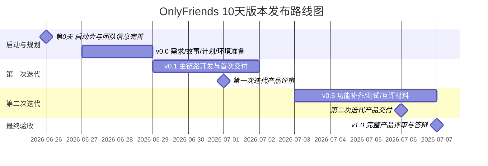

# OnlyFriends 版本发布计划

> **文档版本**：RP-2.0  

---

## 1. 文档说明

| 项 | 说明 |
|---|---|
| 发布策略 | 短周期增量交付（Incremental Delivery）+ 每日时间盒（Daily Time-box） |
| 总周期 | 10 天开发与验收（第 0 天为启动准备；第 1-10 天为综合实践交付周期） |
| 日程范围 | 2026-06-27 至 2026-07-07（其中 2026-07-02 未安排正式任务，不计入 10 天编号） |
| 核心节奏 | 需求与计划 → 第一次迭代交付 → 第二次迭代交付 → 完整产品评审 |
| 环境链路 | Dev → Test/Demo → 验收环境 |

### 版本命名规范

| 版本 | 含义 | 对应日程 |
|------|------|----------|
| v0.0.x | 启动与规划版：团队、需求、故事、验收标准、环境准备 | 第 0-2 天 |
| v0.1.x | 首次迭代版：主链路 MVP，可完成第一次产品评审 | 第 3-5 天 |
| v0.5.x | 第二次迭代版：补齐关键体验与评审材料，可进行互评 | 第 6-9 天 |
| v1.0.0 | 实践验收版：完整答辩演示与最终材料提交 | 第 10 天 |
| v1.1.0+ | 后续增强版：实践结束后的功能补充与体验优化 | 实践结束后 |

---

## 2. 版本路线图总览



### 版本演进一览

| 版本 | 周期 | 核心目标 | 交付重点 |
|------|------|----------|----------|
| v0.0 | 第 0-2 天 | 完成团队启动、需求拆解、用户故事、验收标准、首次迭代计划和开发环境 | 文档基线 + 环境基线 |
| v0.1 | 第 3-5 天 | 完成首次迭代可演示产品 | P0 主链路 + 第一次迭代总结 |
| v0.5 | 第 6-9 天 | 完成第二次迭代交付与互评材料 | P0 收口 + 关键 P1 + 测试/用户手册/部署信息 |
| v1.0 | 第 10 天 | 完成完整产品评审和答辩演示 | 最终演示版 + 全套实践材料 |
| v1.1+ | 实践后 | 补齐延期功能与体验优化 | P1/P2 增强 |

### 范围收敛原则

| 优先级 | 处理策略 |
|--------|----------|
| P0 | 必须进入第 1-10 天交付范围，支撑最终演示 |
| P1 | 选择与主链路强相关、风险可控的内容进入第二次迭代 |
| P2 | 默认延期到 v1.1+，仅在主链路稳定后择优补充 |
| NFR | 以演示稳定性、接口可用性、部署可复现、文档完整为主，不追求生产级灰度发布 |

---

## 3. 每日发布节奏与提交物

| 日程 | 日期 | 发布/管理目标 | 当日任务 | 提交成果/门禁 |
|------|------|----------------|----------|---------------|
| 第 0 天晚上 | 2026-06-26 | 项目启动 | 开启动会；熟悉教学平台；完善个人信息和团队信息；理解 U+ 平台需求填写与导出方式 | 团队角色表；团队运行规范 |
| 第 1 天 | 2026-06-27 | v0.0 需求基线 | 理解原始需求案例；划分用户故事；撰写验收标准；完成故事估算、优先级排序和版本发布计划初稿；小组打卡 | 个人原始需求分析概要文档；版本发布计划初稿 |
| 第 2 天 | 2026-06-28 | v0.0 文档与环境基线 | 构建开发环境；参加开发工具培训；参加需求评审；优化用户故事、验收标准和首次迭代计划 | 用户故事与验收标准文档；版本发布计划文档；首次迭代计划 |
| 第 3 天 | 2026-06-29 | v0.1 首次迭代启动 | 首次迭代计划会议；完成故事细化、任务拆分和理想时估算；建立看板、燃尽图、情绪图 | 更新看板/燃尽图/情绪图；提交本次迭代故事到任务的拆分信息 |
| 第 4 天 | 2026-06-30 | v0.1 主链路开发 | 迭代开发；完成核心接口、核心页面和主链路联调；提交自动代码评审 | 更新看板/燃尽图/情绪图；18:00 前提交自动代码评审结果 |
| 第 5 天上午 | 2026-07-01 | v0.1 首次交付 | 组内交付物评审；部署第一次交付产品 | 14:00 前提交第一次迭代产品 |
| 第 5 天下午/晚上 | 2026-07-01 | v0.1 评审与回顾 | 第一次迭代评审；各组回顾总结；根据评审意见调整用户故事和故事地图 | 第一次迭代完成情况总结；更新后的用户故事/故事地图 |
| 第 6 天 | 2026-07-03 | v0.5 第二次迭代启动 | 第二次迭代计划会议；选择第二次迭代用户故事；继续开发 | 迭代计划会议记录；第二次迭代涉及的用户故事及验收标准；任务拆分；看板/燃尽图/情绪图 |
| 第 7 天 | 2026-07-04 | v0.5 功能补齐 | 迭代开发；组内人工代码评审；修复首次评审遗留问题 | 更新看板/燃尽图/情绪图；人工代码评审记录 |
| 第 8 天 | 2026-07-05 | v0.5 联调测试 | 迭代开发；前后端联调；补齐测试用例、演示数据和部署脚本 | 更新看板/燃尽图/情绪图；人工代码评审记录 |
| 第 9 天上午 | 2026-07-06 | v0.5 第二次交付 | 组内交付软件评审；部署第二次交付产品；准备互评材料 | 第二次迭代产品；用户手册、测试计划、测试用例、登录账号、访问地址等互评材料 |
| 第 9 天下午 | 2026-07-06 | v0.5 互评与总结 | 回顾会议；组间互评；准备实践产品验收材料和实践总结 | 组间互评结果；第二次迭代回顾会议总结文档 |
| 第 10 天 | 2026-07-07 | v1.0 实践验收版 | 完整产品评审；答辩演示；提交最终材料 | 用户故事与发布计划文档；测试用例文档；实践总结文档；产品介绍视频等 |

---

## 4. v0.0 — 启动与规划版（第 0-2 天）

### 4.1 版本目标

完成项目启动、团队协作规则、需求理解、用户故事拆分、验收标准、版本发布计划和开发环境准备，为首次迭代开发建立可执行基线。

### 4.2 交付范围

| 模块 | 交付物 |
|------|--------|
| 团队协作 | 团队角色表、团队运行规范、每日站会与看板规则 |
| 需求分析 | 原始需求分析概要、故事地图、用户故事清单 |
| 验收标准 | P0/P1/P2 分级、每个核心用户故事的 AC |
| 发布计划 | 10 天版本发布计划、首次迭代计划 |
| 开发环境 | 后端、前端、数据库、中间件和本地运行说明 |
| 工程基线 | Git 分支规则、提交规范、接口联调约定、统一响应格式 |

### 4.3 退出标准

- [ ] 团队成员角色与分工明确
- [ ] P0 用户故事完成拆分并具备可验收标准
- [ ] 首次迭代计划完成任务拆分和理想时估算
- [ ] 核心工程可在本地启动或具备明确启动说明
- [ ] 版本发布计划、用户故事与验收标准文档提交

---

## 5. v0.1 — 首次迭代版（第 3-5 天）

### 5.1 版本目标

在 3 天内交付可部署、可演示的主链路 MVP，支撑第一次迭代产品评审。

主链路定义为：

```text
注册/登录 → 浏览活动 → 创建活动 → 提交审核 → 审核通过 → 活动详情 → 报名
```

### 5.2 交付范围

#### 后端

| 服务 | 功能 |
|------|------|
| User Service | 注册、登录、基础用户信息、Token 校验 |
| Activity Service | 活动创建、活动列表、活动详情、提交审核、基础报名 |
| AI Service | 内容审核最小可用实现；若大模型接入风险过高，使用规则引擎或 Mock 结果兜底 |
| Admin Service | 管理员登录、活动审核通过/驳回 |
| Gateway | 路由转发、基础鉴权、跨域配置 |

#### 前端

| 端 | 页面 |
|----|------|
| 微信小程序 | 登录/注册页、首页活动列表、活动详情页、活动创建页、报名入口 |
| 管理后台 | 登录页、活动审核页 |

#### 文档与质量

| 类别 | 内容 |
|------|------|
| 计划跟踪 | 看板、燃尽图、情绪图每日更新 |
| 代码质量 | 自动代码评审结果；关键问题修复记录 |
| 演示准备 | 第一次迭代演示数据、部署说明、账号信息 |

### 5.3 用户故事范围

优先纳入全部 P0 用户故事，至少覆盖：

US-U-001~004 · US-A-001~003 · US-A-006 · US-A-009~010 · US-AI-001 · US-ADM-001~002 · US-INF-001~002

### 5.4 服务开发优先级

```text
User Service → Activity Service → Admin Service → Gateway → AI Service → 前端联调
```

### 5.5 明确排除（Out of Scope）

- 等待队列、签到、评价、活动总结
- IM 即时通讯
- 兴趣小队、好友关系、关注粉丝
- 商家申请与商家审核
- 生产级 HTTPS/WSS、灰度发布、微信正式提审
- 复杂推荐算法、地图模式、附近活动

### 5.6 退出标准（首次迭代门禁）

- [ ] 主链路能够从前端完整演示
- [ ] 第一次交付产品在演示环境部署成功
- [ ] 无阻塞演示的 P0 缺陷
- [ ] 自动代码评审结果已提交，关键问题有处理记录
- [ ] 第一次迭代完成情况总结、调整后的用户故事/故事地图已更新

---

## 6. v0.5 — 第二次迭代版（第 6-9 天）

### 6.1 版本目标

基于第一次评审反馈，修复主链路缺陷，补齐关键体验、测试材料和互评材料，形成可供组间互评和最终验收的候选版本。

### 6.2 交付范围

#### 必做项

| 类别 | 内容 |
|------|------|
| 主链路稳定 | 修复第一次评审发现的问题；确保注册/登录、活动发布、审核、浏览、报名稳定 |
| 测试材料 | 测试计划、核心测试用例、测试账号、演示数据 |
| 用户材料 | 用户手册、系统访问地址、登录账号说明 |
| 部署材料 | 第二次交付产品部署说明、运行环境说明、常见问题 |
| 质量活动 | 组内人工代码评审、联调测试、回归测试 |

#### 择优补齐项

| 模块 | 候选功能 | 进入条件 |
|------|----------|----------|
| 活动模块 | 取消报名、活动状态流转、活动搜索/筛选 | 主链路稳定后优先补齐 |
| 用户模块 | 个人资料编辑、头像/标签展示 | 前端页面工作量可控 |
| 管理后台 | 用户查询、活动下架/恢复 | 后台审核流程已稳定 |
| 通知模块 | 审核结果通知、报名结果提示 | 可采用站内消息或页面提示的轻量实现 |
| AI 模块 | 活动标题/简介辅助生成 | 大模型接口稳定且不影响主链路 |

### 6.3 延期至 v1.1+ 的功能

- WebSocket 私聊/群聊与完整 IM 模块
- 好友关系、兴趣小队、小队相册/文件/投票/积分榜
- 地图模式、附近活动、复杂推荐算法
- 签到二维码、活动图文总结、评价体系
- 商家申请完整流程
- 生产级监控告警、CDN、灰度发布、微信正式提审

### 6.4 联调重点

| 调用链 | 说明 |
|--------|------|
| 前端 → Gateway → User | 登录态、Token 校验、用户信息展示 |
| 前端 → Gateway → Activity | 活动列表、详情、创建、报名 |
| Activity → Admin | 审核状态流转与后台操作一致 |
| Activity → AI | 内容审核成功、失败、超时均有兜底 |
| 数据库 → 演示数据 | 第二次交付与最终答辩使用同一套稳定数据 |

### 6.5 退出标准（第二次迭代门禁）

- [ ] P0 用户故事验收标准通过
- [ ] 第二次交付产品部署成功
- [ ] 互评材料齐备：用户手册、测试计划、测试用例、账号、访问地址
- [ ] 组内人工代码评审完成，严重问题已关闭或记录风险
- [ ] 第二次迭代回顾总结和组间互评结果已提交

---

## 7. v1.0.0 — 实践验收版（第 10 天）

### 7.1 版本目标

完成综合实践最终答辩演示，提交完整产品与过程材料。该版本定位为课程实践验收版本，不等同于面向真实用户开放的生产 GA。

### 7.2 交付范围

| 类别 | 内容 |
|------|------|
| 产品 | 可演示系统、稳定演示数据、前台与后台账号 |
| 演示 | 答辩演示脚本、核心业务流程、异常/兜底说明 |
| 测试 | 测试用例文档、核心用例执行结果、缺陷关闭情况 |
| 文档 | 用户故事与验收标准、版本发布计划、实践总结文档、用户手册 |
| 视频 | 产品介绍视频 |
| 部署 | 访问地址、部署说明、运行环境、账号与权限说明 |

### 7.3 最终演示流程

```text
1. 介绍产品定位与目标用户
2. 展示用户注册/登录
3. 展示活动浏览与详情
4. 展示活动创建与提交审核
5. 展示后台审核
6. 展示审核通过后的活动报名
7. 展示第二次迭代补齐的亮点功能
8. 说明测试结果、已知风险和后续计划
```

### 7.4 发布清单（Checklist）

- [ ] 演示环境可访问，核心服务可启动
- [ ] 演示账号、管理员账号、测试数据准备完成
- [ ] 主链路至少完成 1 次完整回归
- [ ] 用户故事与发布计划文档已更新到最终版本
- [ ] 测试用例文档、实践总结文档、产品介绍视频已准备
- [ ] 已知问题清单和后续优化计划已整理

### 7.5 退出标准（最终验收门禁）

- [ ] 答辩演示顺利完成
- [ ] 第 10 天要求提交的材料齐备
- [ ] P0 主链路无阻塞缺陷
- [ ] 对未完成 P1/P2 功能给出延期说明与后续版本安排

---

## 8. v1.1.0+ — 后续增强版（实践结束后）

### 8.1 版本目标

在课程实践验收后，基于互评、教师反馈和真实使用反馈，继续补齐中长期能力。

### 8.2 候选范围

| 功能 | 关联故事/说明 |
|------|---------------|
| IM 私聊/群聊 | 补齐 WebSocket、会话列表、未读数、离线消息 |
| 社群与好友 | 关注/粉丝/好友申请、兴趣小队创建与管理 |
| 活动增强 | 地图模式、附近活动、等待队列、签到、评价、总结 |
| 商家流程 | 商家申请、审核、商家活动能力 |
| AI 增强 | 活动策划生成、图片分类、推荐优化 |
| 运维增强 | HTTPS/WSS、监控告警、备份恢复、微信正式提审 |

---

## 9. 跨版本依赖矩阵

| 依赖项 | 阻塞版本 | 说明 |
|--------|----------|------|
| 用户故事与验收标准冻结 | v0.0 | 第一次迭代开发必须以 P0 故事和 AC 为准 |
| 开发环境可启动 | v0.0 | 阻塞第 3 天进入开发 |
| 数据库核心表与演示数据 | v0.1 | 支撑活动创建、审核、报名演示 |
| 登录鉴权 | v0.1 | 前台和后台所有核心流程前置依赖 |
| 活动审核状态机 | v0.1 | 阻塞活动发布、浏览和报名 |
| 演示环境部署 | v0.1/v0.5 | 第一次、第二次交付均要求可部署产品 |
| 测试用例与用户手册 | v0.5 | 第 9 天互评材料前置依赖 |
| 产品介绍视频与实践总结 | v1.0 | 第 10 天最终答辩材料 |

---

## 10. 团队迭代与版本映射

| 日程 | 版本增量 | 团队焦点 |
|------|----------|----------|
| 第 0 天 | 启动准备 | 熟悉平台、完善团队信息、明确角色与规范 |
| 第 1 天 | v0.0 前半 | 需求理解、故事拆分、验收标准、优先级和发布计划初稿 |
| 第 2 天 | v0.0 后半 | 开发环境、工具培训、需求评审、首次迭代计划完善 |
| 第 3 天 | v0.1 计划 | 任务拆分、理想时估算、看板与燃尽图建立 |
| 第 4 天 | v0.1 开发 | 主链路开发、接口联调、自动代码评审 |
| 第 5 天 | v0.1 交付 | 第一次部署、产品评审、回顾总结 |
| 第 6 天 | v0.5 计划 | 第二次迭代计划、故事调整、任务拆分 |
| 第 7 天 | v0.5 开发 | 缺陷修复、功能补齐、人工代码评审 |
| 第 8 天 | v0.5 联调 | 前后端联调、测试用例、演示数据和部署材料 |
| 第 9 天 | v0.5 交付 | 第二次部署、互评材料、组间互评、迭代回顾 |
| 第 10 天 | v1.0 验收 | 完整产品评审、答辩演示、最终材料提交 |

### 推荐分组（6-8 人团队）

| 小组 | 人数 | 负责模块 |
|------|------|----------|
| 前端组 | 2 | 微信小程序 + 管理后台 Web + 用户手册截图 |
| 后端核心组 | 2 | User Service + Activity Service + 核心数据库 |
| 后台与审核组 | 1 | Admin Service + 审核流程 + 管理端联调 |
| AI/质量组 | 1 | AI 审核兜底、测试用例、代码评审记录 |
| DevOps/文档组 | 1 | 部署、演示环境、发布计划、实践总结、视频材料 |

---

## 11. 风险登记册

| 编号 | 风险描述 | 概率 | 影响 | 缓解措施 | 关联版本 |
|------|----------|------|------|----------|----------|
| R-001 | 10 天周期极短，P1/P2 无法全部完成 | 高 | 高 | 严格按 P0 主链路优先；P1 择优；P2 延期至 v1.1+ | 全周期 |
| R-002 | 第一次迭代主链路未按时打通 | 中 | 高 | 第 3 天完成任务拆分；第 4 天优先联通最短路径；AI 可用 Mock 兜底 | v0.1 |
| R-003 | 前后端联调进度不一致 | 高 | 高 | 接口契约先行；提供 Mock 数据；每日固定联调窗口 | v0.1/v0.5 |
| R-004 | AI 大模型 API 不稳定或超时 | 中 | 中 | 规则引擎/固定审核结果兜底；最终演示不强依赖外部模型 | v0.1+ |
| R-005 | 互评材料准备不足 | 中 | 高 | 第 8 天开始整理测试用例、用户手册、账号和访问地址 | v0.5 |
| R-006 | 演示环境临时故障 | 中 | 高 | 准备本地演示方案、录屏备份和固定演示数据 | v0.5/v1.0 |
| R-007 | 文档与实际产品不一致 | 中 | 中 | 第 5 天、第 9 天评审后同步更新用户故事、发布计划和总结 | v0.1/v0.5/v1.0 |

---

## 12. 沟通与评审机制

| 活动 | 频率/时间 | 参与方 | 产出 |
|------|-----------|--------|------|
| 每日站会 | 每日开始前 15min | 全组 | 当日目标、阻塞项、责任人 |
| 看板更新 | 每日结束前 | 全组 | 看板、燃尽图、情绪图 |
| 需求评审 | 第 2 天下午 | 全组 + 指导教师/助教/青软老师 | 优化后的用户故事、验收标准、首次迭代计划 |
| 自动代码评审 | 第 4 天 18:00 前 | 开发成员 | 自动代码评审结果 |
| 第一次产品评审 | 第 5 天 14:00 | 全组 + 全体师资 | 第一次迭代产品、完成情况总结 |
| 第二次迭代计划会 | 第 6 天 | 全组 | 第二次迭代计划会议记录、任务拆分 |
| 人工代码评审 | 第 7-8 天 | 组内成员 | 人工代码评审记录与修复清单 |
| 第二次产品评审 | 第 9 天上午 | 全组 | 第二次迭代产品、互评材料 |
| 组间互评与回顾 | 第 9 天下午 | 全组 + 互评组 | 互评结果、第二次迭代回顾总结 |
| 完整产品评审 | 第 10 天 | 全体师资、每组 PO、青软老师 | 答辩演示、最终实践材料 |
